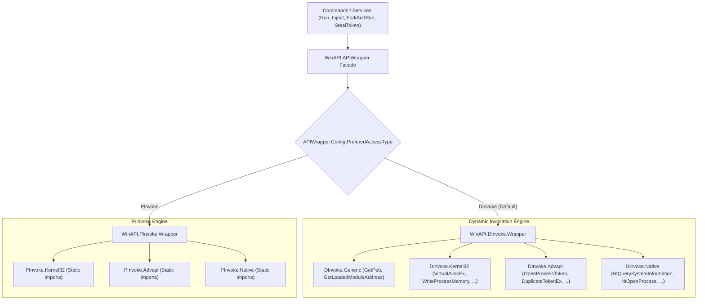

# WinAPI & Native Subsystem

## Overview

The `WinAPI` subsystem serves as the low-level execution engine of the Agent. It encapsulates process creation, memory allocation, thread injection, security token duplication, privilege escalation, and direct NT kernel querying.

To evade detection by Endpoint Detection and Response (EDR) systems that hook standard Win32 APIs, the subsystem implements a **Dual-Access Engine**:
1. **P/Invoke Layer**: Standard .NET platform invocation via `[DllImport]`.
2. **DInvoke (Dynamic Invocation) Layer**: Dynamically resolves and invokes functions at runtime without static imports in the PE Import Address Table (IAT).

The operator can configure the preferred engine globally via `IConfigService.APIAccessType` (`DInvoke` vs `PInvoke`).

---

## Subsystem Architecture



---

## DInvoke: In-Memory PE Parsing & Dynamic Resolution

`DInvoke` circumvents static analysis and user-mode API hooking:
1. **Module Base Resolution**:
   - Traverses the Process Environment Block (PEB) loader data structures (`InLoadOrderModuleList`) to locate loaded modules (`ntdll.dll`, `kernel32.dll`) without calling `LoadLibrary` or `GetModuleHandle`.
2. **Export Address Table (EAT) Traversal**:
   - Parses the DOS Header (`IMAGE_DOS_HEADER`), NT Headers (`IMAGE_NT_HEADERS`), and Export Directory (`IMAGE_EXPORT_DIRECTORY`).
   - Resolves function pointers by matching hashes or string names against `AddressOfNames` and `AddressOfFunctions`.
3. **Dynamic Delegate Binding**:
   - Converts raw function pointers into managed delegates using `Marshal.GetDelegateForFunctionPointer`.

---

## Process Injection Engine

The Agent supports two distinct injection techniques via `APIWrapper.Inject`:

```csharp
public static void Inject(IntPtr processHandle, IntPtr threadHandle, byte[] shellcode, uint entrypointOffset = 0, InjectionMethod? injectMethod = null)
```

| Injection Technique | Value | Mechanism |
| :--- | :--- | :--- |
| **`CreateRemoteThread`** | Default | Allocates memory in target (`VirtualAllocEx` with `PAGE_EXECUTE_READWRITE`), writes shellcode (`WriteProcessMemory`), and invokes `CreateRemoteThread`. |
| **`ProcessHollowingWithAPC`** | Early Bird / APC | Targets a suspended thread (e.g. sacrificial process in `fork-and-run`). Allocates memory, writes shellcode, and queues an Asynchronous Procedure Call via `QueueUserAPC` before resuming the thread. |

---

## Reflective DLL Loader Helper (`ReflectiveLoaderHelper`)

When executing reflective DLLs via `inject` or `fork-and-run`:
- The Agent cannot invoke a standard DLL export through `LoadLibrary`.
- `ReflectiveLoaderHelper.GetReflectiveFunctionOffset(dllBytes, "ReflectiveDllMain")`:
  1. Pins the byte buffer in memory using `GCHandle.Alloc`.
  2. Inspects `IMAGE_FILE_HEADER.Machine` to detect `x86` (`0x014c`) or `x64` (`0x8664`).
  3. Traverses the Export Directory to find the named export (default: `ReflectiveDllMain`).
  4. Calls `RVA2Offset(dwRVA, pBaseAddress)`: Iterates over the PE section headers (`IMAGE_SECTION_HEADER`), calculates the section delta `(dwRVA - VirtualAddress) + PointerToRawData`, and returns the raw file offset of the entry point.
- The entry point offset is passed to `APIWrapper.Inject`, starting execution directly at the reflective bootstrap code.

---

## Token Manipulation & Privilege Management

### 1. `APIWrapper.EnableDebugPrivilege()`
- Calls `OpenProcessToken` with `TOKEN_ADJUST_PRIVILEGES | TOKEN_QUERY`.
- Looks up LUID for `"SeDebugPrivilege"`.
- Calls `AdjustTokenPrivileges` with `SE_PRIVILEGE_ENABLED`.

### 2. `APIWrapper.StealToken(int processId)`
- Opens target process with `PROCESS_QUERY_INFORMATION`.
- Calls `OpenProcessToken(hProcess, TOKEN_DUPLICATE | TOKEN_QUERY | TOKEN_ASSIGN_PRIMARY)`.
- Invokes `DuplicateTokenEx(hToken, MAXIMUM_ALLOWED, SecurityImpersonation, TokenPrimary, ...)` to create a new impersonation token.
- Returns duplicated `IntPtr` handle.

### 3. `APIWrapper.CreateProcess(ProcessCreationParameters parms)`
- If an impersonation token is specified (`parms.Token != IntPtr.Zero`), invokes `Advapi.CreateProcessWithTokenW`.
- If credentials are provided (`parms.Credentials`), invokes `Advapi.CreateProcessWithLogonW`.
- Otherwise calls standard `Kernel32.CreateProcessW`.
- Configures anonymous pipe redirection for `hStdOutput` and `hStdError` to capture output without opening console windows.

---

## Cross-References

- [Command Dispatch & Execution](./command-dispatch-and-execution.md)
- [PowerShell Engine](./powershell-engine.md)
- [Functional Token Manipulation Guide](../../Functional/Agent/token-manipulation-and-privilege.md)
