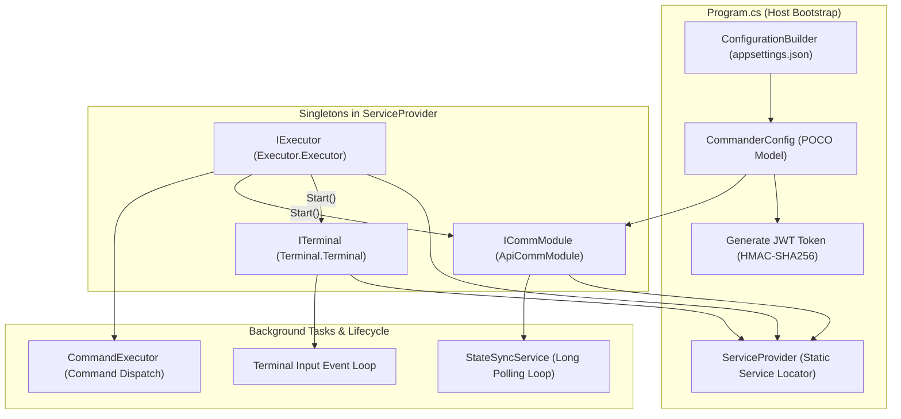
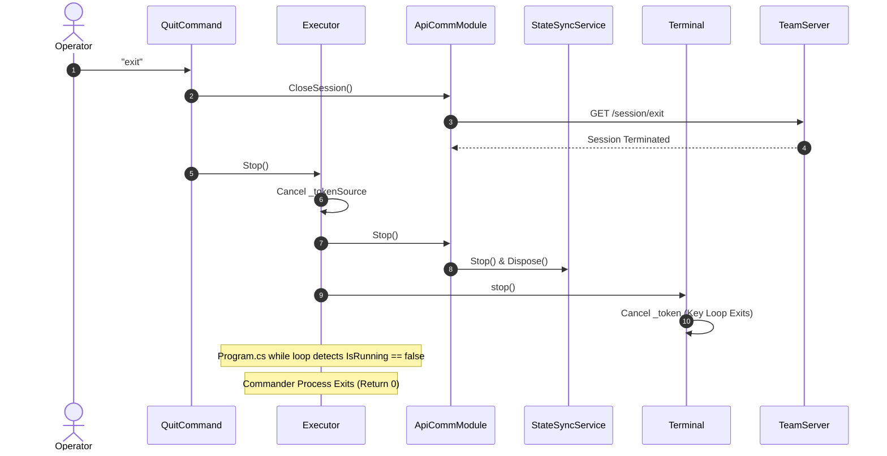

# Architecture, Dependency Injection & Configuration — Technical Guide

## Architectural Overview

Commander is designed as a standalone, event-driven .NET 8 console application. Its architecture prioritizes responsiveness, decoupling, and high resilience against network blips or unhandled command exceptions.



---

## Startup Sequence & Bootstrap (`Program.cs`)

The application entry point is contained entirely in `Commander/Program.cs`:

```csharp
static void Main(string[] args)
{
    IConfiguration config = new ConfigurationBuilder()
        .AddJsonFile("appsettings.json")
        .Build();

    var c = new CommanderConfig(config);

    var terminal = new Terminal.Terminal();
    ServiceProvider.RegisterSingleton<ITerminal>(terminal);
    
    var apiCommModule = new ApiCommModule(terminal, c);
    ServiceProvider.RegisterSingleton<ICommModule>(apiCommModule);
    
    var exec = new Executor.Executor(terminal, apiCommModule);
    ServiceProvider.RegisterSingleton<IExecutor>(exec);

    exec.Start();

    while(exec.IsRunning)
    {
        Thread.Sleep(500);
    }
}
```

### Execution Flow:
1. **Configuration Initialization**: Reads `appsettings.json` via Microsoft Configuration extensions.
2. **Configuration Binding**: Maps values into strongly-typed `CommanderConfig` and `ApiConfig` instances and generates an operational `Session` GUID.
3. **Service Registration**: Instantiates the three fundamental subsystems (`Terminal`, `ApiCommModule`, `Executor`) and registers them into the lightweight `ServiceProvider`.
4. **Subsystem Startup**: `exec.Start()` initiates the terminal key-reading loop and begins the initial server synchronization.
5. **Main Thread Liveness**: The main thread parks in a low-overhead loop (`Thread.Sleep(500)`) polling `exec.IsRunning` until cancellation is requested.

---

## Configuration Management (`Config.cs` & `appsettings.json`)

The application configuration is parsed from `appsettings.json` into structured C# classes defined in `Commander/Config.cs`.

### Configuration Schema (`appsettings.json`)
```json
{
    "Api": {
        "Address": "127.0.0.1",
        "Port": "5000",
        "User": "Fropops",
        "ApiKey": "lFAsXztlvBRVMr2DduUI7S2cSyIkodgC?S42aLF6-BHJD?2n1HlEQzPFn9SRGvfKrgyaXRAzkTFYR!xSkKQr6P6mOWPUitnIu8K-2dq0DEtaZ3BNX/Pzf11sBq?Dfpe9"
    },
    "Verbose": false
}
```

### Configuration Classes:
```csharp
public class ApiConfig
{
    public string Address { get; set; }
    public int Port { get; set; }
    public string User { get; set; }
    public string ApiKey { get; set; }
    public int Delay { get; set; } = 500;
    public string EndPoint => this.Address + ":" + this.Port;

    public void FromSection(IConfigurationSection section)
    {
        this.Address = section.GetValue<string>("Address");
        this.Port = section.GetValue<int>("Port");
        this.User = section.GetValue<string>("User");
        this.ApiKey = section.GetValue<string>("ApiKey");
    }
}

public class CommanderConfig
{
    public ApiConfig ApiConfig { get; private set; }
    public string Session { get; private set; }
    public bool Verbose { get; set; } = false;

    public CommanderConfig()
    {
        this.ApiConfig = new ApiConfig();
        this.Session = Guid.NewGuid().ToString();
    }

    public CommanderConfig(IConfiguration config) : this()
    {
        this.Verbose = config.GetValue<bool>("Verbose");
        this.ApiConfig.FromSection(config.GetSection("Api"));
    }
}
```

- **Session Isolation**: Each instance of Commander generates a unique session GUID (`Session = Guid.NewGuid().ToString()`), allowing the TeamServer to track individual operator connections independently.

---

## Authentication & JWT Token Synthesis

Commander does not prompt for interactive password logins. Instead, it signs requests using a pre-shared master key (`ApiKey`) via JSON Web Tokens (JWT):

```csharp
private string GenerateToken()
{
    var tokenHandler = new System.IdentityModel.Tokens.Jwt.JwtSecurityTokenHandler();
    var key = System.Text.Encoding.ASCII.GetBytes(this.Config.ApiConfig.ApiKey);
    var tokenDescriptor = new Microsoft.IdentityModel.Tokens.SecurityTokenDescriptor
    {
        Subject = new System.Security.Claims.ClaimsIdentity(new[] { 
            new System.Security.Claims.Claim("id", Config.ApiConfig.User), 
            new System.Security.Claims.Claim("session", Config.Session) 
        }),
        Expires = DateTime.UtcNow.AddDays(7),
        SigningCredentials = new Microsoft.IdentityModel.Tokens.SigningCredentials(
            new Microsoft.IdentityModel.Tokens.SymmetricSecurityKey(key), 
            Microsoft.IdentityModel.Tokens.SecurityAlgorithms.HmacSha256Signature)
    };
    var token = tokenHandler.CreateToken(tokenDescriptor);
    return tokenHandler.WriteToken(token);
}
```

### Security Details:
- **Algorithm**: HMAC-SHA256 (`HmacSha256Signature`).
- **Subject Claims**:
  - `id`: Identifies the operator username (`Config.ApiConfig.User`).
  - `session`: Identifies the unique client execution session (`Config.Session`).
- **Expiration**: Tokens are valid for 7 days (`Expires = DateTime.UtcNow.AddDays(7)`).
- **Transport**: Transmitted in the standard HTTP header: `Authorization: Bearer <Token>`.

---

## Lightweight Service Locator (`ServiceProvider.cs`)

To avoid heavyweight DI container overhead while maintaining loose coupling across commands and formatting helpers, Commander uses a static service locator:

```csharp
public static class ServiceProvider
{
    private static Dictionary<Type, object> instances = new Dictionary<Type, object>();
    
    public static void RegisterSingleton<T>(T service)
    {
        if (instances.ContainsKey(typeof(T)))
            throw new ApplicationException($"Service Provider : {typeof(T).ToString()} is already registered!");

        instances.Add(typeof(T), service);
    }

    public static T GetService<T>()
    {
        return (T)instances[typeof(T)];
    }
}
```

### Registered Singletons:
1. `ITerminal`: Console rendering, line editing, and key capture.
2. `ICommModule`: TeamServer REST client, state cache, and event publisher.
3. `IExecutor`: Execution coordinator, command routing, and mode switcher.

---

## Application Lifecycle & Shutdown Sequence



---

## Error Handling and Fault Tolerance

1. **Console Key Loop Isolation**: `Terminal.Start()` wraps key handling in a `try...catch` block. If an unhandled key navigation error occurs, the stack trace is rendered using `WriteError` without crashing the process, and `CanHandleInput` is re-enabled.
2. **Command Execution Isolation**: In `Executor.HandleInput()`, all command parsing and execution invocations are wrapped in a `try...catch` block. Command errors are surfaced to the operator as red terminal text, followed by an immediate `InputHandled()` prompt reset.
3. **Network Resilience**: In `StateSyncService.PollLoop()`, HTTP transport failures do not throw unhandled exceptions. Instead, the connection status is set to `false`, firing `OnConnectionStatusChanged` to notify the operator while continuing the background polling loop.

---

## Technical Cross-Reference

- Console key loop and rendering engine: [Terminal Subsystem](./terminal-subsystem.md).
- HTTP communication and caching: [Communication & State Sync](./communication-and-state-sync.md).
- Command dispatching and context binding: [Command Framework & Execution](./command-framework-and-execution.md).
