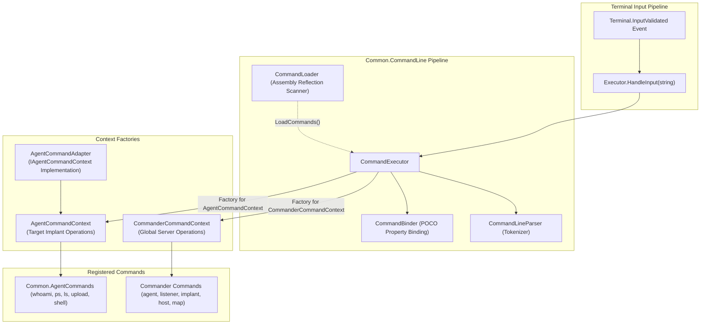

# Command Framework & Execution Engine — Technical Guide

## Architectural Overview

The Command Framework is the orchestrating core of Commander. It processes raw console input lines, tokenizes command arguments, maps them to strongly-typed options models, enforces operational execution rules (such as blocking agent commands when no agent is selected), and dispatches work across dual operational contexts.



---

## Assembly Scanning & Context Factory Registration

When `Executor` initializes, it loads command definitions from two distinct assemblies:
1. **`Common.AgentCommands`**: Contains all cross-platform implant post-exploitation command definitions (`WhoamiCommand`, `PsCommand`, `LsCommand`, `ShellCommand`, `CaptureCommand`, etc.).
2. **`Commander` (Executing Assembly)**: Contains console-specific management commands (`ManageAgentCommand`, `ManageListenerCommand`, `ManageImplantCommand`, `MapCommand`, etc.).

```csharp
public Executor(ITerminal terminal, ICommModule commModule)
{
    this.CommModule = commModule;
    this.Terminal = terminal;

    // 1. Register Context Factories
    this.CommandExecutor.RegisterContextFactory(() => 
        new CommanderCommandContext(this.CommModule, this.Terminal, this));
        
    this.CommandExecutor.RegisterContextFactory(() => 
        new AgentCommandContext(new AgentCommandAdapter(this, this.Terminal, this.CommModule)));

    // 2. Discover and Register Commands from Assemblies
    var commonAssembly = typeof(WhoamiCommand).Assembly;
    this.CommandExecutor.LoadCommands(commonAssembly);

    var webAssembly = Assembly.GetExecutingAssembly();
    this.CommandExecutor.LoadCommands(webAssembly);

    // 3. Subscribe to Communication & Terminal Events
    this.Terminal.InputValidated += Instance_InputValidated;
    this.CommModule.ConnectionStatusChanged += CommModule_ConnectionStatusChanged;
    this.CommModule.TaskResultUpdated += CommModule_TaskResultUpdated;
    this.CommModule.AgentMetaDataUpdated += CommModule_AgentMetadataUpdated;
    this.CommModule.AgentAdded += CommModule_AgentAdded;
}
```

---

## Dual Operational Contexts

Commander differentiates between commands that manipulate local/server state and commands that task remote implants:

### 1. `CommanderCommandContext`
Inherits from `Common.CommandLine.Core.CommandContext`. Injected into all global commands:
- **Properties**:
  - `ICommModule CommModule`: Access to cached agents, listeners, implants, and API dispatchers.
  - `ITerminal Terminal`: Access to console writing and markup rendering.
  - `IExecutor Executor`: Access to the current execution state and active agent pointer.
- **Methods**:
  - `bool? IsAgentAlive(Agent agent)`: Evaluates agent check-in times and parent relay latencies to determine liveness.

### 2. `AgentCommandContext` & `AgentCommandAdapter`
Implements `Common.AgentCommands.IAgentCommandContext`. Serves as the operational bridge between generic agent command classes and Commander's networking layer:
- Injects target agent metadata (`AgentMetadata`).
- Implements `TaskAgent(commandLine, commandId, parameters)`: Forwards the serialized command to `CommModule.TaskAgent`.
- Handles interactive UI feedback: `WriteSuccess`, `WriteError`, `WriteInfo`.
- Bridges payload generation requests: `GeneratePayload(ImplantConfig)`.

---

## Input Processing & Dispatch Pipeline (`Executor.HandleInput`)

```mermaid
sequenceDiagram
    autonumber
    actor Op as Operator
    participant Term as Terminal
    participant Exec as Executor
    participant CmdExec as CommandExecutor
    participant Handler as ICommand Implementation

    Op->>Term: Presses Enter on Command Line
    Term->>Exec: InputValidated(inputString)
    Exec->>Term: Set CanHandleInput = false (Lock Console)

    Exec->>CmdExec: GetCommand(inputString)
    CmdExec-->>Exec: Return CommandDefinition

    alt Command Not Found
        Exec->>Term: WriteError("Command <input> is unknown.")
    else Agent Command Executed with No Agent Active
        Exec->>Term: WriteError("No agent selected. Use 'interact' command...")
    else Valid Command
        Exec->>CmdExec: ExecuteAsync(inputString)
        CmdExec->>CmdExec: Tokenize, Bind Options, Invoke Context Factory
        CmdExec->>Handler: Execute(context, options)
        Handler-->>CmdExec: CommandResult (Succeed / Failed, Message)
        CmdExec-->>Exec: Return Result
        opt If Error/Success Message Present
            Exec->>Term: WriteLine / WriteError
        end
    end

    Exec->>Exec: InputHandled()
    Exec->>Term: Set CanHandleInput = true & NewLine()
```



### Safety Guard against Unbound Execution:
```csharp
if (typeof(Common.AgentCommands.AgentCommandBase).IsAssignableFrom(commandDef.CommandType) 
    && this.CurrentAgent == null)
{
    this.Terminal.WriteError("No agent selected. Use 'interact' command to select an agent.");
    return;
}
```
This guarantees that commands like `shell whoami` or `ps` cannot execute in a void or target an undefined host.

---

## Dynamic Prompt Generation (`UpdateAgentPrompt`)

Whenever the active agent changes (`CurrentAgent` setter) or when updated metadata is pushed by the TeamServer (`CommModule_AgentMetadataUpdated`), `Executor` recalculates the prompt string:

```csharp
private void UpdateAgentPrompt()
{
    if (this._currentAgent.Metadata == null)
    {
        this.Terminal.Prompt = $"$({_currentAgent.Id})> ";
    }
    else
    {
        var star = _currentAgent.Metadata?.HasElevatePrivilege() == true ? "*" : string.Empty;
        this.Terminal.Prompt = $"$({_currentAgent.Metadata.Name}) {_currentAgent.Metadata.UserName}{star}@{_currentAgent.Metadata.Hostname}> ";
    }
}
```

---

## Automatic Screenshot Interception (`CommModule_TaskResultUpdated`)

When incoming task results arrive, `Executor` inspects the originating command type:

```csharp
if (task.CommandId == CommandId.Capture)
{
    if (res.Objects == null || res.Objects.Length == 0)
        return;

    var list = res.Objects.BinaryDeserializeAsync<List<DownloadFile>>().Result;

    if (!Directory.Exists("media"))
        Directory.CreateDirectory("media");

    var path = Path.Combine("media", task.AgentId);
    if (!Directory.Exists(path))
        Directory.CreateDirectory(path);

    foreach (var file in list)
    {
        File.WriteAllBytes(Path.Combine(path, file.FileName), file.Data);
        this.Terminal.WriteInfo($"Screenshot saved : {file.FileName}.");
    }
}
```

---

## Technical Cross-Reference

- Console key loop and line restoration: [Terminal Subsystem](./terminal-subsystem.md).
- Detailed command classes and option models: [Command Handlers](./command-handlers.md).
- Output deserialization and formatting: [Formatters & Helpers](./formatters-and-helpers.md).
