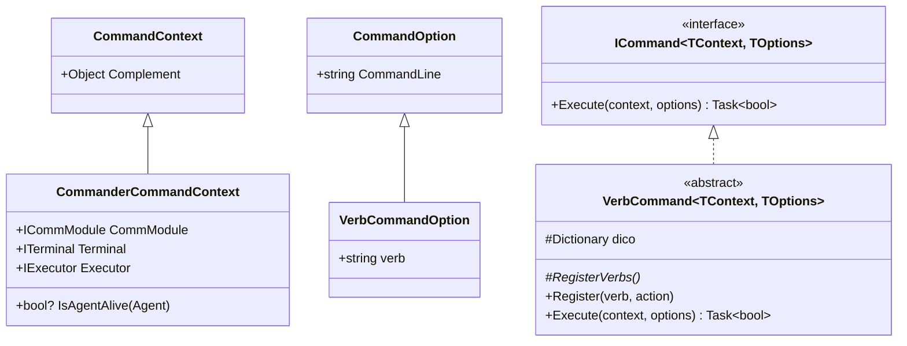

# Command Handlers Reference — Technical Guide

## Architectural Overview

All operational commands in Commander are implemented as strongly-typed command classes adhering to contracts defined in `Common.CommandLine`. Commands are declarative, self-documenting via attributes, and cleanly decoupled from low-level terminal I/O or network serialization.



---

## The VerbCommand Pattern (`VerbCommand.cs`)

For complex infrastructure management tasks (e.g., `agent`, `listener`, `implant`, `host`, `proxy`, `tool`), commands support sub-action verbs (e.g., `show`, `start`, `stop`, `delete`, `push`). To avoid monolithic `switch-case` blocks, Commander employs the **`VerbCommand<TContext, TOptions>`** design pattern:

```csharp
public abstract class VerbCommand<TContext, TOptions> : ICommand<TContext, TOptions>
    where TContext : CommandContext
    where TOptions : VerbCommandOption
{
    protected Dictionary<string, Func<TContext, TOptions, Task<bool>>> dico = 
        new Dictionary<string, Func<TContext, TOptions, Task<bool>>>();

    public VerbCommand()
    {
        RegisterVerbs();
    }

    protected abstract void RegisterVerbs();

    public void Register(string verb, Func<TContext, TOptions, Task<bool>> action)
    {
        dico.Add(verb.ToLower(), action);
    }

    public virtual async Task<bool> Execute(TContext context, TOptions options)
    {
        var verb = options.verb.ToLower();
        if (dico.TryGetValue(verb, out var action))
            return await action(context, options);

        return false;
    }
}
```

---

## Command Implementations

### 1. Fleet & Session Commands

#### `ManageAgentCommand` (`agent` / `agents`)
- **Options**: `ManageAgentCommandOptions` (`verb`, `index`, `all`)
- **Verbs**:
  - `show`: Renders a Spectre.Console table listing all checked-in implants. Invokes `context.IsAgentAlive(agent)` to color active agents green/white, dead agents grey, and the currently interacted agent cyan.
  - `delete`: Decommissions agents. Validates safety rule: **Active agents cannot be deleted**.
- **Context**: `CommanderCommandContext`

#### `InteractAgentCommand` (`int` / `interact`)
- **Options**: `InteractAgentCommandOptions` (`id`: index or GUID string)
- **Behavior**: Resolves agent by numeric list index or GUID matching; sets `context.Executor.CurrentAgent = agent`. Triggers immediate prompt adaptation.

#### `BackCommand` (`back` / `home`)
- **Implements**: `ICommanderAgentCommand`
- **Behavior**: Clears `context.Executor.CurrentAgent = null` and resets `context.Terminal.Prompt = "$> "`.

#### `StatusCommand` (`status`)
- **Implements**: `ICommanderAgentCommand`
- **Behavior**: Renders key-value telemetry table (Architecture, OS, User, Integrity, Process Name/PID, Internal IP, EndPoint, Version, Sleep interval, and Last Seen delta).

#### `MapCommand` (`map`)
- **Options**: `CommandOption`
- **Behavior**: Queries all agents from `CommModule`. Initializes a root node for the TeamServer. Evaluates each agent's `Links` collection to determine parent-child P2P relay relationships, building a recursive `MapTreeNode` structure. Renders an interactive Spectre.Console `Tree`.

---

### 2. Tasking & In-Agent Commands

#### `ListTasksCommand` (`view`)
- **Implements**: `ICommanderAgentCommand`
- **Options**: `ViewTasksCommandOptions` (`index`, `Top`, `loot`)
- **Behavior**:
  - If `index` is omitted: Renders a summary table of the latest $N$ tasks (defaults to 10).
  - If `index` is specified: Retrieves and reprints output, errors, or structured objects for that task.
  - If `loot` flag is set (`-l`): Invokes `LootOutputFormatter.FormatLootContent()`, packages output as `task_<id>.txt`, and calls `context.CommModule.CreateLootAsync()`.

#### `UploadCommand` (`upload`)
- **Inherits**: `Common.AgentCommands.AgentCommand<UploadCommandoptions>`
- **Options**: `UploadCommandoptions` (`localfile`, `remotefile`)
- **Behavior**:
  - `CheckParams`: Validates that `localfile` exists on the operator's workstation.
  - `SpecifyParameters`: Reads all bytes into memory, resolves target file name, and appends `ParameterId.Name` and `ParameterId.File` into the task parameter dictionary.

#### `ProxyCommand` (`proxy`)
- **Implements**: `ICommanderAgentCommand`
- **Options**: `ProxyCommandOptions` (`verb`: start/stop/show, `port`: default 1080)
- **Verbs**:
  - `start`: Calls `CommModule.StartProxy(CurrentAgent.Id, port)`.
  - `stop`: Calls `CommModule.StopProxy(port)`.
  - `show`: Displays active proxy-to-agent port mappings.

---

### 3. Infrastructure & Staging Commands

#### `ManageListenerCommand` (`listener`)
- **Options**: `ManageListenerCommandOptions` (`verb`: start/stop/show, `name`, `port`, `address`, `secured`)
- **Verbs**:
  - `start`: Validates unique name, sets default ports (443 secured / 80 unsecured), and calls `CommModule.CreateListener()`.
  - `stop`: Resolves listener GUID by friendly name and calls `CommModule.StopListener(id)`.
  - `show`: Lists listeners in a Spectre table with Name, Port, Host, ID, and TLS status.

#### `ManageImplantCommand` (`implant`)
- **Options**: `ManageImplantCommandOptions` (`verb`: show/download/generate/delete/script, `name`, `listener`, `endpoint`, `type`, `arch`, `debug`, `inject`, `injectDelay`, `injectProcessId`, `injectProcessName`, `injectSpawn`, `download`)
- **Verbs**:
  - `show`: Lists previously generated implants and their configurations.
  - `generate`: Synthesizes `ImplantConfig`, invokes `CommModule.GenerateImplant()`, and renders staging one-liners.
  - `download`: Downloads raw compiled binary data via `CommModule.GetImplantBinary()` and writes to local disk using `PayloadGenerator.GetImplantFileName()`.
  - `script`: Formats PowerShell cradles (clear and base64) or Bash one-liners.
  - `delete`: Deletes implant records from server.

#### `ManageWebHostCommand` (`host`)
- **Options**: `ManageWebHostCommandOptions` (`verb`: show/push/delete/script/log/clear, `file`, `path`, `powershell`, `description`, `listener`)
- **Verbs**:
  - `push`: Reads local file bytes and stages them at `path` on the TeamServer.
  - `show`: Lists hosted URI paths mapped under each active listener.
  - `script`: Generates PowerShell cradles for hosted files flagged with `-ps`.
  - `log`: Retrieves access logs from `CommModule.GetWebHostLogs()` and prints table.
  - `delete` / `clear`: Unmounts individual files or flushes all hosted assets.

#### `ManageToolsCommand` (`tool` / `tools`)
- **Options**: `ManageToolsCommandOptions` (`verb`: show/add, `type`, `name`, `path`)
- **Verbs**:
  - `show`: Lists offensive binaries registered on the TeamServer.
  - `add`: Reads local binary from disk and posts Base64 data to `CommModule.AddTool()`.

---

### 4. Utility & Navigation Commands

#### `HelpCommand` (`help`)
- **Behavior**:
  - Scans `context.Executor.GetAllCommands()`.
  - Dynamically filters commands based on `CurrentAgent != null` and `cmd.SupportedOs.Contains(CurrentAgent.Metadata.OsType)`.
  - Groups results into categories and renders Spectre.Console rounded tables with dividers.

#### `LocalNavigationCommands` (`lcd`, `lls`, `lpwd`)
- `LocalPrintWorkingDirectory` (`lpwd`): Outputs `Directory.GetCurrentDirectory()`.
- `LocalChangeWorkingDirectory` (`lcd`): Sets `Directory.SetCurrentDirectory(path)` if directory exists.
- `LocalListDirectoryCommand` (`lls`): Renders local filesystem contents with file size and directory flags.

#### `QuitCommand` (`exit`)
- **Behavior**: Calls `CommModule.CloseSession()` to invalidate JWT session on the TeamServer, then calls `Executor.Stop()` to terminate Commander.

---

## Technical Cross-Reference

- Command execution pipeline: [Command Framework & Execution](./command-framework-and-execution.md).
- Result deserialization and process tree generation: [Formatters & Helpers](./formatters-and-helpers.md).
- Communication module interface: [Communication & State Sync](./communication-and-state-sync.md).
