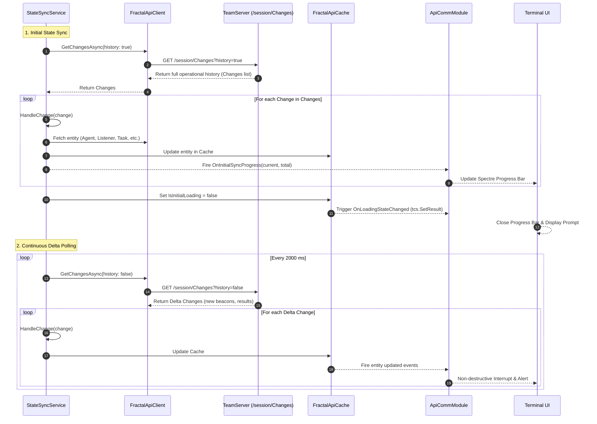

# Communication Subsystem & State Synchronization — Technical Guide

## Architectural Overview

The Communication subsystem bridges the local interactive console with the remote **FractalC2 TeamServer**. Rather than performing blocking, synchronous REST queries on every user keystroke or command, Commander utilizes a **local in-memory cache synchronized in near-real-time via delta long-polling**.

```mermaid
graph TD
    subgraph ClientLayer["Commander Client Application"]
        IComm["ICommModule (Interface Contract)"]
        ApiMod["ApiCommModule (Adapter & Event Coordinator)"]
        Cache["FractalApiCache (In-Memory Concurrent Dictionaries)"]
        Known["_knownAgents (HashSet Tracker)"]
    end

    subgraph APIClientLib["Common.APIClient Project"]
        Sync["StateSyncService (Background Polling Loop)"]
        Client["FractalApiClient (HTTP REST Façade)"]
        SubClients["Typed REST Clients (Agents, Tasks, Listeners, etc.)"]
    end

    subgraph ServerLayer["FractalC2 TeamServer"]
        SessionAPI["/session/Changes?history={bool}"]
        RESTEndpoints["RESTful Resource Controllers"]
    end

    IComm <|.. ApiMod
    ApiMod --> Client
    ApiMod --> Cache
    ApiMod --> Sync
    ApiMod --> Known
    Sync --> Client
    Sync --> Cache
    Client --> SubClients
    Client <==>|"HTTP / Bearer JWT"| ServerLayer
```

---

## The Synchronization Engine (`StateSyncService`)

State synchronization is managed by `Common.APIClient.StateSyncService`. It runs an asynchronous polling loop (`PollLoop`) on a dedicated thread, querying `/session/Changes` every 2,000 milliseconds:



### Change Element Dispatching (`HandleChange`):
When a change record arrives, `StateSyncService` fetches the latest entity payload and updates `FractalApiCache`:
- `ChangingElement.Agent`: Fetches agent record and metadata -> `Cache.UpdateAgent(agent)`.
- `ChangingElement.Listener`: Fetches listener record -> `Cache.UpdateListener(listener)`.
- `ChangingElement.Task`: Fetches task record -> `Cache.UpdateTask(task)`.
- `ChangingElement.Result`: Fetches task execution result -> `Cache.UpdateResult(result)`.
- `ChangingElement.Implant`: Fetches compiled implant metadata -> `Cache.UpdateImplant(implant)`.
- `ChangingElement.Metadata`: Updates host telemetry on cached agent instances.

---

## Initial Synchronization UX & Progress Bar (`ApiCommModule.Start`)

When Commander starts, it performs a blocking UI synchronization using a rich Spectre.Console progress bar before presenting the prompt to the operator:

```csharp
public async Task Start()
{
    var tcs = new TaskCompletionSource();
    Action loadingHandler = () =>
    {
        if (!_apiCache.IsInitialLoading)
            tcs.TrySetResult();
    };
    
    _apiCache.OnLoadingStateChanged += loadingHandler;
    if (!_apiCache.IsInitialLoading) tcs.TrySetResult();

    try
    {
        await AnsiConsole.Progress()
            .Columns(new ProgressColumn[]
            {
                new TaskDescriptionColumn(),
                new ProgressBarColumn(),
                new PercentageColumn(),
                new SpinnerColumn(Spinner.Known.Default).Style(Style.Parse("cyan")),
            })
            .StartAsync(async ctx =>
            {
                var task1 = ctx.AddTask("[cyan]Syncing with TeamServer[/]");
                Action<int, int> progressHandler = (current, total) =>
                {
                    if (total > 0)
                    {
                        task1.Description = $"[cyan]Syncing with TeamServer ({total} items)[/]";
                        task1.MaxValue = total;
                        task1.Value = current;
                    }
                };

                _syncService.OnInitialSyncProgress += progressHandler;
                _syncService.Start();
                await tcs.Task; // Awaits completion signal from Cache
                task1.Value = task1.MaxValue;
                task1.StopTask();
                _syncService.OnInitialSyncProgress -= progressHandler;
            });
    }
    catch (Exception ex)
    {
        this.Terminal.WriteError($"Initial sync failed: {ex.Message}");
        _syncService.Start();
    }
    finally
    {
        _apiCache.OnLoadingStateChanged -= loadingHandler;
    }
    this.Terminal.NewLine(false);
}
```

---

## Reactive Event Propagation

`ApiCommModule` subscribes to `FractalApiCache` internal events and bridges them to Commander's execution subsystems:

### Distinguishing New Check-Ins from Initial Cache Population
To prevent Commander from spamming alerts for every historical agent during startup, `ApiCommModule` maintains a `HashSet<string> _knownAgents`:

```csharp
this._apiCache.OnAgentUpdated += (agent) => 
{
    bool isNew = _knownAgents.Add(agent.Id);
    
    // Only fire AgentAdded if it's genuinely new AND initial sync is complete
    if (isNew && !this._apiCache.IsInitialLoading)
    {
        this.AgentAdded?.Invoke(this, agent);
    }
    else
    {
        this.AgentMetaDataUpdated?.Invoke(this, agent);
    }
};
```

### Event Routing Summary:
| Source Event (`FractalApiCache`) | CommModule Event | Subscribed Handler (`Executor`) |
| :--- | :--- | :--- |
| `OnAgentUpdated` (new ID) | `AgentAdded` | `CommModule_AgentAdded`: Triggers non-destructive alert with agent ID & index. |
| `OnAgentUpdated` (existing ID) | `AgentMetaDataUpdated` | `CommModule_AgentMetadataUpdated`: Updates prompt if active agent metadata changed. |
| `OnResultUpdated` (Completed/Error) | `TaskResultUpdated` | `CommModule_TaskResultUpdated`: Calls `TaskPrinter.Print()`; saves screenshots. |
| `OnTaskUpdated` / `OnResultUpdated` | `RunningTaskChanged` | Tracks count of in-flight tasks. |
| `OnConnectionStatusChanged` | `ConnectionStatusChanged` | `CommModule_ConnectionStatusChanged`: Alerts operator if server connection drops or restores. |
| `OnImplantUpdated` | `ImplantAdded` | Signals payload compilation completion. |

---

## Outbound API Task Dispatching (`TaskAgent`)

When an operator issues an execution command (e.g., `shell`, `whoami`, `upload`), `ApiCommModule.TaskAgent` packages the instruction into a binary format:

```csharp
public async Task TaskAgent(string label, string agentId, CommandId commandId, ParameterDictionary parms)
{    
    var agentTask = new AgentTask()
    {
        Id = ShortGuid.NewGuid(),
        CommandId = commandId,
        Parameters = parms,
    };
    
    // 1. Serialize parameters to binary stream using BinarySerializer
    var ser = await agentTask.BinarySerializeAsync();
    
    // 2. Wrap binary into JSON request DTO
    var taskrequest = new CreateTaskRequest()
    {
        Command = label,
        Id = agentTask.Id,
        TaskBin = Convert.ToBase64String(ser),
    };
    
    // 3. Post to TeamServer
    await _apiClient.Tasks.CreateAsync(agentId, taskrequest);
}
```

---

## Technical Cross-Reference

- Console interruption and alert rendering: [Terminal Subsystem](./terminal-subsystem.md).
- Executor event subscriptions: [Command Framework & Execution](./command-framework-and-execution.md).
- Binary serialization and result formatting: [Formatters & Helpers](./formatters-and-helpers.md).
