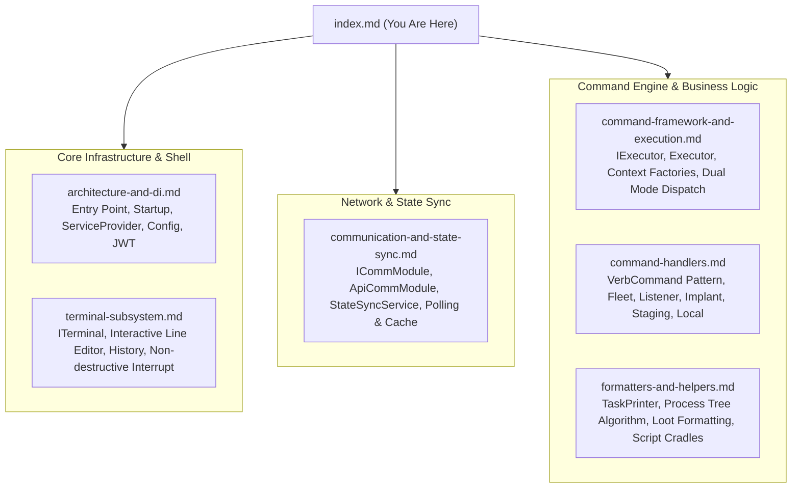

# FractalC2 Commander — Technical Documentation

## Project Overview

| Property | Value |
| :--- | :--- |
| **Project File** | `Commander.csproj` |
| **Target Framework** | .NET 8.0 (`net8.0`) |
| **Project SDK** | `Microsoft.NET.Sdk` |
| **Output Type** | Console Application (`OutputType: Exe`) |
| **Assembly / File Version** | `2.4.0.0` |
| **Primary Output** | Executable Console Client (`Commander.exe` / `Commander.dll`) |
| **Role in Solution** | Interactive command-and-control (C2) operator console for the FractalC2 platform. Serves as the rich terminal client connecting to the central `TeamServer`. Hosts the interactive shell, manages real-time state synchronization, dynamically routes commands between global C2 infrastructure and targeted implants, formats complex execution telemetry, and provides local operational tools. |

---

## Solution Dependency Map

The Commander application relies on shared platform libraries for models, protocol definitions, payload generation, command routing, and API communication:

```mermaid
graph TD
    subgraph SolutionProjects["Referenced Solution Projects"]
        Cmdr["Commander.csproj<br/>(.NET 8.0 Console Client)"]
        CommonCmdLine["Common.CommandLine.csproj<br/>(Reflection Command Loader, Parser, Binder)"]
        CommonAgentCmds["Common.AgentCommands.csproj<br/>(Implant Command Definitions & Contexts)"]
        CommonApiClient["Common.APIClient.csproj<br/>(REST Clients, StateSyncService, FractalApiCache)"]
        CommonPayloadGen["Common.Payload.Generation.csproj<br/>(Implant Configs, Payload Helpers)"]
        CommonProj["Common.csproj<br/>(Models, API Contracts, Config, ShortGuid)"]
    end

    subgraph AssemblyRefs["Raw Assembly References"]
        BinSer["BinarySerializer.dll<br/>(Compact Binary Serialization Engine)"]
    end

    subgraph NuGetPackages["Direct NuGet Dependencies"]
        Spectre["Spectre.Console (v0.46.1-preview.0.20)<br/>Rich Terminal Rendering, Tables, Trees, Spinners"]
        SysCmd["System.CommandLine (v2.0.0-beta3.22114.1)<br/>CLI Option Modeling & Binding"]
        Jwt["System.IdentityModel.Tokens.Jwt (v6.28.1)<br/>Client-Side HMAC-SHA256 Token Generation"]
        Json["Newtonsoft.Json (v13.0.1)<br/>JSON Serialization & Deserialization"]
        Config["Microsoft.Extensions.Configuration (v7.0.0)<br/>JSON & Environment Variable App Configuration"]
    end

    Cmdr --> CommonCmdLine
    Cmdr --> CommonAgentCmds
    Cmdr --> CommonApiClient
    Cmdr --> CommonPayloadGen
    Cmdr --> CommonProj
    Cmdr --> BinSer

    CommonApiClient --> CommonProj
    CommonAgentCmds --> CommonCmdLine
    CommonAgentCmds --> CommonProj
    CommonPayloadGen --> CommonProj

    Cmdr --> Spectre
    Cmdr --> SysCmd
    Cmdr --> Jwt
    Cmdr --> Json
    Cmdr --> Config
```



### Dependency Rationale

| Dependency | Scope / Type | Architectural Role & Purpose |
| :--- | :--- | :--- |
| **`Common.CommandLine`** | Project Reference | Core CLI abstraction layer. Scans assemblies for `[Command]` attributes, tokenizes user input strings, performs parameter binding onto strongly-typed options classes, and dynamically supplies execution contexts via registered factories. |
| **`Common.AgentCommands`** | Project Reference | Shared repository of agent-side post-exploitation command definitions (`whoami`, `ps`, `ls`, `cd`, `upload`, `psexec`, `shell`, `capture`, etc.) allowing Commander to load and execute identical command specifications as the implants. |
| **`Common.APIClient`** | Project Reference | High-level HTTP client library providing REST endpoints (`Agents`, `Listeners`, `Tasks`, `Implants`, `Loot`, `Tools`, `Proxy`, `WebHost`), in-memory client caching (`FractalApiCache`), and real-time delta change synchronization (`StateSyncService`). |
| **`Common.Payload.Generation`** | Project Reference | Shared configuration models for payload compilation (`ImplantConfig`), architecture enums, and naming helpers (`PayloadGenerator`). |
| **`Common`** | Project Reference | Foundational data models (`Agent`, `AgentMetadata`, `TeamServerAgentTask`, `TeamServerListener`, `Tool`, `Loot`), `ShortGuid` utilities, and protocol enums. |
| **`BinarySerializer`** | Assembly Reference | High-performance custom binary serialization used to serialize `AgentTask` parameters and deserialize complex structured telemetry objects (`ListProcessResult`, `ListDirectoryResult`, `Job`, `LinkInfo`, `ReversePortForwarResult`). |
| **`Spectre.Console`** | Package Reference | Powers the visual presentation of Commander: ANSI color styling, Figlet banner rendering, progress bars with spinners during sync, styled tables, and interactive hierarchical tree views (`map`). |
| **`System.IdentityModel.Tokens.Jwt`** | Package Reference | Synthesizes HMAC-SHA256 signed JSON Web Tokens from the configured `ApiKey`, `User`, and unique session GUID to authenticate all outbound HTTP API requests to the TeamServer. |

---

## Technical Component Guide

The Commander codebase is structured into modular subsystems:



### Component Breakdown

1. **[Architecture, Dependency Injection & Configuration](./architecture-and-di.md)**: Details `Program.cs`, configuration binding via `appsettings.json`, JWT Bearer token generation, the `ServiceProvider` static service locator, and the application lifecycle.
2. **[Terminal Subsystem & Interactive Shell](./terminal-subsystem.md)**: In-depth technical breakdown of `ITerminal`, `Terminal.cs`, the custom `CommandDetail` line editor, cursor math, keyboard handling, persistent `CommandHistory`, and the non-destructive `Interrupt()` / `Restore()` concurrency mechanism.
3. **[Communication Subsystem & State Synchronization](./communication-and-state-sync.md)**: Explains `ICommModule`, `ApiCommModule`, integration with `Common.APIClient`, the asynchronous long-polling sync loop (`StateSyncService`), in-memory cache indexing (`FractalApiCache`), and reactive event propagation.
4. **[Command Framework & Execution Engine](./command-framework-and-execution.md)**: Architecture of `IExecutor`, `Executor.cs`, dual execution contexts (`CommanderCommandContext` vs `AgentCommandContext`), integration with `Common.CommandLine` and `Common.AgentCommands`, dynamic prompt updates, and OS filtering.
5. **[Command Handlers Reference](./command-handlers.md)**: Complete technical specification of all command classes, option models, and the `VerbCommand<TContext, TOptions>` sub-command dispatch pattern.
6. **[Formatters, Renderers & Helpers](./formatters-and-helpers.md)**: Analysis of `TaskPrinter.cs`, the recursive process tree rendering algorithm (`RenderPSTree`), binary telemetry deserialization, `LootOutputFormatter`, and `ScriptHelper`.

---

## Directory & File Structure

```text
Commander/
├── Commander.csproj               # Project definition, references, dependencies
├── appsettings.json               # Default API configuration (Address, Port, User, ApiKey)
├── appsettings.release.json       # Production release configuration overrides
├── Program.cs                     # Main entry point and bootstrap sequence
├── ServiceProvider.cs             # Lightweight static service locator
├── Config.cs                      # Strongly-typed configuration POCOs
├── Extensions.cs                  # String tokenizers, argument extraction, ShortGuid
│
├── Terminal/                      # Interactive Console Subsystem
│   ├── ITerminal.cs               # Terminal interface contract
│   ├── Terminal.cs                # Core console loop, key handling, and life cycle
│   ├── Terminal-Write.cs          # Colored output, Spectre.Console markup wrappers
│   ├── TerminalConstants.cs       # Console colors and formatting constants
│   ├── CommandDetail.cs           # Line buffer editor, character placement, cursor math
│   └── CommandHistory.cs          # Persistent command history management
│
├── Communication/                 # TeamServer Connectivity & Sync
│   ├── ICommModule.cs             # Communication interface contract
│   ├── ApiCommModule.cs           # REST API client adapter, event wiring, progress UI
│   └── ConnectionStatus.cs        # Connection status enumeration
│
├── Executor/                      # Execution Coordinator & Context Dispatcher
│   ├── IExecutor.cs               # Executor interface contract
│   ├── Executor.cs                # Execution engine, context binding, input router
│   └── ExecutorMode.cs            # Execution mode enumeration
│
├── Commands/                      # Command Implementations
│   ├── CommanderCommandContext.cs # Execution context for global Commander commands
│   ├── VerbCommand.cs             # Abstract base class for verb/sub-command dispatch
│   ├── HelpCommand.cs             # Context-sensitive help generator
│   ├── InteractAgentCommand.cs    # Command to bind session to target agent ('int')
│   ├── ManageAgentCommand.cs      # Fleet listing and agent decommissioning ('agent')
│   ├── ManageImplantCommand.cs    # Implant generation, download, and scripting ('implant')
│   ├── ManageListenerCommand.cs   # Ingress listener orchestration ('listener')
│   ├── ManageToolsCommand.cs      # Central tool registry management ('tool')
│   ├── ManageWebHostCommand.cs    # Staging and web hosting ('host')
│   ├── MapCommand.cs              # Network topology graph generator ('map')
│   ├── LocalChangeWorkingDirectory.cs # Local directory navigation ('lcd')
│   ├── LocalListDirectoryCommand.cs   # Local directory listing ('lls')
│   ├── LocalPrintWorkingDirectory.cs  # Local path printing ('lpwd')
│   ├── QuitCommand.cs             # Session teardown and exit ('exit')
│   │
│   └── Agent/                     # Agent-Mode Specific Commands
│       ├── ICommanderAgentCommand.cs  # Marker interface for agent-bound commands
│       ├── AgentCommandAdapter.cs     # Bridge between Common.AgentCommands and CommModule
│       ├── BackCommand.cs             # Unbind agent and return to global prompt ('back')
│       ├── ListTasksCommand.cs        # Task history inspection and looting ('view')
│       ├── ProxyCommand.cs            # In-memory SOCKS4 proxy management ('proxy')
│       ├── StatusCommand.cs           # Deep agent telemetry inspection ('status')
│       └── UploadCommand.cs           # Local to agent file staging ('upload')
│
└── Helper/                        # Formatting and Conversion Utilities
    ├── Extension.cs               # Enum conversion helpers
    ├── LootOutputFormatter.cs     # Text formatter for exporting outputs to loot
    ├── PathHelper.cs              # Absolute path normalization
    ├── ScriptHelper.cs            # PowerShell and Bash cradle generator
    ├── StringHelper.cs            # Formatting for file sizes, elapsed times, IP addresses
    └── TaskPrinter.cs             # Polymorphic deserializer and Spectre table builder
```

For functional feature specifications and operator manuals, see the [Functional Documentation Index](../../Functional/Commander/index.md).
