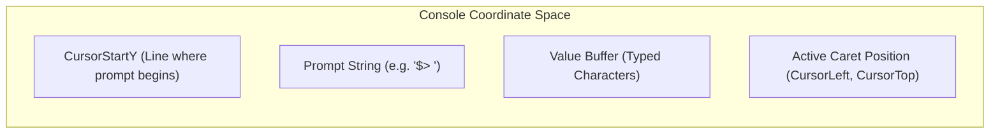
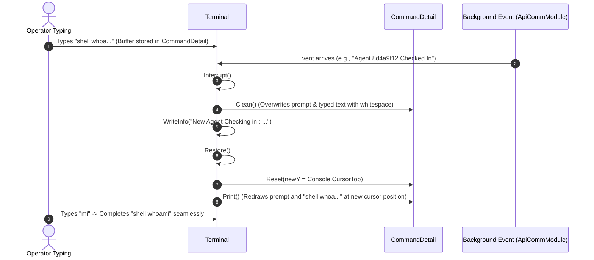

# Terminal Subsystem & Interactive Shell — Technical Guide

## Architectural Overview

The Terminal subsystem in Commander provides an interactive, full-duplex console interface. Unlike basic `Console.ReadLine()` implementations, Commander provides a custom character-by-character line editor with support for real-time background event interruption, inline character insertion/deletion, arbitrary caret repositioning, persistent shell history, and rich ANSI rendering via Spectre.Console.

```mermaid
graph TD
    subgraph TerminalSubsystem["Commander.Terminal Namespace"]
        ITerm["ITerminal (Interface Contract)"]
        Term["Terminal (Core Controller & Event Loop)"]
        TermWrite["Terminal-Write (Formatting & Spectre Bridge)"]
        CmdDetail["CommandDetail (Line Buffer & Cursor Math)"]
        CmdHist["CommandHistory (In-Memory & Disk Persistence)"]
        Consts["TerminalConstants (Color Definitions)"]
    end

    ITerm <|.. Term
    Term --> TermWrite
    Term --> CmdDetail
    Term --> CmdHist
    TermWrite --> Consts
```

---

## Core Terminal Loop & Key Processing (`Terminal.cs`)

The terminal loop runs asynchronously in `Terminal.Start()`, querying the operating system console for keyboard events every 2 milliseconds:

```csharp
public async Task Start()
{
    // Render ASCII banner and assembly version
    this.Write(new FigletText("Fractal C2").LeftJustified().Color(Color.Green));
    this.WriteLineMarkup($"[grey]Version {Assembly.GetExecutingAssembly().GetName().Version}[/]");
    this.NewLine(false);

    while (!_token.IsCancellationRequested)
    {
        if (Console.KeyAvailable)
        {
            var key = Console.ReadKey(true);
            try
            {
                this.HandleKey(key);
            }
            catch (Exception e)
            {
                this.WriteError("Terminal Error :", e.ToString());
                this.CanHandleInput = true;
            }
        }
        await Task.Delay(2);
    }
}
```

### Key Handling Mechanics (`HandleKey`)
`HandleKey(ConsoleKeyInfo key)` routes keystrokes to either history navigation, command submission, or inline editing:

| Key Sequence | Action / Destination | Method Invocation |
| :--- | :--- | :--- |
| **`Enter`** | Commits command to history and fires event | `InputValidated?.Invoke(this, line)` |
| **`Up Arrow`** | Navigates to earlier command in history | `History.Previous()` -> `CreateNewCommandAndPrint` |
| **`Down Arrow`** | Navigates to newer command in history | `History.Next()` -> `CreateNewCommandAndPrint` |
| **`Ctrl + C`** | Discards current line buffer without terminating process | `History.Pop()` -> `this.NewLine()` |
| **`Left / Right Arrow`** | Moves caret without modifying text | `CurrentCommand.HandleInput(HandledKey.LeftArrow)` |
| **`Home / End`** | Jumps caret to prompt start or line end | `CurrentCommand.HandleInput(HandledKey.Home)` |
| **`Backspace / Delete`** | Deletes preceding or targeted character | `CurrentCommand.HandleInput(HandledKey.BackSpace)` |
| **Standard Char** | Inserts character at caret index | `CurrentCommand.HandleInput(key.KeyChar)` |

---

## Line Buffer Editor & Cursor Math (`CommandDetail.cs`)

`CommandDetail` models the active input buffer. Because user input can span multiple lines when terminal wrapping occurs, `CommandDetail` maintains rigorous mathematical coordinate tracking:



### Mathematical Formulations:
1. **Full Line Length**:
   $$\text{FullLength} = \text{Prompt.Length} + \text{Value.Length}$$
2. **Relative Caret Y Offset**:
   $$\text{LocalCursorY} = \text{Console.CursorTop} - \text{CursorStartY}$$
3. **Caret Index in String Buffer**:
   $$\text{CursorValueIndex} = (\text{LocalCursorY} \times \text{Console.WindowWidth}) + \text{Console.CursorLeft} - \text{Prompt.Length}$$
4. **Caret Repositioning by Index**:
   $$\text{Console.CursorTop} = \text{CursorStartY} + \lfloor \frac{\text{Index} + \text{Prompt.Length}}{\text{Console.WindowWidth}} \rfloor$$
   $$\text{Console.CursorLeft} = (\text{Index} + \text{Prompt.Length}) \pmod{\text{Console.WindowWidth}}$$

### Inline Editing Algorithm (`PutCharAt`)
When a character is typed midway through an existing command string:
1. Moves the console cursor to the insertion position.
2. Clears the trailing text by printing empty spaces.
3. Inserts the character into the string (`this.Value.Insert(index, c)`).
4. Redraws the remaining substring (`PrintAfter(index)`).
5. Advances the caret coordinate by one position.

---

## The Non-Destructive Interruption Pattern

In a collaborative C2 platform, agents check in and tasks complete asynchronously while the operator is actively composing a command. If an uncoordinated write occurs, the prompt becomes illegible.

Commander solves this with the **`Interrupt()` and `Restore()` pattern**:



### Implementation:
```csharp
public void Interrupt()
{
    this.CurrentCommand.Interrupt(); // Erases prompt and input from screen
}

public void Restore()
{
    this.CurrentCommand.Reset(Console.CursorTop); // Adapts to lines pushed by alert
    this.CurrentCommand.Print();                  // Re-renders prompt and typed text
}
```

---

## Persistent Command History (`CommandHistory.cs`)

`CommandHistory` manages chronological command retention:
- **Local File Persistence**: Appends every executed command to `command_history.txt`.
- **Session Restoration**: When Commander starts, it reads `command_history.txt` line-by-line, priming the in-memory history buffer.
- **Bidirectional Traversal**: `Previous()` and `Next()` cycle through previous commands.
- **Top-of-Stack Tracking**: `IsMostRecent(cmd)` distinguishes active line buffer editing from historical playback.
- **Clean Discard (`Pop()`)**: Discards empty or canceled command drafts when `Ctrl + C` is pressed.

---

## Spectre.Console Integration & Formatting (`Terminal-Write.cs`)

`Terminal-Write.cs` provides unified console output wrappers supporting both standard ANSI console output and rich Spectre.Console widgets:

```csharp
public void Write(IRenderable item)      => AnsiConsole.Write(item);
public void WriteMarkup(string markup)   => AnsiConsole.Markup(markup);
public void WriteLineMarkup(string text) => AnsiConsole.MarkupLine(text);
```

### Message Classification & Palette (`TerminalConstants.cs`):
```csharp
public static ConsoleColor SuccessColor = ConsoleColor.Green;
public static ConsoleColor ErrorColor = ConsoleColor.Red;
public static ConsoleColor InfoColor = ConsoleColor.Cyan;
public static ConsoleColor PromptColor = ConsoleColor.White;
public static ConsoleColor DefaultForeGroundColor = ConsoleColor.White;
public static ConsoleColor DefaultBackGroundColor = ConsoleColor.Black;
```

---

## Technical Cross-Reference

- Startup and lifecycle coordination: [Architecture & DI](./architecture-and-di.md).
- Event wiring from communication module: [Communication & State Sync](./communication-and-state-sync.md).
- Execution dispatching and prompt management: [Command Framework & Execution](./command-framework-and-execution.md).
