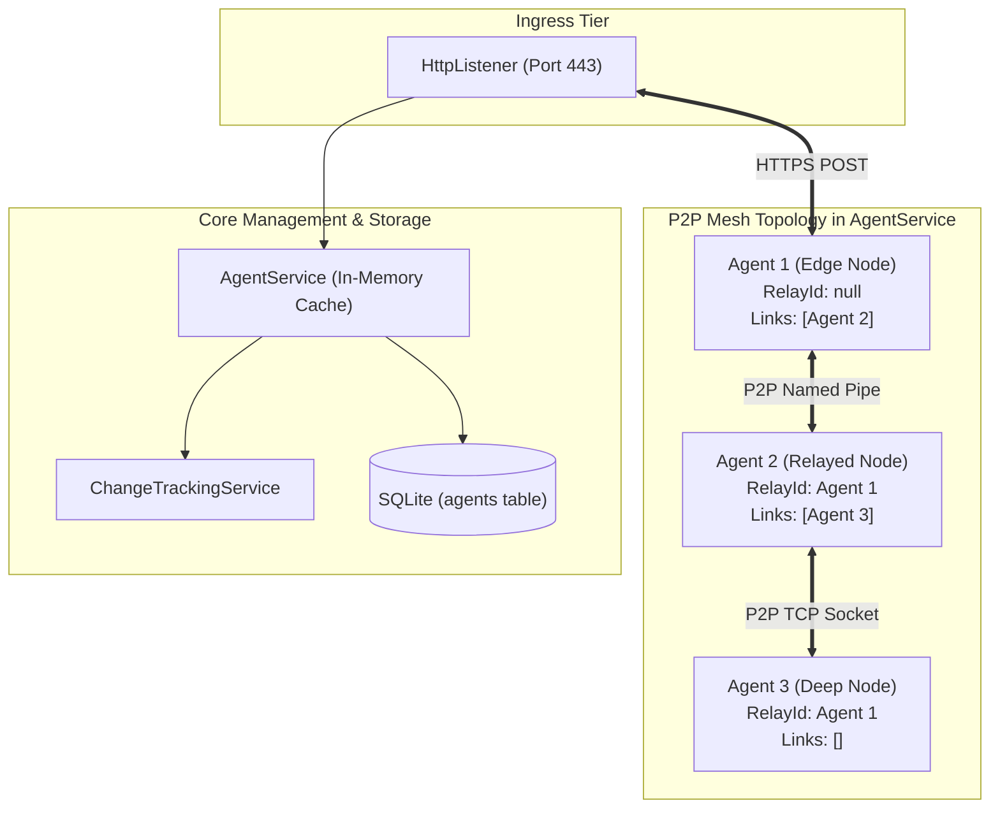
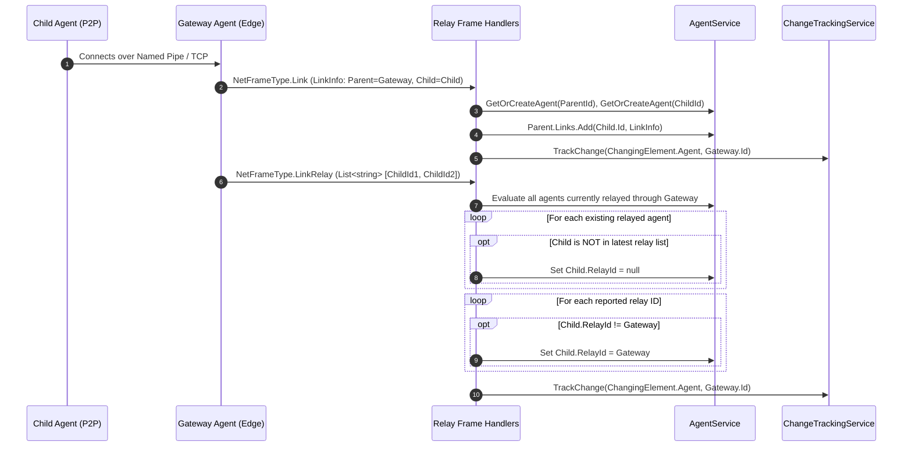

# Agent & Relay System — Technical Guide

## System Overview

The **Agent & Relay System** manages the lifecycle, connectivity state, system metadata, and multi-tier peer-to-peer (P2P) mesh topology of all deployed implants.

Because implants frequently operate behind firewalls or within segmented networks without direct internet access, the system supports both direct edge connections and daisy-chained relaying over internal transports (such as TCP or Named Pipes).



---

## Core Data Structures

### `Agent` (`Models/Agent/Agent.cs`)
Represents the runtime state of a tracked implant:

```csharp
public class Agent
{
    public string Id { get; protected set; }
    public string RelayId { get; set; }
    public Dictionary<string, LinkInfo> Links { get; protected set; } = new();
    public Shared.AgentMetadata Metadata { get; set; }
    public DateTime LastSeen { get; set; }
    public DateTime FirstSeen { get; set; }
    public string ListenerId { get; set; }
    public bool CheckInrequested { get; set; } = false;

    public Agent(string id)
    {
        Id = id;
        FirstSeen = DateTime.UtcNow;
    }
}
```

- **`Id`**: Unique alphanumeric ShortGuid identifier.
- **`RelayId`**: Identifier of the gateway agent through which this agent reaches the TeamServer (`null` if directly connected to a listener).
- **`Links`**: Map of child peer connections established via P2P listeners (`LinkInfo`).
- **`CheckInrequested`**: Boolean flag tracking whether the server has dispatched an initial metadata interrogation frame to this agent.

### `AgentMetadata` (`Shared/AgentMetadata.cs`)
System fingerprinting payload captured upon initial check-in:

| Field | Type | Description |
| :--- | :--- | :--- |
| `Hostname` | `string` | NetBIOS / DNS hostname of the target host. |
| `UserName` | `string` | User context under which the agent process is executing. |
| `ProcessName` | `string` | Process image name (e.g., `dllhost`, `powershell`). |
| `ProcessId` | `int` | Operating system process ID (PID). |
| `Integrity` | `IntegrityLevel` | Windows token security level (`Low`, `Medium`, `High`, `System`). |
| `Architecture` | `string` | Operating system architecture (`x86` or `x64`). |
| `EndPoint` | `string` | IP address and port string reported by the host. |
| `SleepInterval` | `int` | Agent heartbeat sleep time in seconds. |
| `SleepJitter` | `int` | Percentage variation applied to heartbeat interval. |

---

## The `AgentService` Architecture (`Services/AgentService.cs`)

`AgentService` implements `IAgentService` and `IStorable`. It maintains an in-memory dictionary of all active implants (`_agents`) synchronized with SQLite storage (`AgentDao`):

```csharp
[InjectableService]
public interface IAgentService : IStorable
{
    void AddAgent(Agent agent);
    IEnumerable<Agent> GetAgents();
    Agent GetAgent(string id);
    void RemoveAgent(Agent agent);
    List<Agent> GetAgentToRelay(string id);
    Agent GetOrCreateAgent(string agentId);
    void Checkin(Agent agent, AgentMetadata metaData = null);
}
```

### In-Memory Cache with Database Mirroring
1. **`AddAgent(agent)`**: Adds or updates the agent in the local dictionary. Checks `AgentDao` in SQLite; if existing, executes `_dbService.Update()`, otherwise `_dbService.Insert()`.
2. **`Checkin(agent, metadata)`**: Updates `LastSeen = DateTime.UtcNow` and refreshes metadata if provided.
3. **`RemoveAgent(agent)`**: Removes the agent from active memory and flags `IsDeleted = true` in SQLite (soft deletion).
4. **`LoadFromDB()`**: Invoked at server startup by the `IStorable` discovery engine. Clears in-memory dictionaries and reloads all non-deleted agents from SQLite.

---

## P2P Relay Mesh Protocol & Handlers

The mesh topology is continuously updated through four dedicated frame handlers:



### 1. `CheckinFrameHandler` (`NetFrameType.CheckIn`)
- Handles incoming check-ins from both direct and relayed agents.
- If `frame.Source != relay`, marks `agent.RelayId = relay`, tracking the path to the child node.
- Calls `AgentService.Checkin(agent, metadata)`.
- Dispatches `ChangingElement.Agent` and `ChangingElement.Metadata` change events.

### 2. `LinkFrameHandler` & `LinksFrameHandler` (`NetFrameType.Link` / `NetFrameType.Links`)
- Registers parent-child peer connections announced by either endpoint.
- Populates `parent.Links[child.Id] = linkInfo`.

### 3. `UnlinkFrameHandler` (`NetFrameType.Unlink`)
- Removes the severed child connection from `parent.Links`.

### 4. `LinkRelayFrameHandler` (`NetFrameType.LinkRelay`)
- Synchronizes the set of active child agents currently reaching TeamServer through an edge node.
- Automatically clears `RelayId` for child implants that have dropped off the edge relay.

---

## Mesh-Aware Outbound Frame Multiplexing

When an edge gateway agent checks in at `HttpListenerController.HandleImplant()`, the controller retrieves pending outbound frames for the edge agent **and all child agents currently routing through it**:

```csharp
var returnedFrames = new List<NetFrame>();

// Gather queued frames for edge agent and all its relayed children
foreach (var relayedAgent in this._agentService.GetAgentToRelay(agent.Id))
{
    returnedFrames.AddRange(this._frameService.ExtractCachedFrame(relayedAgent.Id));
}

var ser = await returnedFrames.BinarySerializeAsync();
return Ok(Convert.ToBase64String(ser));
```

The edge agent unpacks the frame bundle and routes each frame across internal pipes or TCP sockets matching `frame.Destination`.

---

## Technical Reference Links

- **Frame Processing Engine**: [Frame Handling & Cryptography](./frame-handling-and-cryptography.md)
- **Ingress Controller**: [Listener Subsystem](./listener-subsystem.md)
- **Database Entity Mapping**: [Storage & Persistence](./storage-and-persistence.md)
- **Functional Guide**: [Agent Management Functional Doc](../../Functional/TeamServer/agent-management.md)
