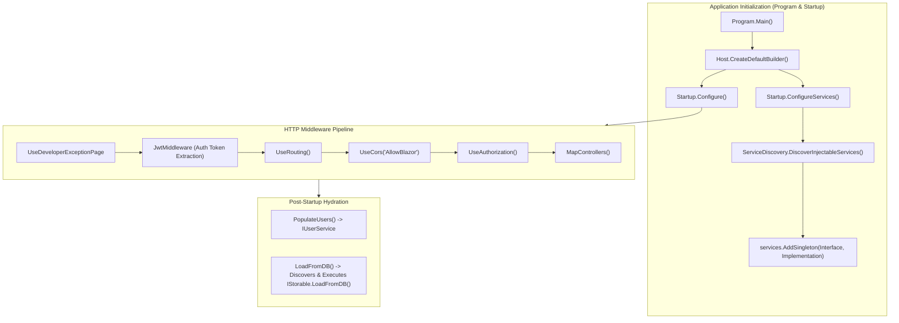
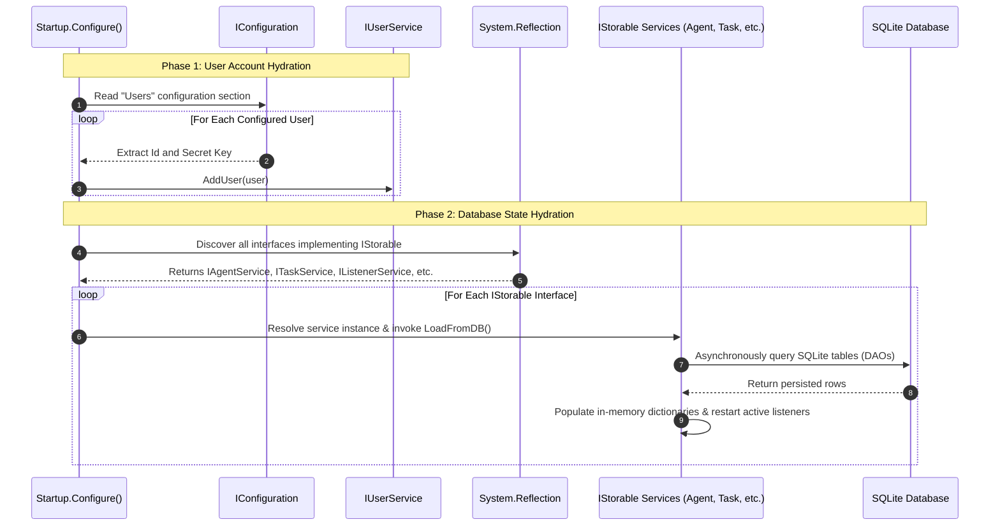

# Architecture, Hosting & Dependency Injection — Technical Guide

## Architectural Overview

The **FractalC2 TeamServer** is built as an ASP.NET Core Web Application on **.NET 8.0**. It serves two concurrent hosting roles:
1. **Administrative REST API Server**: Provides an authenticated, CORS-enabled HTTP API consumed by operator interfaces (such as Blazor web consoles, desktop clients, or automated CLI tools).
2. **Dynamic Ingress Orchestrator**: Manages independent, embedded Kestrel web servers running on arbitrary ports to handle agent command-and-control channels and staging endpoints.



---

## Hosting Model & Entry Point

### `Program.cs`
The entry point initializes the ASP.NET Core generic host using `Host.CreateDefaultBuilder(args)` and binds the web host to `Startup`:

```csharp
public class Program
{
    public static void Main(string[] args)
    {
        CreateHostBuilder(args).Build().Run();
    }

    public static IHostBuilder CreateHostBuilder(string[] args) =>
        Host.CreateDefaultBuilder(args)
            .ConfigureWebHostDefaults(webBuilder =>
            {
                webBuilder.UseStartup<Startup>();
            });
}
```

The host configuration binds Kestrel to the URL specified in `appsettings.json` (typically `http://*:5000` for administrative access).

---

## Reflection-Based Dependency Injection Engine

Rather than maintaining a large, brittle list of manual service registrations in `Startup.cs`, TeamServer implements a custom reflection-based discovery engine.

### Attributes (`InjectableAttributes.cs`)
Services declare their injection intent using two custom metadata attributes:

```csharp
[AttributeUsage(AttributeTargets.Interface)]
public class InjectableServiceAttribute : Attribute { }

[AttributeUsage(AttributeTargets.Class)]
public class InjectableServiceImplementationAttribute : Attribute
{
    public Type ServiceType { get; set; }
    public InjectableServiceImplementationAttribute(Type serviceType)
    {
        ServiceType = serviceType;
    }
}
```

### Discovery Routine (`ServiceDiscovery.cs`)
During `ConfigureServices`, `ServiceDiscovery.DiscoverInjectableServices()` inspects all types in the executing assembly:
1. Identifies all interfaces decorated with `[InjectableService]`.
2. Locates the matching concrete class decorated with `[InjectableServiceImplementation(typeof(IService))]` (or by type assignment).
3. Registers each pair as a **Singleton** in the ASP.NET Core `IServiceCollection`.

```csharp
var discoveredServices = ServiceDiscovery.DiscoverInjectableServices(Assembly.GetExecutingAssembly());

foreach (var (serviceInterface, implementation) in discoveredServices)
    services.AddSingleton(serviceInterface, implementation);
```

### Architectural Benefits
- **Zero-Maintenance Registration**: Adding a new service requires only decorating the interface and implementation class; no changes to `Startup.cs` are needed.
- **Strict Singleton Lifecycle**: Because TeamServer maintains active in-memory frame queues, connected TCP proxies, and listener threads, singleton lifecycles ensure all controllers and frame handlers reference the exact same operational state.

---

## Startup Sequence & Hydration Pipeline

Once the HTTP pipeline is configured in `Startup.Configure()`, the server executes two critical post-startup hydration tasks:



### 1. `PopulateUsers()`
Reads the `Users` array from `appsettings.json` and loads authorized operator accounts into the in-memory `IUserService`.

### 2. `LoadFromDB()` (`IStorable` Pattern)
TeamServer uses the **In-Memory Cache with Database Backing** pattern. Any service that manages persisted state implements the `IStorable` interface:

```csharp
public interface IStorable
{
    Task LoadFromDB();
}
```

At startup, reflection scans the container for all registered services implementing `IStorable` and calls `LoadFromDB()`. This automatically:
- Loads active agents into memory (`IAgentService`).
- Hydrates previous tasks and execution results (`ITaskService`, `ITaskResultService`).
- Restores and automatically restarts all running C2 listeners (`IListenerService`).
- Reloads hosted files and access logs (`IWebHostService`).
- Re-registers stored implants (`IImplantService`).

---

## Configuration Architecture

Configuration is managed hierarchically via `IConfiguration` and strongly typed extension helpers (`ConfigurationExtension.cs`):

```csharp
public static class ConfigurationExtension
{
    public static FoldersConfig FoldersConfigs(this IConfiguration config) => ...;
    public static SpawnConfig SpawnConfigs(this IConfiguration config) => ...;
}
```

### Key Configuration Sections (`appsettings.json`)

```json
{
    "urls": "http://*:5000",
    "ServerKey": "MXlPZEVWWGVmN2xqbnpyUg==",
    "EncryptFrames": true,
    "Users": [
        {
            "Id": "Fropops",
            "Key": "lFAsXztlvBRVMr2DduUI7S2cSyIkodgC?S42aLF6..."
        }
    ],
    "Folders": {
        "DBFolder": "E:\\Share\\tmp\\FractalC2\\DB",
        "LootFolder": "E:\\Share\\tmp\\FractalC2\\Loot",
        "ToolsFolder": "E:\\Share\\Projects\\FractalC2\\Install\\Tools",
        "AuditFolder": "E:\\Share\\tmp\\FractalC2\\Audit",
        "ImplantTemplatesFolder": "E:\\Share\\Projects\\FractalC2\\PayloadTemplates",
        "ImplantsFolder": "E:\\Share\\tmp\\FractalC2\\Implants",
        "WorkingFolder": "E:\\Share\\tmp\\FractalC2\\tmp",
        "DonutFolder": "E:\\Share\\tools\\donut",
        "PythonFolder": "C:\\Users\\Olivier\\AppData\\Local\\Python\\pythoncore-3.14-64"
    },
    "Spawn": {
        "SpawnToX86": "c:\\windows\\SysWOW64\\dllhost.exe",
        "SpawnToX64": "c:\\windows\\system32\\dllhost.exe"
    }
}
```

- **`ServerKey`**: Master Base64 encryption key shared with deployed implants for frame encryption.
- **`EncryptFrames`**: Boolean switch enabling or disabling AES-CBC frame encryption.
- **`Folders`**: Central file paths for SQLite database, loot artifacts, offensive tools catalog, audit logs, and Donut shellcode compiler.
- **`Spawn`**: Default sacrificial target processes used for fork-and-run execution on target hosts.

---

## Error Handling & Global Logging

### Custom File Logger (`Logger.cs`)
A lightweight, high-performance static logger writes diagnostic and operational traces directly to `log.log`:

```csharp
public static class Logger
{
    public static bool Active { get; set; } = true;
    public static string FileName { get; set; } = "log.log";
    public static void Log(string message)
    {
        if (!Active) return;
        File.AppendAllText(FileName, $"{DateTime.Now} => {message}{Environment.NewLine}");
    }
}
```

### Global Exception Middleware (`MiddleWare/Exception.cs`)
ASP.NET Core errors are captured using `ConfigureExceptionHandler`, ensuring unhandled exceptions return structured JSON error payloads with status `500 Internal Server Error` while logging diagnostic details to the system logger.

---

## Technical Reference Links

- **Frame Routing & Crypto**: [Frame Handling & Cryptography](./frame-handling-and-cryptography.md)
- **Database Architecture**: [Storage & Persistence](./storage-and-persistence.md)
- **Operator Security**: [Security, Authentication & Audit](./security-auth-and-audit.md)
- **Functional Overview**: [Functional Index](../../Functional/TeamServer/index.md)
