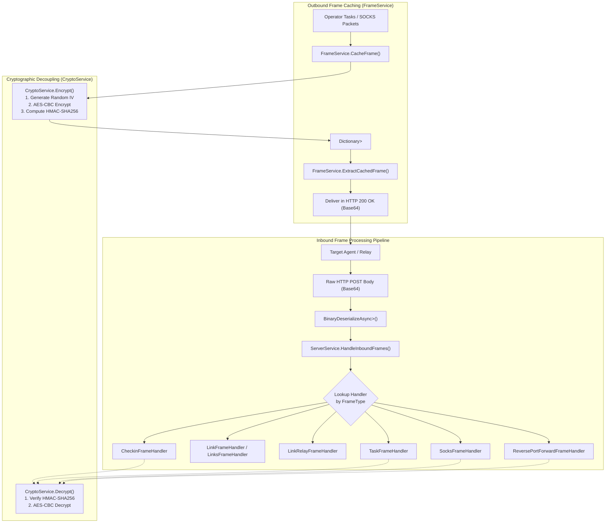

# Frame Handling & Cryptography — Technical Guide

## System Overview

All communication between the FractalC2 TeamServer and deployed implants—including check-in telemetry, task dispatching, execution results, peer-to-peer relaying, and network pivoting packets—is encapsulated into an abstract binary packet protocol known as **NetFrames**.

The Frame Handling & Cryptography subsystem is responsible for:
1. **Authenticated Payload Encryption**: Ensuring confidential, tamper-proof communication over untrusted networks using AES-256-CBC and HMAC-SHA256.
2. **Binary Frame Multiplexing**: Serializing diverse operational payloads into compact binary frames via `BinarySerializer`.
3. **Outbound Frame Caching & Queue Management**: Buffering outbound tasks and proxy data per destination agent until the next check-in cycle.
4. **Polymorphic Inbound Frame Dispatching**: Decoupling frame parsing into specialized handler classes dynamically discovered at runtime.



---

## The `NetFrame` Protocol Structure

A `NetFrame` (`Shared.NetFrame`) is the foundational unit of network transmission across the FractalC2 architecture:

```csharp
public class NetFrame
{
    public string Source { get; set; }
    public string Destination { get; set; }
    public NetFrameType FrameType { get; set; }
    public byte[] Data { get; set; }
}
```

### Supported Frame Types (`NetFrameType`)

| Type | Wire Value | Direction | Payload Type | Description |
| :--- | :--- | :--- | :--- | :--- |
| `CheckIn` | `0` | Inbound | `AgentMetadata` | Agent system fingerprint and check-in announcement. |
| `Task` | `1` | Outbound | `AgentTask` | Tasking command dispatched to the agent. |
| `TaskResult` | `2` | Inbound | `AgentTaskResult` | Execution logs, status, and exfiltrated files. |
| `Link` | `3` | Inbound | `LinkInfo` | Single peer-to-peer mesh link establishment. |
| `Unlink` | `4` | Inbound | `LinkInfo` | Peer-to-peer mesh link termination. |
| `Links` | `5` | Inbound | `List<LinkInfo>` | Full snapshot of an agent's active peer links. |
| `LinkRelay` | `6` | Inbound | `List<string>` | Updated list of child agent IDs routing through an edge relay. |
| `Socks` | `7` | Bidirectional| `Socks4Packet` | Multiplexed SOCKS4 tunneling packets. |
| `ReversePortForward` | `8` | Bidirectional| `ReversePortForwardPacket` | Multiplexed reverse port forwarding packets. |

---

## Cryptographic Security Model (`CryptoService.cs`)

The `CryptoService` provides authenticated symmetric encryption using the server's master key (`ServerKey`).

### Wire Format Layout
When frame encryption is active (`EncryptFrames: true`), the frame data payload conforms to the following byte layout:

```text
+---------------------+-------------------------------+----------------------------------+
| IV (16 Bytes)       | HMAC-SHA256 (32 Bytes)        | AES-256-CBC Encrypted Payload   |
+---------------------+-------------------------------+----------------------------------+
|<----------------- 48 Bytes Header ----------------->|<-------- Variable Length ------->|
```

### 1. Encryption Procedure (`Encrypt`)
1. Generates a fresh, cryptographically secure 16-byte random Initialization Vector (IV).
2. Encrypts the raw serialized object bytes using **AES-256-CBC** with PKCS7 padding.
3. Computes an **HMAC-SHA256** checksum over the ciphertext using `Key`.
4. Combines the IV, HMAC checksum, and ciphertext into a single continuous byte buffer.

```csharp
public byte[] Encrypt(byte[] data)
{
    using var aes = Aes.Create();
    aes.Mode = CipherMode.CBC;
    aes.Key = this.Key;
    aes.GenerateIV();

    using var transform = aes.CreateEncryptor();
    var enc = transform.TransformFinalBlock(data, 0, data.Length);
    var checksum = ComputeHmac(enc);

    var buf = new byte[aes.IV.Length + checksum.Length + enc.Length];
    Buffer.BlockCopy(aes.IV, 0, buf, 0, aes.IV.Length);
    Buffer.BlockCopy(checksum, 0, buf, aes.IV.Length, checksum.Length);
    Buffer.BlockCopy(enc, 0, buf, aes.IV.Length + checksum.Length, enc.Length);

    return buf;
}
```

### 2. Decryption Procedure (`Decrypt`)
1. Extracts the 16-byte IV and 32-byte HMAC checksum from the buffer header.
2. Slices out the ciphertext (remaining `data.Length - 48` bytes).
3. Recomputes the HMAC-SHA256 over the ciphertext and compares it using `SequenceEqual()`. If verification fails, decryption is aborted immediately with an `"Invalid Checksum"` exception, preventing padding oracle attacks.
4. Decrypts the ciphertext using AES-256-CBC and returns plaintext bytes.

---

## Frame Caching & Queue Management (`FrameService.cs`)

Because agents operate on polling sleep cycles or through multi-hop relays, commands cannot be delivered via synchronous push. The `FrameService` acts as an in-memory message broker maintaining private outbound FIFO queues per agent destination:

```csharp
private Dictionary<string, Queue<NetFrame>> _CachedFrames = new();
```

### Core Operations

```csharp
public interface IFrameService
{
    byte[] GetData(NetFrame frame);
    void AddCahedFrames(NetFrame frame);
    NetFrame CacheFrame(string destination, NetFrameType typ, byte[] data);
    NetFrame CacheFrame<T>(string destination, NetFrameType typ, T item);
    NetFrame CacheCheckInFrame(string destination);
    Queue<NetFrame> ExtractCachedFrame(string destination);
}
```

- **`CacheFrame<T>(destination, type, item)`**: Serializes the payload using `BinarySerializer`, encrypts the resulting bytes via `CryptoService`, constructs a `NetFrame`, and pushes it onto the destination agent's queue.
- **`CacheCheckInFrame(destination)`**: Queues a special task requesting the agent to return fresh metadata.
- **`ExtractCachedFrame(destination)`**: Atomically drains and returns all queued frames for the given agent when it contacts a listener.

---

## Inbound Frame Dispatcher Pipeline (`ServerService.cs`)

The `ServerService` manages a collection of `FrameHandler` instances discovered automatically at startup via reflection:

```csharp
private void LoadModules()
{
    var self = Assembly.GetExecutingAssembly();
    foreach (var type in self.GetTypes())
    {
        if (!type.IsSubclassOf(typeof(FrameHandler))) continue;
        var handler = (FrameHandler)Activator.CreateInstance(type);
        handler.Init(this);
        _handlers.Add(handler);
    }
}
```

### Handler Hierarchy & Responsibilities

```mermaid
classDiagram
    class FrameHandler {
        <<abstract>>
        +IServerService Server
        +NetFrameType FrameType*
        +ProcessFrame(NetFrame frame, string relay)*
        #ExtractFrameData~T~(NetFrame frame)
    }

    class CheckinFrameHandler {
        +FrameType = NetFrameType.CheckIn
        +ProcessFrame()
    }
    class TaskFrameHandler {
        +FrameType = NetFrameType.TaskResult
        +ProcessFrame()
    }
    class LinkFrameHandler {
        +FrameType = NetFrameType.Link
        +ProcessFrame()
    }
    class LinksFrameHandler {
        +FrameType = NetFrameType.Links
        +ProcessFrame()
    }
    class UnlinkFrameHandler {
        +FrameType = NetFrameType.Unlink
        +ProcessFrame()
    }
    class LinkRelayFrameHandler {
        +FrameType = NetFrameType.LinkRelay
        +ProcessFrame()
    }
    class SocksFrameHandler {
        +FrameType = NetFrameType.Socks
        +ProcessFrame()
    }
    class ReversePortForwardFrameHandler {
        +FrameType = NetFrameType.ReversePortForward
        +ProcessFrame()
    }

    FrameHandler <|-- CheckinFrameHandler
    FrameHandler <|-- TaskFrameHandler
    FrameHandler <|-- LinkFrameHandler
    FrameHandler <|-- LinksFrameHandler
    FrameHandler <|-- UnlinkFrameHandler
    FrameHandler <|-- LinkRelayFrameHandler
    FrameHandler <|-- SocksFrameHandler
    FrameHandler <|-- ReversePortForwardFrameHandler
```



- **`CheckinFrameHandler`**: Deserializes `AgentMetadata`, associates the agent with its relay gateway, updates check-in timestamps, and triggers operator delta changes.
- **`TaskFrameHandler`**: Ingests command output, detects exfiltrated files (`Download` / `Capture`), saves files into `LootService`, and updates task result records.
- **`LinkFrameHandler` / `LinksFrameHandler` / `UnlinkFrameHandler`**: Updates in-memory parent-child mesh routing dictionaries on parent agents.
- **`LinkRelayFrameHandler`**: Updates routing mappings for internal agents relayed through edge nodes.
- **`SocksFrameHandler`**: Unblocks, streams data to, or tears down active `SocksClient` TCP streams.
- **`ReversePortForwardFrameHandler`**: Manages dynamic outbound reverse port forward client connections.

---

## Technical Reference Links

- **Agent Mesh Implementation**: [Agent & Relay System](./agent-and-relay-system.md)
- **Task Dispatching**: [Tasking & Interception Engine](./tasking-and-interception.md)
- **Network Pivoting Internals**: [Network Forwarding](./network-forwarding.md)
- **Functional Overview**: [Agent Management Functional Doc](../../Functional/TeamServer/agent-management.md)
