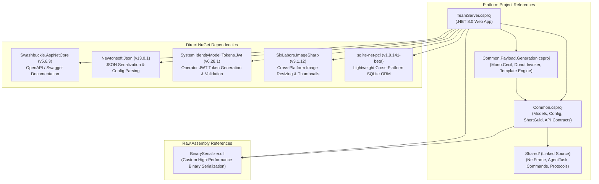
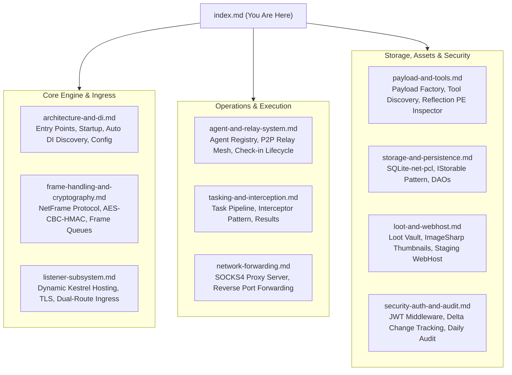

# FractalC2 TeamServer — Technical Documentation

## Project Overview

| Property | Value |
| :--- | :--- |
| **Project File** | `TeamServer.csproj` |
| **Target Framework** | .NET 8.0 (`net8.0`) |
| **Project SDK** | `Microsoft.NET.Sdk.Web` (ASP.NET Core Web Application) |
| **Assembly / File Version** | `2.4.1.0` |
| **Primary Output** | Executable Web Application / Kestrel HTTP Host (`TeamServer.exe` / `TeamServer.dll`) |
| **Role in Solution** | Central command-and-control (C2) server and state coordinator for the FractalC2 platform. Hosts the administrative REST API, terminates agent C2 channels, manages dynamic listeners, coordinates peer-to-peer relay meshes, handles task interception and payload compilation, and manages persistent operational storage. |

---

## Solution Dependency Map

The TeamServer project is tightly integrated with core platform libraries while keeping third-party dependencies focused on performance, cross-platform persistence, and security primitives:

### Dependency Rationale

| Dependency | Scope / Type | Architectural Role & Purpose |
| :--- | :--- | :--- |
| **`Common`** | Project Reference | Shared data models (`TeamServerAgent`, `TeamServerAgentTask`, `TeamServerListener`), API request/response contracts, folder configuration parsers (`FoldersConfig`, `SpawnConfig`), and utility classes (`ShortGuid`, `PathHelper`). |
| **`Common.Payload.Generation`** | Project Reference | Compiles and patches implants on demand using `Mono.Cecil`, invokes the Donut shellcode generator for unmanaged executable execution, and manages payload templates. |
| **`BinarySerializer`** | Assembly Reference | High-performance, low-overhead binary serialization engine used across the platform for packing and unpacking `NetFrame` structures, task parameters, results, and network tunnel packets. |
| **`sqlite-net-pcl`** | Package Reference | Asynchronous, zero-dependency SQLite ORM providing persistent storage for agents, tasks, listeners, implants, results, and web host logs without requiring external database servers. |
| **`SixLabors.ImageSharp`** | Package Reference | Pure-managed, cross-platform image processing library used by `LootService` to generate JPEG preview thumbnails from captured screenshots without native GDI+ dependencies. |
| **`System.IdentityModel.Tokens.Jwt`** | Package Reference | Generates and cryptographically verifies HMAC-SHA256 signed JSON Web Tokens for operator authentication and session management. |
| **`Newtonsoft.Json`** | Package Reference | Serializes complex configuration structures, polymorphic payload settings, and JSON payloads across controllers. |
| **`Swashbuckle.AspNetCore`** | Package Reference | Generates interactive Swagger OpenAPI documentation during development environments. |

---

## Technical Component Guide

The TeamServer codebase is partitioned into specialized namespaces and architectural layers:

### Component Directory & Documentation Map

| Component Page | Responsibility / Scope | Key Classes & Interfaces |
| :--- | :--- | :--- |
| [**Architecture & DI Discovery**](./architecture-and-di.md) | Entry point, web host bootstrap, attribute-driven dependency injection discovery, configuration binding, and global error handling. | `Program`, `Startup`, `ServiceDiscovery`, `[InjectableService]`, `[InjectableServiceImplementation]` |
| [**Frame Handling & Cryptography**](./frame-handling-and-cryptography.md) | Binary frame multiplexing, AES-256-CBC authenticated encryption, in-memory frame queuing, and polymorphic frame handlers. | `IFrameService`, `FrameService`, `ICryptoService`, `CryptoService`, `IServerService`, `FrameHandler` |
| [**Agent & Relay System**](./agent-and-relay-system.md) | In-memory agent tracking, metadata management, P2P mesh discovery, and relay route updates. | `IAgentService`, `AgentService`, `Agent`, `CheckinFrameHandler`, `LinkFrameHandler`, `LinkRelayFrameHandler` |
| [**Tasking & Interception Engine**](./tasking-and-interception.md) | Task queuing, automated payload interception, Donut shellcode generation, and result streaming. | `ITaskService`, `TaskService`, `ITaskResultService`, `ITaskInterceptionService`, `TaskInterceptor` |
| [**Listener Subsystem**](./listener-subsystem.md) | Dynamic embedded Kestrel hosting, port sharing, TLS certificate termination, and unified ingress routing. | `IListenerService`, `ListenerService`, `Listener`, `HttpListener`, `HttpListenerController` |
| [**Network Forwarding**](./network-forwarding.md) | High-performance multi-threaded SOCKS4 proxy server and asynchronous Reverse Port Forwarding engine. | `ISocksService`, `SocksService`, `SocksProxy`, `SocksClient`, `IReversePortForwardService`, `RPortFwdClient` |
| [**Payload Generation & Tools**](./payload-and-tools.md) | Integration with `Common.Payload.Generation`, tool armory scanning, and reflection-based .NET/PE classification. | `IImplantService`, `ImplantService`, `IToolsService`, `ToolService`, `PayloadGenerator` |
| [**Storage & Persistence**](./storage-and-persistence.md) | Asynchronous SQLite ORM, database schema management, `IStorable` startup hydration, and entity DAOs. | `IDatabaseService`, `DatabaseService`, `IStorable`, `AgentDao`, `TaskDao`, `ResultDao`, `ImplantDao` |
| [**Loot & WebHost Subsystem**](./loot-and-webhost.md) | Exfiltrated asset vault, ImageSharp thumbnail caching, and staging web host with access logging. | `ILootService`, `LootService`, `IWebHostService`, `WebHostService`, `WebHostLogDao` |
| [**Security, Authentication & Audit**](./security-auth-and-audit.md) | Operator authentication, JWT validation middleware, real-time delta change tracking, and rotating audit trails. | `IUserService`, `UserService`, `IJwtUtils`, `JwtUtils`, `JwtMiddleware`, `IChangeTrackingService`, `IAuditService` |

---

## Build Configurations & Compilation Options

`TeamServer.csproj` defines multiple build configurations for different deployment targets:

| Configuration | Target Framework | Purpose & Compiler Behavior |
| :--- | :--- | :--- |
| `Debug` | `net8.0` | Development profile with debugging symbols, Swagger UI enabled, and developer error pages. |
| `Release` | `net8.0` | Optimized production build for high-throughput C2 operations. |
| `ReleaseButDebug` | `net8.0` | Optimized IL generation with full debug symbols for production diagnostic profiling. |
| `Local` | `net8.0` | Local developer loopback configuration. |

For functional workflows, business rules, and user-facing capabilities, see the [Functional Documentation Index](../../Functional/TeamServer/index.md).
