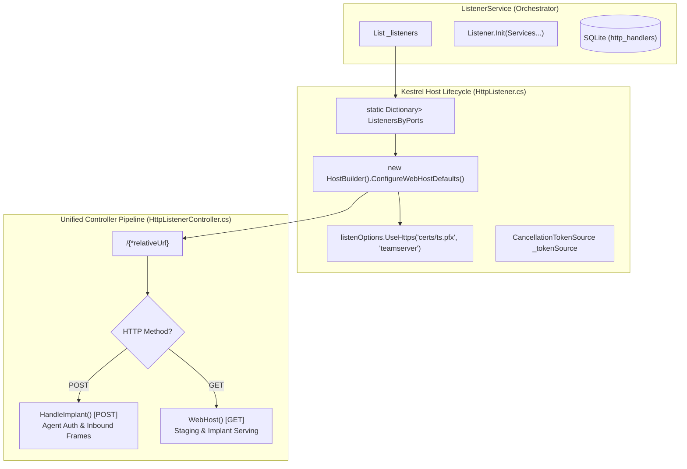

# Listener Subsystem — Technical Guide

## System Overview

The **Listener Subsystem** manages the TeamServer's network ingress endpoints. It abstracts network listeners into a modular architecture capable of hosting multiple dynamic HTTP/HTTPS ingress channels across arbitrary network interfaces and ports.

A standout characteristic of this architecture is **Dynamic Embedded Kestrel Hosting**: each physical listener port is powered by an independently managed, embedded ASP.NET Core Kestrel instance initialized and controlled programmatically at runtime.



---

## Listener Abstraction & Lifecycle

### `Listener` Base Class (`Models/Listeners/Listener.cs`)
Defines the standard contract for any network ingress channel:

```csharp
public abstract class Listener
{
    public string Id { get; protected set; }
    public virtual string Name { get; protected set; }
    public virtual string Ip { get; protected set; }
    public virtual int BindPort { get; protected set; }
    public virtual string Protocol { get; protected set; }
    public bool Secured { get; protected set; }

    public abstract Task Start();
    public abstract void Stop();
}
```

The base class maintains references to all core server singletons (`IAgentService`, `IFrameService`, `IServerService`, `ICryptoService`, `IWebHostService`, `IDatabaseService`, etc.) injected via `Init()` during registration.

---

## Embedded Kestrel Implementation (`HttpListener.cs`)

When `HttpListener.Start()` is invoked, it dynamically configures a full ASP.NET Core web host:

```csharp
var hostBuilder = new HostBuilder()
    .ConfigureWebHostDefaults(host =>
    {
        host.UseUrls($"http://*:{BindPort}");
        host.Configure(ConfigureApp);
        host.ConfigureServices(ConfigureServices);

        host.UseKestrel(options =>
        {
            options.Listen(IPAddress.Any, BindPort, listenOptions =>
            {
                if (this.Secured)
                {
                    listenOptions.UseHttps("certs/ts.pfx", "teamserver");
                }
            });
            options.Limits.MinRequestBodyDataRate =
                new MinDataRate(bytesPerSecond: 100, gracePeriod: TimeSpan.FromSeconds(20));
        });
    });

var host = hostBuilder.Build();
_tokenSource = new CancellationTokenSource();
host.RunAsync(_tokenSource.Token);
```

### Port Sharing Architecture (`ListenersByPorts`)
To allow multiple logical listeners to coordinate across the same network socket:
1. `HttpListener` maintains a static `Dictionary<int, List<HttpListener>> ListenersByPorts`.
2. The embedded Kestrel host is only constructed when the **first** listener binds to that port.
3. Subsequent listeners registering on the same port are added to the list without re-binding the socket.
4. Calling `Stop()` removes the listener from the port list; the underlying Kestrel server is cancelled via `_tokenSource.Cancel()` only when the list becomes empty.

### Child Service Container Propagation
The child Kestrel instance configures an isolated dependency injection container (`ConfigureServices`). To ensure complete state consistency with the main application, `HttpListener` registers all parent singleton instances directly into the child container.

---

## Unified Ingress Controller (`HttpListenerController.cs`)

The listener routes all incoming requests through a catch-all route mapped to `HttpListenerController.HandleRequest`:

```csharp
public async Task<IActionResult> HandleRequest(string relativeUrl)
{
    if (HttpContext.Request.Method == "POST")
        return await this.HandleImplant();
    else
        return await this.WebHost(relativeUrl);
}
```

### 1. Inbound Agent Processing (`HandleImplant()`)
Handles encrypted agent check-ins over HTTP `POST`:
1. **Authorization Check**: Reads the agent identifier from the `Authorization` request header.
2. **Body Deserialization**: Decodes the Base64 request body into `List<NetFrame>` via `BinarySerializer`.
3. **Heartbeat & Liveness**: Updates `agent.LastSeen` in `IAgentService`.
4. **Initial Interrogation**: If `agent.CheckInrequested` is false, automatically enqueues a `CheckIn` task frame to request host metadata.
5. **Relay Check-ins**: Iterates over all child agents associated with this gateway (`GetAgentToRelay(agentId)`), ensuring their heartbeat and check-in statuses are also updated.
6. **Frame Dispatch**: Passes incoming frames to `ServerService.HandleInboundFrames(frames, agentId)`.
7. **Outbound Frame Harvesting**: Extracts all queued outbound frames for the edge agent and all its relayed children (`ExtractCachedFrame`).
8. **Binary Response**: Serializes outbound frames into a Base64-encoded binary string and returns `200 OK`.

### 2. Public Staging & Web Hosting (`WebHost()`)
Handles public downloads over HTTP `GET`:
1. **Access Audit Telemetry**: Captures incoming client headers (`UserAgent`), request URL, path, and timestamp.
2. **Payload Routing**:
   - If the path matches `imp/{implantName}`, retrieves the compiled implant from `IImplantService` and returns the binary.
   - Otherwise, queries `IWebHostService.GetFile(path)`.
3. **Logging & Response**: If found, records status `200` in `WebHostLogDao` and streams the file as `application/octet-stream`; if missing, records status `404` and returns `NotFound()`.

---

## Technical Reference Links

- **Frame Dispatching Pipeline**: [Frame Handling & Cryptography](./frame-handling-and-cryptography.md)
- **Agent Registry Interaction**: [Agent & Relay System](./agent-and-relay-system.md)
- **Web Hosting Store**: [Loot & WebHost Subsystem](./loot-and-webhost.md)
- **Functional Guide**: [Listener Management Functional Specification](../../Functional/TeamServer/listener-management.md)
