# Loot & WebHost Subsystems — Technical Guide

## System Overview

The **Loot & WebHost Subsystems** provide asset storage and delivery capabilities:
1. **Loot Processing Engine**: Stores and indexes target files and screenshots exfiltrated by agents, leveraging `SixLabors.ImageSharp` to dynamically generate compressed image preview thumbnails.
2. **WebHost & Staging Engine**: Manages public file hosting on active C2 listeners for payload staging, download cradles, and decoy assets, complete with HTTP access logging.

```mermaid
graph TD
    subgraph LootPipeline["Loot Exfiltration & Thumbnail Pipeline"]
        Agent["Target Agent"] --> TaskResult["NetFrameType.TaskResult (Download/Capture)"]
        TaskResult --> TaskHandler["TaskFrameHandler"]
        TaskHandler --> LootSvc["LootService.AddFileAsync()"]
        LootSvc --> DiskStore["Write to LootFolder/{agentId}/{fileName}"]
        LootSvc --> InvalCache["Invalidate AgentLootCache"]
        
        OpReq["Operator GET /loot/{agentId}"] --> LootCtrl["LootController"]
        LootCtrl --> LootSvc
        LootSvc --> ReadDisk["Read Files & Check Extension"]
        ReadDisk --> ImageCheck{".png, .jpg, .bmp?"}
        ImageCheck -- Yes --> ImageSharp["SixLabors.ImageSharp Resize (250px Max)"]
        ImageSharp --> JPEGThumb["Encode as Base64 JPEG Thumbnail"]
        ImageCheck -- No --> RawLoot["Loot Metadata"]
        JPEGThumb --> Cache["Populate AgentLootCache"]
        RawLoot --> Cache
        Cache --> ReturnLoot["Return Loot[] to Operator UI"]
    end

    subgraph WebHostPipeline["Staging & Access Audit Pipeline"]
        OpStage["Operator POST /WebHost"] --> WebCtrl["WebHostController"]
        WebCtrl --> WebSvc["WebHostService.Add()"]
        WebSvc --> DBFiles[("SQLite: web_host_file")]
        
        Target["Target Machine / Stager"] --> GetReq["HTTP GET /payload.ps1"]
        GetReq --> Listener["HttpListener (Kestrel)"]
        Listener --> WebSvc
        WebSvc --> LogEntry["Generate WebHostLog (URL, IP, UA, Status)"]
        LogEntry --> DBLogs[("SQLite: web_host_log")]
        WebSvc --> StreamBytes["Stream File Binary (200 OK)"]
    end
```



---

## The Loot Processing Engine (`LootService.cs`)

### Storage Architecture
Loot is stored in `Folders:LootFolder` with strict per-agent filesystem isolation:
```text
LootFolder/
├── Agent-01/
│   ├── screen_102030.png
│   └── sam.hive
└── Agent-02/
    └── passwords.txt
```

### High-Performance In-Memory Cache
To avoid disk bottlenecks when multiple operators browse exfiltrated assets simultaneously, `LootService` implements a concurrent cache (`ConcurrentDictionary<string, AgentLootCache>`):

```csharp
private class AgentLootCache
{
    public DateTime LastRefresh { get; set; }
    public List<Loot> Loots { get; set; }
}
```

- **Cache TTL**: Cached entries expire after 30 seconds (`CacheExpirationSeconds = 30`).
- **Cache Invalidation**: Invoking `AddFileAsync()` or `DeleteFileAsync()` sets `LastRefresh = DateTime.MinValue`, forcing an immediate filesystem refresh on the next query.

### Thumbnail Generation via `SixLabors.ImageSharp`
When `includeThumbnail = true` is requested for an image file (`.png`, `.jpg`, `.jpeg`, `.bmp`, `.gif`):

```csharp
private async Task GenerateThumbnailAsync(string agentId, Loot loot)
{
    var filePath = GetAgentFilePath(agentId, loot.FileName);
    if (!File.Exists(filePath)) return;

    using var image = await SixLabors.ImageSharp.Image.LoadAsync(filePath);

    // Calculate aspect-ratio preserved dimensions
    int width, height;
    if (image.Width > image.Height)
    {
        width = ThumbnailMaxSize; // 250px
        height = (int)((double)image.Height / image.Width * ThumbnailMaxSize);
    }
    else
    {
        height = ThumbnailMaxSize;
        width = (int)((double)image.Width / image.Height * ThumbnailMaxSize);
    }

    image.Mutate(x => x.Resize(width, height));

    using var ms = new MemoryStream();
    await image.SaveAsJpegAsync(ms);
    loot.ThumbnailData = Convert.ToBase64String(ms.ToArray());
}
```

This reduces raw multi-megabyte screenshot payloads down to ~5–10 KB JPEG thumbnails, optimizing operator UI rendering performance.

---

## The WebHost Subsystem (`WebHostService.cs`)

`WebHostService` implements `IWebHostService` and `IStorable`, providing in-memory lookup and SQLite persistence for hosted files and access logs:

```csharp
[InjectableService]
public interface IWebHostService : IStorable
{
    void Add(string path, FileWebHost file);
    void Remove(string path);
    byte[] GetFile(string path);
    FileWebHost Get(string path);
    List<FileWebHost> GetAll();
    void Clear();
    List<WebHostLog> GetLogs();
    void ClearLogs();
    void Addlog(WebHostLog log);
}
```

### Access Telemetry Logging
Every `GET` request processed by `HttpListenerController.WebHost()` generates a `WebHostLog` record:

```csharp
var log = new WebHostLog()
{
    Path = path,
    Date = DateTime.UtcNow,
    UserAgent = Request.Headers.ContainsKey("UserAgent") ? Request.Headers["UserAgent"].ToString() : string.Empty,
    Url = Request.GetDisplayUrl(),
    StatusCode = fileContent != null ? 200 : 404
};
this._webHostService.Addlog(log);
```

Logs are persisted immediately to the `web_host_log` SQLite table via `WebHostLogDao`, ensuring a permanent operational audit trail of target stager downloads.

---

## Controller Endpoints Summary

### `LootController.cs`
- `GET /loot/{agentId}`: Returns all loot records for an agent (with optional Base64 thumbnail data).
- `GET /loot/{agentId}/{fileName}`: Returns full loot record including Base64 file payload.
- `POST /loot/{agentId}/add`: Manually uploads loot into an agent's vault.
- `DELETE /loot/{agentId}/{fileName}`: Deletes an exfiltrated file from disk and cache.
- `GET /loot/{agentId}/thumbnail/{fileName}`: Streams the generated thumbnail image directly as `image/jpeg`.

### `WebHostController.cs`
- `POST /WebHost`: Stages a new file on active listeners.
- `GET /WebHost`: Lists all currently staged files.
- `GET /WebHost/Logs`: Retrieves historical HTTP download logs.
- `DELETE /WebHost?path={path}`: Removes a staged file.
- `GET /WebHost/Clear`: Purges all hosted files and clears the database table.

---

## Technical Reference Links

- **Task Frame Ingestion**: [Tasking & Interception Engine](./tasking-and-interception.md)
- **Ingress Controller**: [Listener Subsystem](./listener-subsystem.md)
- **Database Schema**: [Storage & Persistence](./storage-and-persistence.md)
- **Functional Guides**: [Loot & Artifacts](../../Functional/TeamServer/loot-and-artifacts.md) | [Web Hosting](../../Functional/TeamServer/web-hosting.md)
