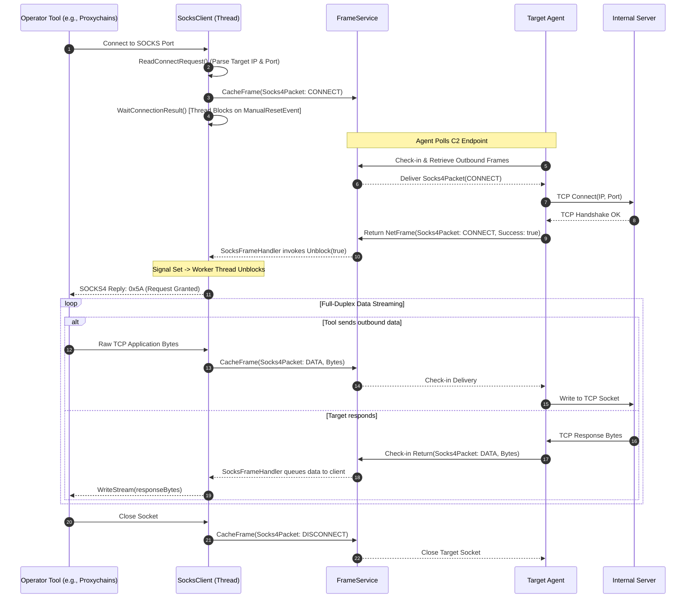
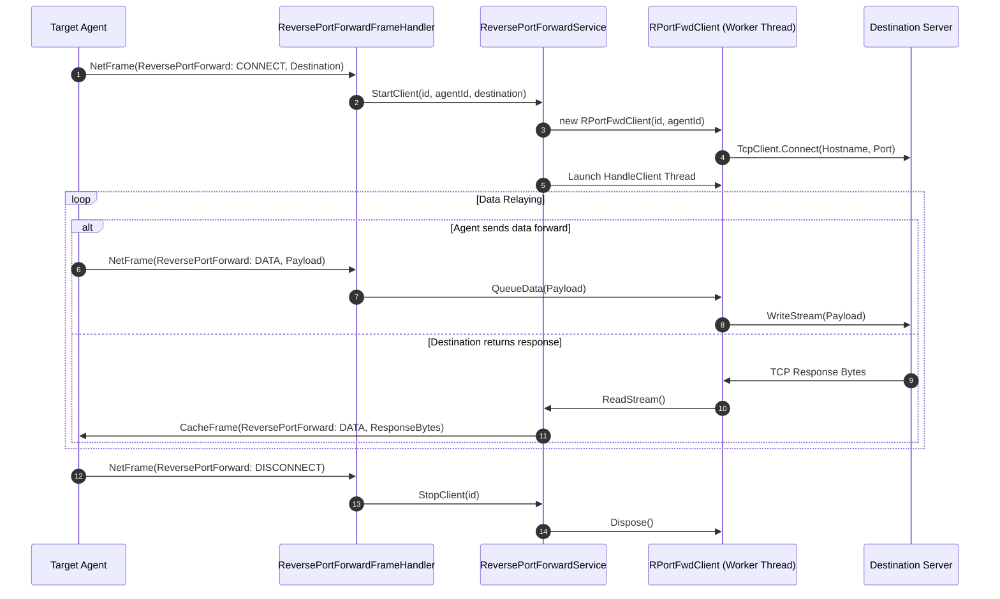

# Network Forwarding Subsystem — Technical Guide

## System Overview

The **Network Forwarding Subsystem** provides network pivoting capabilities that bridge the operator's local tools into remote target enclaves.

The subsystem consists of two complementary components:
1. **Dynamic SOCKS4 Proxy Engine**: Binds a local SOCKS4 proxy server on the TeamServer, translating standard SOCKS client connections into encrypted `NetFrame` packets routed through a designated agent.
2. **Reverse Port Forwarding Engine**: Bridges TCP sockets initiated from or through target agents back to internal destinations reached directly from the TeamServer.

```mermaid
graph TD
    subgraph SOCKSArchitecture["SOCKS4 Dynamic Proxy Pipeline"]
        OpTool["Operator Tool (Proxychains / Browser)"] <== "TCP Handshake & Data" ==> SocksPrx["SocksProxy (TcpListener)"]
        SocksPrx --> ClientThread["Thread(HandleClient) -> SocksClient"]
        ClientThread <== "Socks4Packet (CONNECT / DATA / DISCONNECT)" ==> FrameQ["FrameService Outbound Queue"]
        FrameQ <== "Encrypted NetFrame" ==> TargetAgent["Compromised Target Agent"]
        TargetAgent <== "Raw TCP Socket" ==> InternalTarget["Internal Corporate Server"]
    end

    subgraph RPortFwdArchitecture["Reverse Port Forwarding Pipeline"]
        TargetAgent2["Target Agent (RPortFwd Initiator)"] <== "ReversePortForwardPacket" ==> InboundHandler["ReversePortForwardFrameHandler"]
        InboundHandler --> RPFwdSvc["ReversePortForwardService"]
        RPFwdSvc --> RPFwdClient["Thread(HandleClient) -> RPortFwdClient"]
        RPFwdClient <== "Direct TCP Socket" ==> DestServer["Destination Target Host"]
    end
```

---

## Dynamic SOCKS4 Proxy Architecture

### Core Components
- **`ISocksService` / `SocksService`**: Singleton manager tracking active proxies by agent (`ProxiesByAgent`) and port (`ProxiesByPort`).
- **`SocksProxy`**: Wraps an asynchronous `TcpListener`. Upon accepting a connection, it instantiates a `SocksClient` and launches a dedicated worker thread.
- **`SocksClient`**: Represents a single active TCP stream through the proxy. Contains a thread synchronization primitive (`ManualResetEvent _signal`) and a thread-safe `ConcurrentQueue<byte[]>` for response data.

### SOCKS4 Tunnel Lifecycle & Sequence

### Thread Synchronization in `SocksClient`
To prevent the client application from sending payload data before the target agent has successfully established the remote TCP connection:
1. `SocksClient.WaitConnectionResult()` halts the worker thread using `_signal.WaitOne()`.
2. When the agent reports connection success via `SocksFrameHandler`, it calls `socks.Unblock(connected)`.
3. `Unblock()` assigns `ConnexionResult = true` and triggers `_signal.Set()`, releasing the worker thread to send the SOCKS4 success grant (`0x5A`) back to the client.

---

## Reverse Port Forwarding Architecture

While SOCKS proxying routes outbound connections from the operator into the target network, **Reverse Port Forwarding** enables connections originating from or relayed by an agent to connect outward to specified targets through the TeamServer.

### Core Components
- **`IReversePortForwardService` / `ReversePortForwardService`**: Singleton maintaining active client connections in `_RPortFwrdClients`.
- **`ReversePortForwardFrameHandler`**: Ingests incoming `NetFrameType.ReversePortForward` packets and drives client lifecycle events (`CONNECT`, `DATA`, `DISCONNECT`).
- **`RPortFwdClient`**: Wraps a managed `TcpClient` connecting to the specified `ReversePortForwardDestination` (`Hostname`, `Port`).

### Reverse Port Forward Execution Flow

---

## Technical Reference Links

- **Frame Transport Layer**: [Frame Handling & Cryptography](./frame-handling-and-cryptography.md)
- **Agent Mesh Integration**: [Agent & Relay System](./agent-and-relay-system.md)
- **Functional Overview**: [Network Pivoting Functional Specification](../../Functional/TeamServer/network-pivoting.md)
