# Payload Generation & Tool Management — Technical Guide

## System Overview

The **Payload Generation & Tool Management** subsystem integrates the TeamServer with the platform's payload generation engine (`Common.Payload.Generation`) and provides an offensive tool repository.

This subsystem provides:
1. **Dynamic Implant Compilation**: On-demand generation and binary modification of implants across multiple platforms and formats.
2. **Automated Shellcode Transformation**: Invoking the Donut generator to transform native executables and .NET assemblies into position-independent shellcode.
3. **Automated Tool Classification**: Categorizing uploaded offensive binaries via managed metadata reflection into `.NET Assemblies`, `Native Executables`, or `PowerShell Scripts`.

```mermaid
graph TD
    subgraph ImplantsEngine["Implant Generation Pipeline"]
        ImpReq["POST /Implants (ImplantConfig)"] --> ImpCtrl["ImplantsController.CreateImplant()"]
        ImpCtrl --> GenInit["PayloadGenerator(FoldersConfig, SpawnConfig)"]
        GenInit --> TemplateStore["PayloadTemplates/ (Template Binaries)"]
        GenInit --> CecilPatch["Mono.Cecil Metadata & Resource Patching"]
        GenInit --> DonutComp["Donut Shellcode Generator"]
        CecilPatch --> ImpBytes["Compiled Payload Bytes"]
        DonutComp --> ImpBytes
        ImpBytes --> ImpSvc["ImplantService (Cache & SQLite)"]
    end

    subgraph ToolsEngine["Tools Armory & Reflection Classifier"]
        ToolUp["POST /Tools (Upload Binary / Script)"] --> ToolSvc["ToolService.AddTool()"]
        ToolSvc --> ExtCheck{".exe or .ps1?"}
        ExtCheck -- .ps1 --> PSType["ToolType.PowerShell"]
        ExtCheck -- .exe --> WriteTmp["Write to tmpTool.exe"]
        WriteTmp --> ReflCheck{"AssemblyName.GetAssemblyName()"}
        ReflCheck -- Success --> DotNetType["ToolType.DotNet"]
        ReflCheck -- Throws Exception --> NativeType["ToolType.Exe"]
        PSType --> SaveDisk["Write to ToolsFolder/<Type>/<Name>"]
        DotNetType --> SaveDisk
        NativeType --> SaveDisk
    end
```



---

## Implant Generation Engine (`ImplantService.cs` & `Common.Payload.Generation`)

### `ImplantConfig` Specification
Controls the compilation parameters passed to `PayloadGenerator`:

```csharp
public class ImplantConfig
{
    public string ImplantName { get; set; }
    public ImplantArchitecture Architecture { get; set; } // x86 or x64
    public ImplantType Type { get; set; }                 // Executable, ReflectiveLibrary, Shellcode, Linux, Python
    public ConnexionUrl Endpoint { get; set; }            // Listener URL
    public string Listener { get; set; }                  // Target Listener Identifier
    public string ServerKey { get; set; }                 // Master Encryption Key
    public bool IsDebug { get; set; }                     // Console Debug Tracing
    public bool StoreImplant { get; set; }                // Persist in DB for Staging
}
```

### Binary Patching & Generation Mechanics
`PayloadGenerator` leverages several underlying mechanisms depending on the target format:
1. **Windows Executables & Reflective DLLs**: Loads a pre-compiled base implant assembly from `Folders:ImplantTemplatesFolder`. Using `Mono.Cecil`, it parses the assembly IL, edits embedded resource manifests, patches hardcoded encryption keys and listener URLs, and writes the output binary.
2. **Shellcode Generation (Donut)**: When generating unmanaged shellcode or preparing a tool for fork-and-run execution, `PayloadGenerator` calls the Donut binary compiler (located in `Folders:DonutFolder`) to generate position-independent shellcode targeting `x86` or `x64`.
3. **Cross-Platform Stagers**: Utilizes token substitution templates for Python and Linux deployment targets.

### Implant Persistence (`ImplantService.cs`)
Implements `IImplantService` and `IStorable`. Implants configured with `StoreImplant = true` are stored in SQLite (`ImplantDao`):

```csharp
[InjectableService]
public interface IImplantService : IStorable
{
    void AddImplant(Implant implant);
    IEnumerable<Implant> GetImplants();
    Implant GetImplant(string id);
    Implant GetImplantbyName(string name);
    void RemoveImplant(Implant implant);
}
```

Stored implants are queryable by name (`GetImplantbyName`), allowing `HttpListenerController` to stream them directly when requested via `/imp/{implantName}`.

---

## Tool Repository & Automated Classifier (`ToolsService.cs`)

The `ToolService` manages the physical files located in `Folders:ToolsFolder`.

### Disk Organization
Files are partitioned into three dedicated subdirectories corresponding to the `ToolType` enumeration:
```text
ToolsFolder/
├── DotNet/       # Managed .NET assemblies (e.g., Seatbelt.exe, Rubeus.exe)
├── Exe/          # Unmanaged native binaries (e.g., procdump.exe, mimikatz.exe)
└── PowerShell/   # PowerShell scripts (e.g., PowerView.ps1)
```

### Reflection-Based Binary Classification (`AddTool`)
When a new tool is submitted via `POST /Tools`:
1. Validates file extension: only `.exe` and `.ps1` are accepted.
2. If `.ps1`, sets `tool.Type = ToolType.PowerShell`.
3. If `.exe`, writes the payload to a temporary file (`tmpTool.exe`) and calls `IsDotNetAssembly()`:

```csharp
private static bool IsDotNetAssembly(string filePath)
{
    try
    {
        _ = System.Reflection.AssemblyName.GetAssemblyName(filePath);
        return true;
    }
    catch
    {
        return false;
    }
}
```

- If `AssemblyName.GetAssemblyName()` succeeds, the binary contains valid CLR metadata and is classified as `ToolType.DotNet`.
- If an exception is thrown (e.g., `BadImageFormatException`), the binary is an unmanaged PE and is classified as `ToolType.Exe`.
- The binary is written to `ToolsFolder/{Type}/{Name}`, and the temporary file is deleted.

### On-Demand Data Loading
To conserve server memory, `GetTools()` returns lightweight catalog records without binary bytes. The full binary data is only loaded from disk (`withData = true`) when requested by `TaskInterceptionService` during command enrichment.

---

## Technical Reference Links

- **Task Interception Pipeline**: [Tasking & Interception Engine](./tasking-and-interception.md)
- **Staging Web Server**: [Loot & WebHost Subsystem](./loot-and-webhost.md)
- **Storage Entity Mapping**: [Storage & Persistence](./storage-and-persistence.md)
- **Functional Guide**: [Tools Repository Functional Specification](../../Functional/TeamServer/tools-repository.md)
