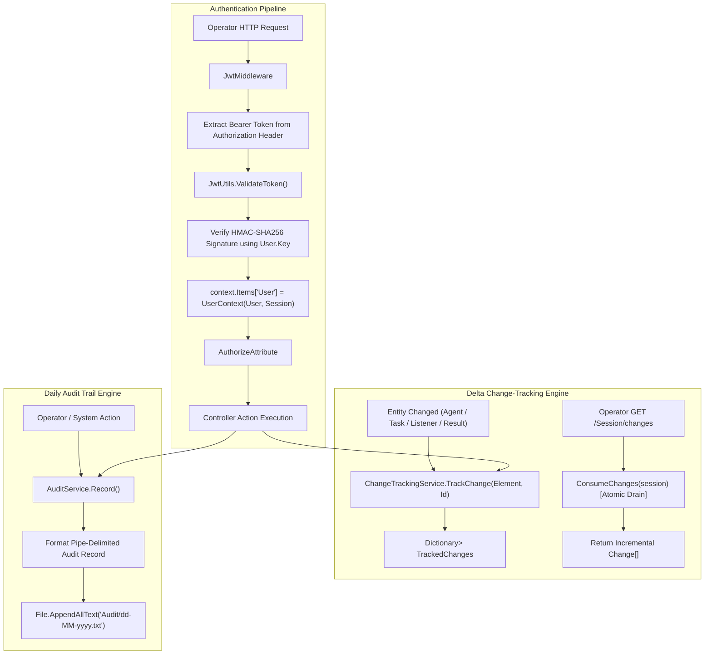

# Security, Authentication & Audit — Technical Guide

## System Overview

The **Security, Authentication & Audit** subsystem secures administrative access to the TeamServer, coordinates multi-operator collaboration, and maintains an immutable audit trail of all operational events.

The subsystem comprises three primary engines:
1. **Operator Authentication & Identity Engine**: Validates operator credentials via cryptographic JWT bearer tokens using `System.IdentityModel.Tokens.Jwt`.
2. **Delta Change-Tracking Engine**: Provides real-time synchronization of server state changes across connected operator consoles without requiring heavy full-state polling.
3. **Operational Audit Trail Engine**: Records chronological, time-stamped activity logs to rotating daily files on disk for post-engagement reporting and compliance.



---

## Operator Authentication & JWT Model

### Operator Identity & Credential Store
Operator credentials are configured in `appsettings.json` under the `Users` section:

```json
"Users": [
    {
        "Id": "Fropops",
        "Key": "lFAsXztlvBRVMr2DduUI7S2cSyIkodgC?S42aLF6-BHJD?2n1HlEQzPFn9SRGvfKrgyaXRAzkTFYR..."
    }
]
```

At startup, `Startup.PopulateUsers()` loads these records into the in-memory `IUserService`.

### JWT Token Generation & Verification (`JwtUtils.cs`)

```csharp
[InjectableService]
public interface IJwtUtils
{
    string GenerateToken(User user);
    UserContext ValidateToken(string token);
}
```

#### Token Generation
Tokens are signed with **HMAC-SHA256** using the operator's private `user.Key` and are valid for 7 days:

```csharp
public string GenerateToken(User user)
{
    var tokenHandler = new JwtSecurityTokenHandler();
    var key = Encoding.ASCII.GetBytes(user.Key);
    var tokenDescriptor = new SecurityTokenDescriptor
    {
        Subject = new ClaimsIdentity(new[] { new Claim("id", user.Id.ToString()) }),
        Expires = DateTime.UtcNow.AddDays(7),
        SigningCredentials = new SigningCredentials(
            new SymmetricSecurityKey(key),
            SecurityAlgorithms.HmacSha256Signature)
    };
    var token = tokenHandler.CreateToken(tokenDescriptor);
    return tokenHandler.WriteToken(token);
}
```

#### Token Validation Pipeline
1. Reads token claims: extracts `id` (operator ID) and `session` (unique client session identifier).
2. Retrieves the `User` object from `_userService.GetUser(userId)`.
3. Validates the signature using `SymmetricSecurityKey(Encoding.ASCII.GetBytes(user.Key))` with `ClockSkew = TimeSpan.Zero` for exact expiration enforcement.
4. On success, constructs and returns a `UserContext(user, session)`.

### Middleware & Authorization Filter

- **`JwtMiddleware` (`MiddleWare/JwtMiddleWare.cs`)**: Executes on every incoming request, validates any supplied Bearer token, and binds the resulting `UserContext` to `HttpContext.Items["User"]`.
- **`[Authorize]` Attribute (`Helper/AuthorizeAttribute.cs`)**: Action filter applied to administrative controllers. Rejects requests lacking a valid `UserContext` with HTTP `401 Unauthorized`, while honoring `[AllowAnonymous]` exemptions.

---

## Real-Time Delta Change-Tracking Subsystem (`ChangeTrackingService.cs`)

To support multi-operator collaboration without overloading server resources, `ChangeTrackingService` decouples event generation from event consumption.

```csharp
[InjectableService]
public interface IChangeTrackingService
{
    List<Change> ConsumeChanges(string session);
    void CleanSession(string session);
    void RecordSession(string session);
    bool ContainsSession(string session);
    void TrackChange(ChangingElement element, string id);
}
```

### Delta Tracking Mechanics
- **`TrackedChanges`**: Maintains a private queue of changes for every active operator session:
  ```csharp
  public Dictionary<string, List<Change>> TrackedChanges = new();
  ```
- **`TrackChange(element, id)`**: When an entity changes (`Agent`, `Metadata`, `Task`, `Result`, `Listener`, `Implant`), the event is dispatched to **all** registered sessions, deduplicating identical pending changes.
- **`ConsumeChanges(session)`**: Atomically drains and clears the session's queue, returning only modifications that occurred since the last poll.
- **Full Snapshot Hydration (`SessionController.Changes(history = true)`)**: When an operator first opens their console, requesting `history = true` generates a complete synthesized change list containing all active listeners, agents, tasks, results, and implants, bringing the client interface up to date instantly.

---

## Operational Audit Logging Subsystem (`AuditService.cs`)

The `AuditService` writes structured, immutable records to the configured audit folder (`Folders:AuditFolder`).

### Daily Log Partitioning
Logs are automatically partitioned by day based on server time:
```text
AuditFolder/
├── 24-11-2025.txt
├── 25-11-2025.txt
└── 26-11-2025.txt
```

### Record Format
Each entry is written as a pipe-delimited string:
```text
dd/MM/yyyy HH:mm:ss | Type | Category | Source | Target | Message
```

```csharp
File.AppendAllText(FileName + ".txt",
    $"{auditItem.Date:dd/MM/yyyy HH:mm:ss} | {auditItem.Type} | {auditItem.Category} | {auditItem.Source} | {auditItem.Target} | {auditItem.Message}{Environment.NewLine}");
```

### Audit Item Schema

| Property | Enum / Type | Description |
| :--- | :--- | :--- |
| **`Date`** | `DateTime` | Timestamp of the logged event. |
| **`Type`** | `AuditType` | Severity classification (`Info`, `Warning`, `Success`, `Error`). |
| **`Category`** | `AuditCategory` | Origin category (`User`, `Agent`, `Host`). |
| **`Source`** | `string` | Operator session (`UserId-SessionId`) or `System`. |
| **`Target`** | `string` | Affected agent ID, listener name, or tool path. |
| **`Message`** | `string` | Descriptive explanation of the operation. |

### Failure Isolation
All filesystem writes inside `AuditService.Record()` are protected by `try/catch` blocks, ensuring disk write contention or full storage conditions cannot crash critical C2 listener operations.

---

## Technical Reference Links

- **ASP.NET Middleware Pipeline**: [Architecture, Hosting & DI](./architecture-and-di.md)
- **Controller Layer**: [Listener Subsystem](./listener-subsystem.md) | [Tasking Engine](./tasking-and-interception.md)
- **Functional Guide**: [Multi-User Collaboration & Auditing](../../Functional/TeamServer/multi-user-and-audit.md)
