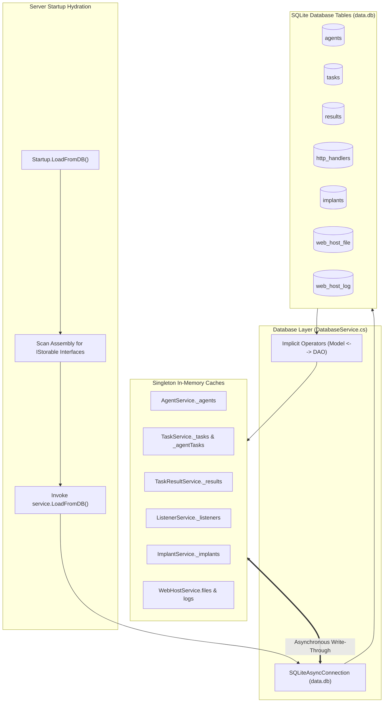
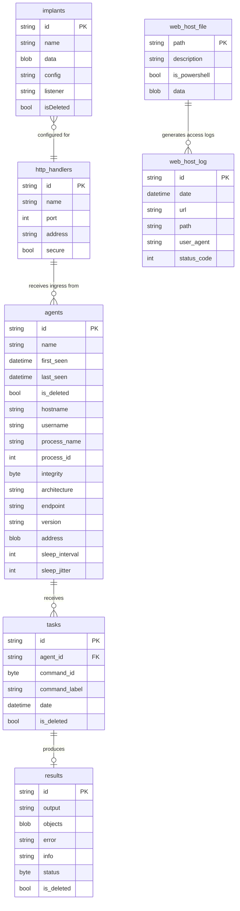

# Storage & Persistence Layer — Technical Guide

## System Overview

The **Storage & Persistence Layer** provides the durable data store for the TeamServer. It is built upon `sqlite-net-pcl`, a lightweight, zero-configuration, cross-platform SQLite ORM.

The architecture combines **In-Memory Speed** with **Durable Disk Persistence**:
- High-frequency operational read/write actions operate against optimized in-memory collections (`Dictionary`, `List`).
- Modifications are asynchronously written to the local SQLite database (`data.db`).
- On server restart, a reflective hydration engine (`IStorable`) reads all tables from SQLite and repopulates the in-memory state.



---

## Database Schema & Entity Relationships



---

## The `IDatabaseService` Contract (`DatabaseService.cs`)

`DatabaseService` manages table initialization and provides generic, asynchronous CRUD primitives:

```csharp
[InjectableService]
public interface IDatabaseService
{
    Task<List<T>> Load<T>() where T : TeamServerDao, new();
    Task Insert<T>(T item) where T : TeamServerDao, new();
    Task Update<T>(T item) where T : TeamServerDao, new();
    Task<int> Remove<T>(T item) where T : TeamServerDao, new();
    Task<int> Clear<T>() where T : TeamServerDao, new();
    Task<T> Get<T>(Expression<Func<T, bool>> expr) where T : TeamServerDao, new();
}
```

### Connection Management
- During initialization, a synchronous `SQLiteConnection` executes `conn.CreateTable<T>()` for all eight entity DAOs, guaranteeing the database file (`Folders:DBFolder/data.db`) and tables exist before any service executes queries.
- Operational queries use a non-blocking `SQLiteAsyncConnection`, preventing thread contention during heavy agent polling.

---

## Data Access Objects (DAOs) & Implicit Conversions

To maintain complete architectural separation between domain logic and persistence concerns, the codebase implements the **DAO Mapping Pattern** with C# implicit type conversion operators (`implicit operator`).

### Example: `AgentDao.cs`

```csharp
[Table("agents")]
public sealed class AgentDao : TeamServerDao
{
    [PrimaryKey, Column("id")]
    public string Id { get; set; }
    [Column("hostname")]
    public string Hostname { get; set; }
    // ... other columns

    // Convert Domain Agent to SQLite DAO
    public static implicit operator AgentDao(Agent agent)
    {
        var dao = new AgentDao { Id = agent.Id, FirstSeen = agent.FirstSeen, LastSeen = agent.LastSeen };
        if (agent.Metadata != null)
        {
            dao.Hostname = agent.Metadata.Hostname;
            dao.UserName = agent.Metadata.UserName;
            // flatten metadata into table columns
        }
        return dao;
    }

    // Convert SQLite DAO to Domain Agent
    public static implicit operator Agent(AgentDao dao)
    {
        if (dao == null) return null;
        var agent = new Agent(dao.Id) { FirstSeen = dao.FirstSeen, LastSeen = dao.LastSeen };
        if (!string.IsNullOrEmpty(dao.EndPoint))
        {
            agent.Metadata = new AgentMetadata { Hostname = dao.Hostname, ... };
        }
        return agent;
    }
}
```

### Conversion Advantages
- Services interact purely with business domain objects (`Agent`, `Listener`, `TeamServerAgentTask`).
- Persistence calls simply cast the entity: `_dbService.Insert((AgentDao)agent)` or `_dbService.Update((TaskDao)task)`.
- Complex nested objects (e.g., `ImplantConfig` inside `Implant`) are cleanly serialized to JSON strings inside the DAO conversion methods.

---

## Startup Hydration Pattern (`IStorable`)

Services that own persistent state implement `IStorable`:

```csharp
public interface IStorable
{
    Task LoadFromDB();
}
```

In `Startup.cs`, `LoadFromDB(app)` dynamically locates every registered interface extending `IStorable` and calls `LoadFromDB()`:

```csharp
private void LoadFromDB(IApplicationBuilder app)
{
    var assembly = Assembly.GetExecutingAssembly();
    var storableInterfaceTypes = assembly.GetTypes()
        .Where(t => t.IsInterface &&
                   typeof(IStorable).IsAssignableFrom(t) &&
                   t != typeof(IStorable));

    foreach(var storableInterface in storableInterfaceTypes)
    {
        var service = app.ApplicationServices.GetService(storableInterface) as IStorable;
        service?.LoadFromDB();
    }
}
```

### Hydration Sequence
1. **`AgentService.LoadFromDB()`**: Loads all non-deleted agents (`IsDeleted == false`).
2. **`TaskService.LoadFromDB()`**: Restores tasks and builds the `_agentTasks` secondary index.
3. **`TaskResultService.LoadFromDB()`**: Loads task outputs.
4. **`ListenerService.LoadFromDB()`**: Restores listener configurations and calls `listener.Start()` to reopen Kestrel ports.
5. **`ImplantService.LoadFromDB()`**: Rebuilds the staged implant catalog.
6. **`WebHostService.LoadFromDB()`**: Reloads hosted files and historical access logs.

---

## Soft Deletion Strategy

To prevent data loss and preserve forensic integrity:
- Entities such as `AgentDao`, `TaskDao`, and `ResultDao` include an `is_deleted` column (`bool IsDeleted`).
- Calling `RemoveAgent()` or `StopAgent()` sets `dao.IsDeleted = true` and updates the record instead of executing a SQL `DELETE`.
- Hydration routines filter out records where `IsDeleted == true`, ensuring deleted entities do not appear in operator consoles while retaining their database audit trail.

---

## Technical Reference Links

- **Application Startup Hook**: [Architecture, Hosting & DI](./architecture-and-di.md)
- **Agent Lifecycle**: [Agent & Relay System](./agent-and-relay-system.md)
- **Task & Result Persistence**: [Tasking & Interception Engine](./tasking-and-interception.md)
- **Functional Overview**: [Functional Index](../../Functional/TeamServer/index.md)
