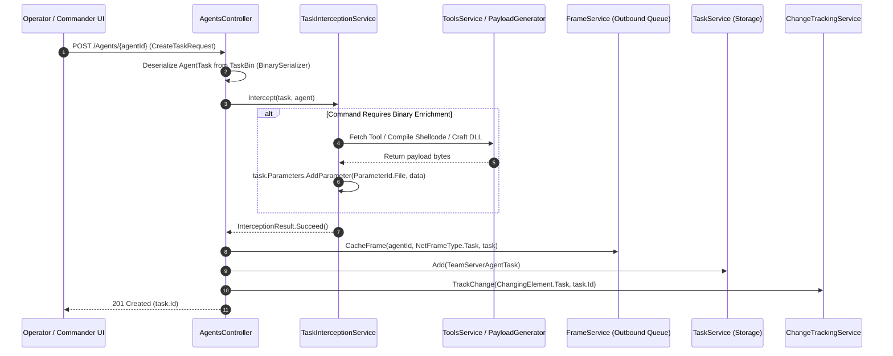
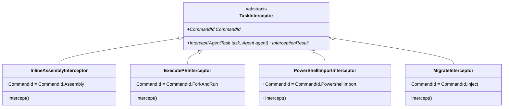
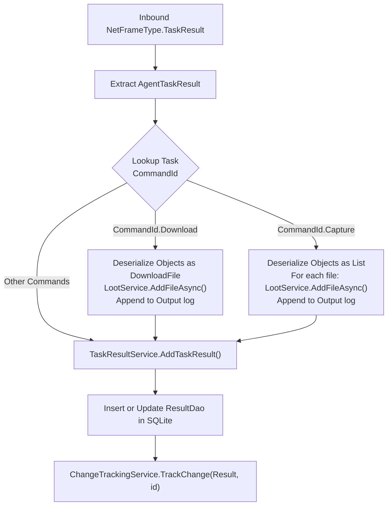

# Tasking & Interception Engine — Technical Guide

## System Overview

The **Tasking & Interception Engine** is responsible for receiving operator commands, enriching tasks with required binary payloads, queuing commands for target delivery, and aggregating execution results.

A central feature of this architecture is the **Task Interception Pattern**: before a task is queued in the network pipeline, specialized interceptor modules inspect the requested command and transparently generate or attach necessary binaries, shellcode, or scripts.



---

## The Task Interception Pattern

### Interceptor Abstraction (`TaskInterceptor`)

```csharp
public abstract class TaskInterceptor
{
    public abstract CommandId CommandId { get; }
    public abstract InterceptionResult Intercept(AgentTask task, Agent agent);
}
```

When `TaskInterceptionService.Intercept()` is called, it iterates through all registered interceptors matching the task's `CommandId`. If any interceptor returns a failure status, task dispatching is aborted immediately and an HTTP `500 Problem` error is returned to the operator.



### Built-in Interceptor Implementations

#### 1. `InlineAssemblyInterceptor` (`CommandId.Assembly`)
Enriches tasks targeting in-memory .NET execution:
- Retrieves the tool name from `task.GetParameter<string>(ParameterId.Name)`.
- Verifies the tool exists in `IToolsService` and is categorized as `ToolType.DotNet`.
- Injects the raw assembly byte array into `task.Parameters[ParameterId.File]`.

#### 2. `ExecutePEInterceptor` (`CommandId.ForkAndRun`)
Automates shellcode generation for unmanaged process execution:
- Verifies the requested tool is a valid `.exe` or `.NET` binary.
- Evaluates the target agent's CPU architecture (`agent.Metadata.Architecture == "x86"` vs `x64`).
- Instantiates `PayloadGenerator` (configured with `FoldersConfig` and `SpawnConfig`).
- Invokes Donut to transform the executable into position-independent shellcode (`GenerateBinForExe` or `GenerateBinForAssembly`).
- Embeds the generated shellcode directly into `task.Parameters[ParameterId.File]`.

#### 3. `PowerShellImportInterceptor` (`CommandId.PowershellImport`)
Supports script importation into the agent's unmanaged runspace:
- Verifies the requested script exists in `IToolsService` as `ToolType.PowerShell`.
- Attaches the raw script string directly to `task.Parameters[ParameterId.File]`.

#### 4. `MigrateInterceptor` (`CommandId.Inject`)
Automates process injection and migration:
- Configures an on-demand `ImplantConfig` for a `ReflectiveLibrary` payload.
- Matches the target process architecture specified in `task.Parameters[ParameterId.Target]`.
- Binds the listener URL specified in `task.Parameters[ParameterId.Bind]`.
- Generates the reflective DLL shellcode via `PayloadGenerator.GenerateImplant()`.
- Packages the compiled reflective payload into `task.Parameters[ParameterId.File]`.

---

## Task Management & Storage (`TaskService.cs`)

`TaskService` implements `ITaskService` and `IStorable`, providing synchronized in-memory caching and SQLite persistence (`TaskDao`):

```csharp
[InjectableService]
public interface ITaskService : IStorable
{
    void Add(TeamServerAgentTask task);
    TeamServerAgentTask Get(string id);
    List<TeamServerAgentTask> RemoveAgent(string agentId);
    List<TeamServerAgentTask> GetForAgent(string agentId);
}
```

- **`_tasks`**: Primary dictionary indexed by `task.Id`.
- **`_agentTasks`**: Secondary index grouping tasks by `agent.Id` for rapid agent history queries.
- **`RemoveAgent(agentId)`**: Soft-deletes all tasks belonging to an agent when the agent is deleted.

---

## Result Processing & Loot Harvesting (`TaskFrameHandler.cs` & `TaskResultService.cs`)

When an agent returns a `NetFrameType.TaskResult` frame, the inbound pipeline invokes `TaskFrameHandler.ProcessFrame()`:



### Result Accumulation & Streaming
In `TaskResultService.AddTaskResult()`:
- If the result is new, it is inserted into the dictionary and written to the SQLite `results` table.
- If the result is an incremental update for a long-running command, newly arrived text is **appended** to the existing output (`existing.Output += res.Output`) and updated in storage, enabling streaming command logs in operator interfaces.

---

## Technical Reference Links

- **Frame Routing Protocol**: [Frame Handling & Cryptography](./frame-handling-and-cryptography.md)
- **Tool Storage Engine**: [Payload Generation & Tools](./payload-and-tools.md)
- **Loot Integration**: [Loot & WebHost Subsystem](./loot-and-webhost.md)
- **Functional Overview**: [Task Execution Functional Guide](../../Functional/TeamServer/task-execution.md)
