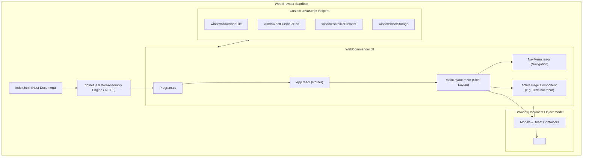

# Architecture & Hosting Pipeline — Technical Documentation

## Overview

**WebCommander** is hosted and executed as an **ASP.NET Core Blazor WebAssembly (.NET 8.0)** client application. Unlike traditional server-side web applications (ASP.NET Core MVC, Razor Pages, or Blazor Server) where code executes on a remote web server, WebCommander's compiled binaries (`.wasm` and `.dll` assemblies packaged in `webcil` format) are downloaded and executed entirely inside the operator's web browser using the client-side WebAssembly runtime.



---

## Application Entry Point (`Program.cs`)

The application entry point initializes the `WebAssemblyHostBuilder`, configures the root DOM attachment targets, and registers the dependency injection (DI) service collection:

```csharp
using Microsoft.AspNetCore.Components.Web;
using Microsoft.AspNetCore.Components.WebAssembly.Hosting;
using WebCommander;
using WebCommander.Services;
using Microsoft.Extensions.DependencyInjection;

var builder = WebAssemblyHostBuilder.CreateDefault(args);
builder.RootComponents.Add<App>("#app");
builder.RootComponents.Add<HeadOutlet>("head::after");

// Core Business Services (Registered as Singletons in WASM)
builder.Services.AddSingleton<AuthService>();
builder.Services.AddSingleton<AgentService>();
builder.Services.AddSingleton<CommandService>();
builder.Services.AddSingleton<TerminalHistoryService>();
builder.Services.AddSingleton<ToastService>();

// Typed HttpClient Registration
builder.Services.AddHttpClient<TeamServerClient>();

await builder.Build().RunAsync();
```

### Dependency Injection Lifetimes in WebAssembly
In a Blazor WebAssembly application, the entire app runs within a single browser tab for a single user session. Consequently:
- Services registered as `AddSingleton` (e.g., `AgentService`, `AuthService`, `CommandService`) persist for the entire lifetime of the browser tab.
- In-memory state (such as the agent cache in `AgentService` or command registry in `CommandService`) is preserved across page navigations without re-initialization.
- `AddHttpClient<TeamServerClient>()` registers a typed HTTP client that delegates low-level networking to the browser's native `Fetch` API via the Blazor WebAssembly HTTP message handler.

---

## Hosting Document & Static Assets (`wwwroot/index.html`)

The hosting document serves as the HTML shell that bootstraps the WebAssembly runtime and exposes custom JavaScript bridge functions to Blazor via `IJSRuntime`.

### Key Elements of `index.html`:
1. **Style Imports**:
   - `css/bootstrap/bootstrap.min.css`: Core responsive CSS grid and layout system.
   - `bootstrap-icons.css`: Vector iconography for actions, protocols, and integrity badges.
   - `css/app.css`: Custom application styling, dark terminal palettes, and animations.
   - `WebCommander.styles.css`: Scoped CSS bundle generated by the Blazor compiler.
2. **Mount Target**: `<div id="app">` displays a circular SVG loading spinner until the `.wasm` runtime initializes.
3. **Runtime Script**: `<script src="_framework/blazor.webassembly.js"></script>` loads the Mono runtime, WASM assemblies, and bootstraps the .NET host.

### JavaScript Interop Functions:
```javascript
// Triggers programmatic file download from Base64 data without server round-trips
window.downloadFile = function (filename, base64Data) {
    const byteCharacters = atob(base64Data);
    const byteNumbers = new Array(byteCharacters.length);
    for (let i = 0; i < byteCharacters.length; i++) {
        byteNumbers[i] = byteCharacters.charCodeAt(i);
    }
    const byteArray = new Uint8Array(byteNumbers);
    const blob = new Blob([byteArray], { type: 'application/octet-stream' });
    const url = window.URL.createObjectURL(blob);
    const link = document.createElement('a');
    link.href = url;
    link.download = filename;
    document.body.appendChild(link);
    link.click();
    document.body.removeChild(link);
    window.URL.revokeObjectURL(url);
};

// Places cursor at the end of input fields during terminal history navigation
window.setCursorToEnd = function (element) {
    if (element) {
        setTimeout(function () {
            element.focus();
            const length = element.value.length;
            element.setSelectionRange(length, length);
        }, 10);
    }
};

// Smooth scrolls to specific DOM elements
window.scrollToElement = function (elementId) {
    const element = document.getElementById(elementId);
    if (element) {
        element.scrollIntoView({ behavior: 'smooth', block: 'start' });
    }
};
```

---

## Routing and Layout Architecture

### 1. Router Configuration (`App.razor`)
```razor
<Router AppAssembly="@typeof(App).Assembly">
    <Found Context="routeData">
        <RouteView RouteData="@routeData" DefaultLayout="@typeof(MainLayout)" />
        <FocusOnNavigate RouteData="@routeData" Selector="h1" />
    </Found>
    <NotFound>
        <PageTitle>Not found</PageTitle>
        <LayoutView Layout="@typeof(MainLayout)">
            <p role="alert">Sorry, there's nothing at this address.</p>
        </LayoutView>
    </NotFound>
</Router>

<LoadingIndicator />
```
The router scans `WebCommander.dll` for components decorated with the `@page` directive and mounts them into the default layout `MainLayout`.

### 2. Shell Layout (`MainLayout.razor`)
`MainLayout.razor` defines the global structural frame of the application:
- **Sidebar**: Mounts `NavMenu.razor` containing links to `/` (Dashboard), `/agents`, `/listeners`, `/implants`, `/hosting`, `/tools`, and `/proxies`.
- **Top Header Bar**: Displays the authenticated username, user menu with **Disconnect** action, and external documentation links.
- **Main Viewport**: Renders the active page content via `@Body`.
- **Global Modal & Overlay Stack**:
  - `<LoginModal>`: Rendered conditionally when credentials are missing or invalid.
  - `<ConnectionErrorOverlay>`: High-priority blocking overlay for connection failures or authorization lapses.
  - `<NotificationToast>`: Stacks non-blocking toast notifications for new agents and system events.
  - `<LoadingIndicator>`: Displays progress during initial bulk synchronization.

### 3. Startup & Authentication Lifecycle in `MainLayout`:
```csharp
protected override async Task OnInitializedAsync()
{
    isAuthenticated = await AuthService.IsAuthenticatedAsync();
    
    if (isAuthenticated)
    {
        var auth = await AuthService.GetAuthConfigAsync();
        username = auth?.Username ?? "User";

        try
        {
            // Validate connection with TeamServer
            await AuthService.ValidateConnectionAsync(TeamServerClient);
            
            // Initialize in-memory cache and begin background polling
            await AgentService.InitializeDataAsync();
            AgentService.StartPolling();
        }
        catch (Exception ex)
        {
            // If validation fails, prompt for login
            showLoginModal = true;
        }
    }
    else
    {
        showLoginModal = true;
    }
}
```

---

## Error Handling and Diagnostic Logging

1. **Blazor Error Boundary UI**: `<div id="blazor-error-ui">` in `index.html` provides a fallback bar if an unhandled JavaScript or WebAssembly exception halts the rendering pipeline.
2. **Browser Console Output**: As WebCommander runs in WebAssembly, all `Console.WriteLine()` calls map directly to the browser's developer console (`F12 -> Console`), providing diagnostic traces of incoming change objects, deserialization operations, and HTTP network requests.
3. **Reactive Error Overlays**: HTTP 401/403 status codes caught during background polling trigger the `HasAuthorizationError` state in `AgentService`, immediately halting the polling timer and prompting the operator to re-authenticate via `<ConnectionErrorOverlay>`.

For service details and state synchronization mechanics, see [Technical: Services & State](./services-and-state.md).
