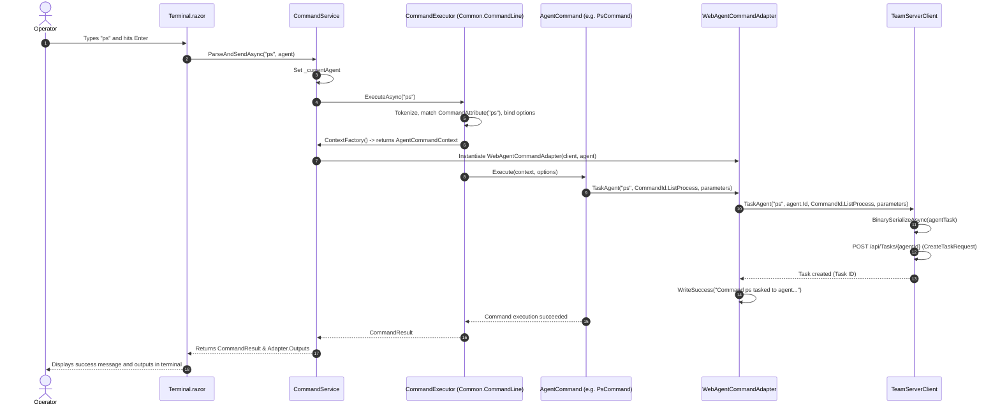
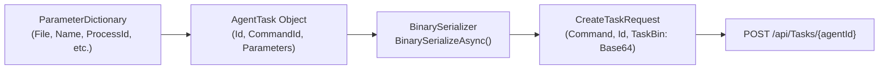

# Command System & Execution Engine — Technical Documentation

## Overview

The command subsystem inside WebCommander bridges interactive browser inputs with the asynchronous command dispatching architecture of the FractalC2 TeamServer. By implementing the `IAgentCommandContext` interface via `WebAgentCommandAdapter`, WebCommander directly executes the identical command library (`Common.AgentCommands`) used by the CLI console, ensuring full operational parity.



---

## Command Subsystem Architecture

### 1. `CommandService` (`Services/CommandService.cs`)
The `CommandService` is a singleton service responsible for initializing the `CommandExecutor` and coordinating command execution requests:

```csharp
private void InitializeCommands()
{
    // Register Context Factory producing WebAgentCommandAdapter
    _commandExecutor.RegisterContextFactory(() => 
    {
        if (_currentAgent == null)
            throw new InvalidOperationException("No current agent set for command execution context.");
            
        var adapter = new WebAgentCommandAdapter(_client, _currentAgent, this, _currentFileBytes);
        if (_currentFileBytes != null)
        {
            adapter.AddParameter(Shared.ParameterId.File, _currentFileBytes);
        }
            
        return new AgentCommandContext(adapter);
    });

    // 1. Load Common Agent Commands from Common.AgentCommands assembly
    var commonAssembly = typeof(WhoamiCommand).Assembly;
    _commandExecutor.LoadCommands(commonAssembly);
    
    // 2. Load WebCommander-specific Commands (UploadCommand, HelpCommand)
    var webAssembly = Assembly.GetExecutingAssembly();
    _commandExecutor.LoadCommands(webAssembly);
}
```

### Execution Lifecycle (`ParseAndSendAsync`):
1. Accepts raw string input, target `Agent`, and optional execution complement (such as file bytes).
2. Sets `_currentAgent` and `_currentFileBytes`.
3. Invokes `_commandExecutor.ExecuteAsync(rawInput, complement)`.
4. The executor parses tokens, matches against loaded `CommandDefinition` entries, resolves arguments/options, and calls the command's `Execute` method.
5. In a `finally` block, resets `_currentAgent` and `_currentFileBytes` to avoid memory leakage.

---

## The Adapter: `WebAgentCommandAdapter`

Located in `Commands/WebAgentCommandAdapter.cs`, this class implements `IAgentCommandContext`. While the CLI `Commander` adapter writes directly to `System.Console`, the web adapter buffers output messages and dispatches tasks asynchronously to the TeamServer HTTP API.

### Key Responsibilities:
- **Output Buffering**: Captures messages via `WriteInfo()`, `WriteSuccess()`, `WriteLine()`, and `WriteError()`, storing them in `Outputs` (`List<Tuple<OutputType, string>>`) for display in the terminal component.
- **Task Serialization & Dispatch**:
  ```csharp
  public async Task TaskAgent(string commandLine, CommandId commandId, ParameterDictionary parameters)
  {
      await _client.TaskAgent(commandLine, _agent.Id, commandId, parameters);
      this.WriteSuccess($"Command {commandLine} tasked to agent {this.Metadata?.Name}.");
  }
  ```
- **Payload Generation Bridge**: Exposes `GeneratePayload(ImplantConfig options)` allowing composite commands to trigger server-side payload compilation.

---

## Custom Web Commands

### 1. `UploadCommand` (`Commands/UploadCommand.cs`)
Unlike the CLI version which reads files directly from the local disk using `System.IO.File`, WebCommander operates in a browser sandbox without direct filesystem access.
- **Command Name**: `upload` (Alias: `put`)
- **Category**: `Network`
- **Options Contract**:
  ```csharp
  public class UploadCommandComplement
  {
      public byte[] FileBytes { get; set; }
      public string FileName { get; set; }
  }
  public class UploadCommandOptions : CommandOption
  {
      [Argument("remotefile", "Path of the file to be saved on the agent", 0)]
      public string remoteFile { get; set; }
  }
  ```
- **Execution Flow**:
  1. Terminal UI intercepts `upload` and opens `FileUploadModal.razor`.
  2. The browser reads the selected file into a byte array.
  3. `Terminal.razor` passes an `UploadCommandComplement` instance as the execution complement.
  4. `UploadCommand` extracts bytes from `context.Complement`, adds `ParameterId.File` and `ParameterId.Name`, and tasks the agent with `CommandId.Upload`.

---

### 2. `HelpCommand` (`Commands/HelpCommand.cs`)
Provides a formatted, category-organized command listing filtered by target OS:
- Queries `adapter.GetAvailableCommands()`.
- Inspects `cmd.SupportedOs` on each command definition against the current agent's `context.Metadata.OsType`.
- Omits Linux-unsupported commands when controlling a Linux implant, and vice-versa.
- Formats aligned text tables grouped by Category (`Commander`, `System`, `Network`, `Stealth`, `Credentials`).

---

## Binary Task Parameter Serialization

When tasking an agent via `TeamServerClient.TaskAgent`:


1. Parameters (strings, integers, byte arrays) are placed into `ParameterDictionary`.
2. An `AgentTask` instance is created with a `ShortGuid` and `CommandId`.
3. The entire `AgentTask` object graph is serialized into a compact binary format using `BinarySerializer`.
4. The binary payload is Base64 encoded into `CreateTaskRequest.TaskBin` and transmitted to the TeamServer.

For technical details on how the terminal renders task results, see [Technical: Components & UI](./components-and-ui.md).
