# Components & UI Subsystem — Technical Documentation

## Overview

The user interface of WebCommander is organized according to the **Blazor Component Model**. UI elements are structured into **Routable Pages** (providing views for URLs) and **Reusable Components** (handling modal dialogs, SVG topology visualization, interactive terminal tables, and toast notifications).

```mermaid
graph TD
    subgraph Layout["Global Layout (MainLayout.razor)"]
        Nav["NavMenu.razor"]
        Body["@Body (Active Page)"]
        OverlayAuth["LoginModal.razor"]
        OverlayErr["ConnectionErrorOverlay.razor"]
        OverlayToast["NotificationToast.razor"]
        OverlayLoad["LoadingIndicator.razor"]
    end

    subgraph RoutablePages["Pages Directory (/Pages)"]
        Home["Home.razor (/)"]
        Agents["Agents.razor (/agents)"]
        Info["AgentInfo.razor (/agent-info/{id})"]
        Tasks["AgentTasks.razor (/agent-tasks/{id})"]
        Term["Terminal.razor (/terminal/{id})"]
        TaskRes["TaskResultViewer.razor (/task-result/{agentId}/{taskId})"]
        Listen["Listeners.razor (/listeners)"]
        Imp["Implants.razor (/implants)"]
        Host["Hosting.razor (/hosting)"]
        Tools["Tools.razor (/tools)"]
        Loot["Loots.razor (/loots/{id})"]
        LootImg["LootImage.razor (/loots/{id}/image/{name})"]
        Proxy["Proxies.razor (/proxies)"]
    end

    subgraph ChildComponents["Presentation & Modal Widgets (/Components)"]
        Topology["AgentTopologyDiagram.razor"]
        TermOut["TerminalOutput.razor"]
        AgentHdr["AgentHeader.razor"]
        FileModal["FileUploadModal.razor"]
        ImpCreator["ImplantCreator.razor"]
        ListCreator["ListenerCreator.razor"]
        UseTool["UseToolModal.razor"]
        ProxyCreator["ProxyCreator.razor"]
        Gallery["LootImageGallery.razor"]
        FileList["LootFileList.razor"]
    end

    Body --> Home
    Body --> Agents
    Body --> Term
    Body --> Tools
    Body --> Loot

    Home --> Topology
    Term --> AgentHdr
    Term --> TermOut
    Term --> FileModal
    Tools --> UseTool
    Loot --> AgentHdr
    Loot --> Gallery
    Loot --> FileList
```



---

## Page Components Catalog

| Page Component | Route | Key Injected Services | Purpose & Primary Interactions |
| :--- | :--- | :--- | :--- |
| `Home.razor` | `/` | `AgentService`, `NavigationManager` | Operational dashboard with live KPI counters and host/agent topology diagram. |
| `Agents.razor` | `/agents` | `AgentService`, `IJSRuntime` | Comprehensive inventory table with live 1s heartbeat timer and delete actions. |
| `AgentInfo.razor` | `/agent-info/{AgentId}` | `AgentService` | Detailed agent dossier with host, process, and connection metadata. |
| `AgentTasks.razor` | `/agent-tasks/{AgentId}` | `AgentService`, `TeamServerClient` | Chronological task execution table with status badges and "Add to Loot" button. |
| `Terminal.razor` | `/terminal/{AgentId}` | `AgentService`, `CommandService`, `TerminalHistoryService` | In-browser command prompt with history navigation, upload modal, and output log. |
| `TaskResultViewer.razor` | `/task-result/{AgentId}/{TaskId}` | `AgentService` | Full-screen terminal console with binary deserialization for task outputs. |
| `Listeners.razor` | `/listeners` | `TeamServerClient`, `AgentService` | Ingress listener list and creation modal. |
| `Implants.razor` | `/implants` | `AgentService`, `TeamServerClient`, `IJSRuntime` | Compiled payloads list, stager generator modal, and binary download handler. |
| `Hosting.razor` | `/hosting` | `TeamServerClient`, `AgentService` | Public web staging file repository with PowerShell/Bash download commands. |
| `Tools.razor` | `/tools` | `TeamServerClient`, `AgentService` | Offensive tool catalog with debounced search, filtering, and "Use with Agent". |
| `Loots.razor` | `/loots/{AgentId}` | `TeamServerClient`, `AgentService` | Tabbed view displaying screenshot gallery and exfiltrated file table. |
| `LootImage.razor` | `/loots/{AgentId}/image/{FileName}` | `TeamServerClient`, `IJSRuntime` | Full-resolution screenshot inspection view. |
| `Proxies.razor` | `/proxies` | `TeamServerClient`, `AgentService` | Active SOCKS proxy manager with stop controls. |

---

## Deep-Dive: Core Specialized Components

### 1. `AgentTopologyDiagram.razor`
Renders an SVG network graph visualizing the relationship between the TeamServer, compromised hosts, and internal relay chains without third-party chart libraries.

#### Coordinate and Layout Algorithms:
1. **Host Grouping**: Groups agents by `Metadata.Hostname`.
2. **Width Calculation**:
   - Inspects agent names, usernames, short IDs, and integrity badges.
   - Dynamically calculates container width: `hostNode.Width = contentWidth + 30`.
   - Centers agent lines: `hostNode.AgentStartX = -4 - (maxLabelWidth / 2)`.
3. **Grid Layout**: Arranges hosts in dynamic rows and columns:
   ```csharp
   int hostsPerRow = Math.Max(1, (int)Math.Ceiling(Math.Sqrt(hostGroups.Count)));
   int spacing = svgWidth / (hostsPerRow + 1);
   hostNode.X = (col + 1) * spacing;
   hostNode.Y = 200 + row * (200 + (maxAgents > 5 ? (maxAgents - 5) * 35 : 0));
   ```
4. **Vector Connection Lines**:
   - **Direct TeamServer Links**: Calculated vector connecting `(svgWidth / 2, 72)` to agent coordinates `(hostX + AgentStartX, agentY)`. Arrowhead polygons are rotated dynamically using `Math.Atan2(dy, dx) * 180 / Math.PI`.
   - **P2P Relay Links**: Dashed lines connecting parent agents to child agents based on `agent.Links` and `agent.RelayId`.
5. **Contextual Mouse Menu**: Clicking any agent captures mouse coordinates `(e.ClientX, e.ClientY)` and renders an HTML popup menu (`Interact`, `View Info`, `Tasks`, `Loots`).

---

### 2. `TerminalOutput.razor`
Renders formatted terminal stream lines while providing dropdown menus for structured results:

#### Interactive Dropdown Handlers:
- **`ls` / `dir` Dropdown**:
  - Emits `OnDownloadFile` or `OnDeleteFile` if the item is a file.
  - Emits `OnListDirectory`, `OnEnterDirectory`, or `OnDeleteDirectory` if the item is a directory.
- **`ps` Dropdown**:
  - Emits `OnMigrateProcess` (executes `migrate <PID>` on Windows agents).
- **`job` Dropdown**:
  - Emits `OnKillJob` (executes `job kill -i <JobID>`).
- **`link` Dropdown**:
  - Emits `OnUnlinkAgent` (executes `link stop -b <Binding>`).

---

### 3. `FileUploadModal.razor`
Decouples file selection from command execution using asynchronous task completion:
```csharp
private TaskCompletionSource<(byte[] Content, string Name)?>? tcs;

public Task<(byte[] Content, string Name)?> ShowAsync()
{
    isVisible = true;
    Reset();
    StateHasChanged();
    tcs = new TaskCompletionSource<(byte[] Content, string Name)?>();
    return tcs.Task;
}

private async Task Confirm()
{
    using var stream = selectedFile.OpenReadStream(maxAllowedSize: 100 * 1024 * 1024);
    using var memoryStream = new MemoryStream();
    await stream.CopyToAsync(memoryStream);
    tcs?.TrySetResult((memoryStream.ToArray(), selectedFile.Name));
    isVisible = false;
}
```

---

## Shared UI Helpers (`Helpers/`)

- **`AgentHelper.cs`**:
  - `IsAgentAlive(agent, allAgents)`: Computes heartbeat validity accounting for direct vs. relayed sleep intervals.
  - `FormatElapsedTime(double seconds)`: Formats seconds into human-readable strings (`"4d 12h 05m 12.45s"`).
  - `IpAsString(byte[]? ipAddressBytes)`: Converts raw IP byte arrays into dot-decimal strings (`192.168.1.10`).
- **`ResultObjectHelper.cs`**:
  - Deserializes binary byte payloads into `ListDirectoryResult`, `List<ListProcessResult>`, `List<Job>`, `List<LinkInfo>`, and `List<ReversePortForwarResult>`.
  - `FormatFileSize(long bytes)`: Converts raw byte lengths into `B`, `KB`, `MB`, `GB`, `TB`.
- **`ScriptHelper.cs`**:
  - Generates stager commands with embedded TLS bypass logic (`PowershellSSlScript`).
- **`CommandsHelper.cs`**:
  - Extension methods for quoting, tokenization, and parameter extraction.

For end-to-end data flows and state synchronizer sequence diagrams, see [Technical: Data Flow & State Sync](./data-flow-and-state-sync.md).
