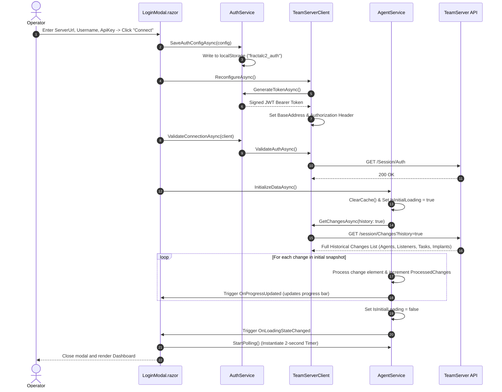
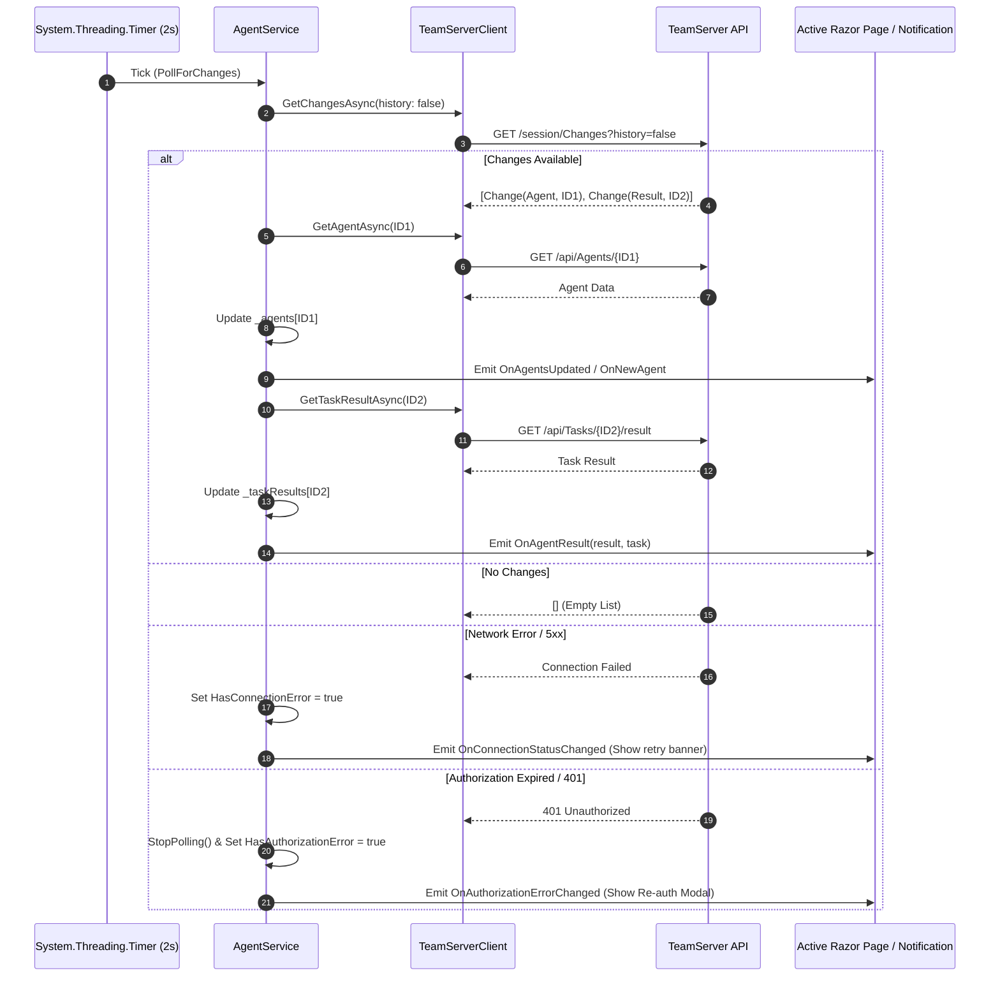
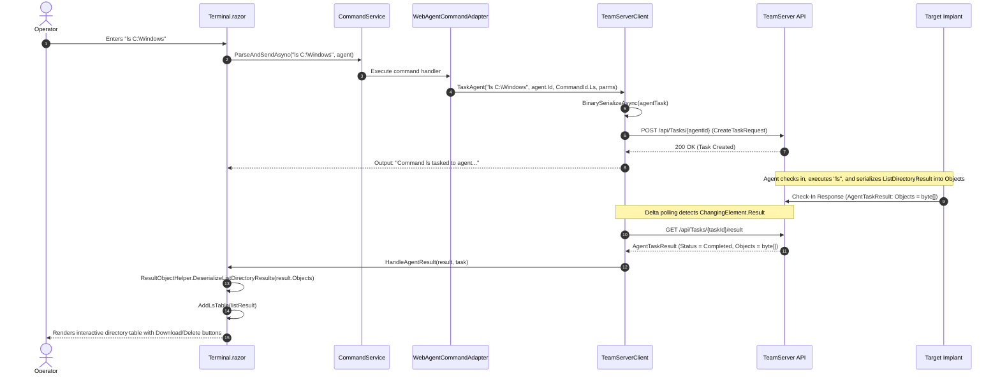
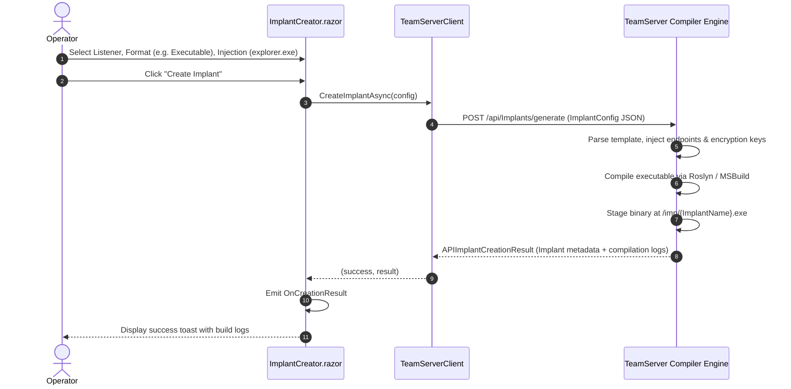
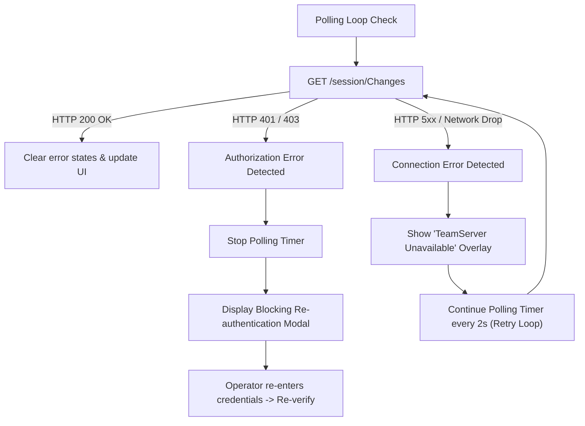

# Data Flow & State Synchronization — Technical Documentation

## Overview

Because WebCommander executes as a client-side WebAssembly application in the operator's browser, data synchronization with the central TeamServer must handle asynchronous network latency, browser thread execution constraints, and non-blocking real-time event updates.

This document details the control flow, network interactions, and state propagation pipelines for the major operational scenarios.

---

## 1. Authentication & Initial State Synchronization

When an operator launches WebCommander or submits the login form:

---

## 2. Background Delta Polling Loop

Once initialized, `AgentService` maintains a recurring `System.Threading.Timer` that fires every 2 seconds:

---

## 3. Command Tasking & Result Deserialization Flow

When an operator issues a command in the terminal (e.g., `ls C:\Windows`):

---

## 4. Payload Generation Pipeline

When an operator creates a new implant via `ImplantCreator.razor`:

---

## 5. Failover and Reconnection Mechanics

WebCommander implements a dual-tier error recovery mechanism:

1. **Transient Network Interruptions**: When network requests fail due to socket drops or server restarts, `AgentService` sets `_hasConnectionError = true`. The `<ConnectionErrorOverlay>` component displays a semi-transparent banner indicating automatic retry. The polling timer continues running, automatically dismissing the overlay once the server recovers.
2. **Permanent Credential Rejection**: When requests return 401 Unauthorized or 403 Forbidden, `AgentService` immediately disposes of the polling timer to prevent flooding the server with unauthorized requests. It sets `HasAuthorizationError = true`, triggering `<ConnectionErrorOverlay>` to prompt for immediate re-authentication.

For storage formats and configuration keys, see [Technical: Configuration & Storage](./configuration-and-storage.md).
