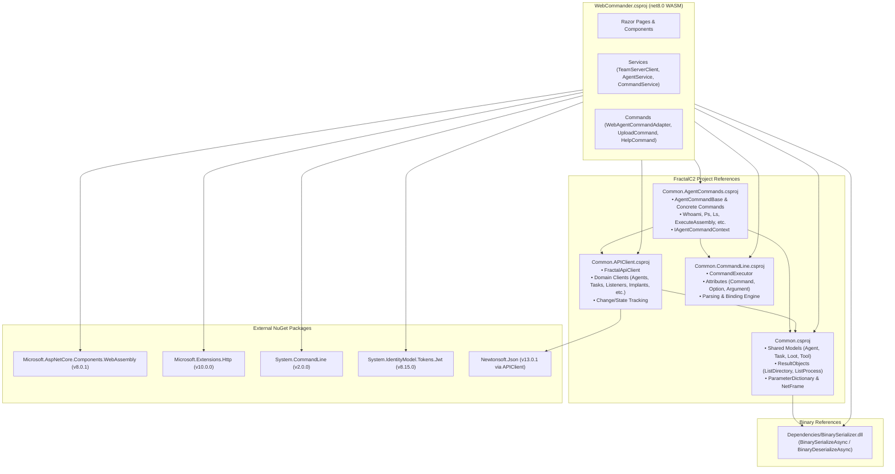

# Dependencies & Integration Map — Technical Documentation

## Overview

The `WebCommander.csproj` project is designed as a modular client interface that leverages shared components from the broader FractalC2 codebase. By consuming shared domain models, API client libraries, and command execution engines, WebCommander maintains complete functional parity with the CLI `Commander.csproj` while executing inside a browser sandbox.

---

## Internal Project References

### 1. `Common.csproj`
- **Location**: `..\Common\Common.csproj`
- **Role**: Foundational data contracts shared across Agents, TeamServer, Commander, and WebCommander.
- **Key Types Consumed**:
  - `Agent`, `TeamServerListener`, `AgentMetadata`: Represents connected target hosts and ingress listeners.
  - `AgentTask`, `AgentTaskResult`: Represents dispatched commands and their returned execution statuses (`Queued`, `Running`, `Completed`, `Error`).
  - `ParameterDictionary`, `ParameterId`: Typed dictionary used to pack command arguments before binary serialization.
  - `ResultObjects/ListDirectoryResult.cs`: Strongly-typed directory item metadata (name, size, file/directory flag).
  - `ResultObjects/ListProcessResult.cs`: Strongly-typed process information (PID, PPID, name, architecture, owner, session).
  - `ResultObjects/ReversePortForwarResult.cs`: Port, destination host, and port for reverse tunnels.
  - `ConnexionUrl`, `ShortGuid`: Connection string parsing and unique identifier generation.

### 2. `Common.APIClient.csproj`
- **Location**: `..\Common.APIClient\Common.APIClient.csproj`
- **Role**: Strongly-typed HTTP REST client library encapsulating communication with the TeamServer.
- **Key Types Consumed**:
  - `FractalApiClient`: Aggregates modular clients:
    - `AgentClient` (`GetAllAsync`, `GetAsync`, `GetMetadataAsync`, `DeleteAsync`)
    - `ListenerClient` (`GetAllAsync`, `GetAsync`, `CreateAsync`, `DeleteAsync`)
    - `TaskClient` (`GetAsync`, `GetResultAsync`, `CreateAsync`)
    - `ImplantClient` (`GetAllAsync`, `GetWithDataAsync`, `GenerateAsync`, `DeleteAsync`)
    - `LootClient` (`GetAllAsync`, `GetFileAsync`, `CreateAsync`, `DeleteAsync`)
    - `ToolClient` (`GetAllAsync`, `AddAsync`)
    - `ProxyClient` (`GetAllAsync`, `StartAsync`, `StopAsync`)
    - `WebHostClient` (`GetAllAsync`, `AddAsync`, `DeleteAsync`)
  - `GetChangesAsync(bool history)`: Queries the `/session/Changes` endpoint for polling delta updates.

### 3. `Common.CommandLine.csproj`
- **Location**: `..\Common.CommandLine\Common.CommandLine.csproj`
- **Role**: Reflection-based command line parsing and execution engine.
- **Key Types Consumed**:
  - `CommandExecutor`: Loads command definitions from assemblies, parses raw input strings, binds options/arguments, and dispatches execution to matching handlers.
  - `CommandDefinition`: Encapsulates command metadata (name, description, category, aliases, option types).
  - `CommandAttribute`, `ArgumentAttribute`, `OptionAttribute`: Declarative metadata attributes.
  - `CommandResult`: Encapsulates execution success, error messages, and context references.

### 4. `Common.AgentCommands.csproj`
- **Location**: `..\Common.AgentCommands\Common.AgentCommands.csproj`
- **Role**: The core command library defining operator-taskable implant behaviors.
- **Key Types Consumed**:
  - `AgentCommandBase`, `AgentCommand<TOptions>`: Abstract base classes defining target OS compatibility and execution hooks.
  - `AgentCommandContext`, `IAgentCommandContext`: Context bridge passed to commands during execution.
  - Concrete Commands: Loaded via reflection by `CommandService` (e.g., `WhoamiCommand`, `PsCommand`, `LsCommand`, `DownloadCommand`, `ExecuteAssemblyCommand`, `InlineAssemblyCommand`, `ShellCommand`, `PowerShellCommand`, `LinkCommand`, `RPortFwdCommand`, `JobCommand`).

---

## External NuGet Packages

| Package | Version | Purpose in WebCommander |
| :--- | :--- | :--- |
| `Microsoft.AspNetCore.Components.WebAssembly` | `8.0.1` | Core Blazor WebAssembly hosting engine, DOM event binding, component rendering pipeline, and Mono WASM runtime. |
| `Microsoft.AspNetCore.Components.WebAssembly.DevServer` | `8.0.1` | Local development server providing static file hosting and WebAssembly debugging support during development. |
| `Microsoft.Extensions.Http` | `10.0.0` | Provides `AddHttpClient<T>` extensions for dependency injection registration and managed `HttpClient` lifecycle. |
| `System.CommandLine` | `2.0.0` | Low-level command-line tokenization and parameter parsing primitives. |
| `System.IdentityModel.Tokens.Jwt` | `8.15.0` | Client-side cryptographic JWT token creation (`JwtSecurityTokenHandler`, `SecurityTokenDescriptor`, `SymmetricSecurityKey`). |
| `Newtonsoft.Json` | `13.0.1` | (Transitive via `Common.APIClient`) High-performance JSON serialization for API contracts and delta changes. |

---

## Binary Dependencies (`Dependencies/BinarySerializer.dll`)

- **Role**: Custom binary serialization engine used by FractalC2.
- **Why Required**: Implants return structured telemetry (process lists, directory trees, reverse port forwards) as raw byte arrays rather than JSON or XML to minimize target footprint, evade network inspection, and optimize performance over low-bandwidth C2 channels.
- **WebCommander Usage**: `ResultObjectHelper` calls `data.BinaryDeserializeAsync<T>()` to deserialize these binary payloads directly in the browser.

For how these components collaborate during command execution, see [Technical: Command System](./command-system.md).
