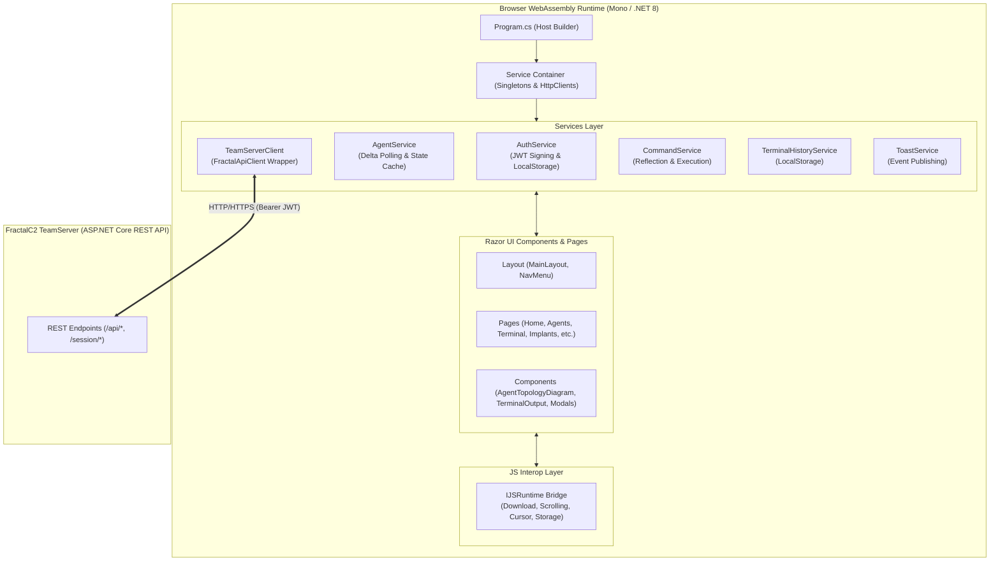

# FractalC2 WebCommander — Technical Documentation

## Technical Overview

**WebCommander** is a client-side Single-Page Application (SPA) built on **ASP.NET Core Blazor WebAssembly (.NET 8.0)**. Serving as the primary graphical command-and-control cockpit in the FractalC2 ecosystem, WebCommander compiles directly to WebAssembly (`webcil` / `.wasm`), executing entirely within the operator's web browser sandbox without requiring server-side ASP.NET Core rendering.



### Key Technical Characteristics
- **Project Type**: `Microsoft.NET.Sdk.BlazorWebAssembly`
- **Target Framework**: `net8.0` (C# 12, Implicit Usings, Nullable enabled)
- **Assembly Version**: `2.4.0.0`
- **Execution Environment**: Client-side browser runtime via WebAssembly / WebCIL.
- **State Management**: Reactive in-memory singleton cache synchronized via long-polling delta updates (`/session/Changes`) and local browser persistence (`localStorage`).
- **Communication Architecture**: Asynchronous HTTP REST requests authenticated via client-generated HMAC-SHA256 JWT bearer tokens.

---

## Technical Documentation Index

| Module | Description | Document Link |
| :--- | :--- | :--- |
| **Architecture & Hosting Pipeline** | Blazor WASM bootstrapping, DI registrations, layout structure, client-side routing, and JS interop architecture. | [Architecture & Hosting](./architecture-and-hosting.md) |
| **Dependencies & Integration Map** | Analysis of referenced solution projects (`Common`, `Common.AgentCommands`, `Common.CommandLine`, `Common.APIClient`), NuGet packages, and binary serializers. | [Dependencies & Integration](./dependencies-and-integration.md) |
| **Core Services & State Management** | Deep dive into `AuthService`, `TeamServerClient`, `AgentService`, `TerminalHistoryService`, `ToastService`, and reactive event models. | [Services & State](./services-and-state.md) |
| **Command System & Execution Engine** | Client-side command dispatching, `WebAgentCommandAdapter`, reflection command loading, parameter serialization, and custom commands. | [Command System](./command-system.md) |
| **Components & UI Subsystem** | Razor page components, interactive SVG topology rendering, action dropdowns, modals, toasts, and overlays. | [Components & UI](./components-and-ui.md) |
| **Data Flow & State Synchronization** | Detailed sequence diagrams covering initial sync, delta polling, task execution, implant generation, and failover recovery. | [Data Flow & State Sync](./data-flow-and-state-sync.md) |
| **Configuration & Storage Mechanics** | Settings structure, HTTP headers, client-side JWT token generation, and `localStorage` JSON schemas. | [Configuration & Storage](./configuration-and-storage.md) |

---

## Codebase Directory Structure

```
WebCommander/
├── Program.cs                     # WASM Host bootstrap and DI container setup
├── App.razor                      # Root Blazor router component
├── _Imports.razor                 # Global namespace imports
├── WebCommander.csproj            # MSBuild project definition
├── Commands/                      # WebCommander-specific terminal commands & adapters
│   ├── HelpCommand.cs             # OS-aware help command implementation
│   ├── UploadCommand.cs           # Browser-assisted file upload command
│   └── WebAgentCommandAdapter.cs  # Bridge between CommandExecutor and TeamServer
├── Components/                    # Reusable Razor presentation widgets & modals
│   ├── ActionToast.razor          # Action result toast component
│   ├── AgentHeader.razor          # Persistent navigation header for active agent
│   ├── AgentTopologyDiagram.razor # SVG visual graph of agents, hosts, and P2P meshes
│   ├── ConnectionErrorOverlay.razor# Server disconnect / auth failure blocking modal
│   ├── FileUploadModal.razor      # Browser file reader dialog for uploads
│   ├── ImplantCreator.razor       # Payload compiler configuration wizard
│   ├── ListenerCreator.razor      # Listener provisioning modal
│   ├── LoadingIndicator.razor     # Startup delta-sync progress bar overlay
│   ├── LoginModal.razor           # TeamServer connection & authentication dialog
│   ├── LootFileList.razor         # File artifacts table with direct browser download
│   ├── LootImageGallery.razor     # Exfiltrated screenshots thumbnail gallery
│   ├── LootUploadModal.razor      # Manual evidence artifact uploader
│   ├── NotificationToast.razor    # Stackable floating alert notifications
│   ├── ProxyCreator.razor         # SOCKS proxy provisioning modal
│   ├── TerminalOutput.razor       # Interactive terminal log with action dropdowns
│   ├── ToolCreator.razor          # Auxiliary tool registration modal
│   └── UseToolModal.razor         # Tool execution modal targeting active agents
├── Helpers/                       # Static utilities for formatting and parsing
│   ├── AgentHelper.cs             # Liveness heuristics and time/IP formatters
│   ├── CommandsHelper.cs          # Tokenizer for command-line arguments
│   ├── ResultObjectHelper.cs      # Binary deserializer for structured task outputs
│   └── ScriptHelper.cs            # Generator for PowerShell and Bash stagers
├── Layout/                        # Application layout framing
│   ├── MainLayout.razor           # Shell layout with top bar, side menu, and overlays
│   ├── MainLayout.razor.css       # Scoped layout styles
│   ├── NavMenu.razor              # Collapsible sidebar navigation links
│   └── NavMenu.razor.css          # Scoped navigation styles
├── Models/                        # Domain contracts and DTOs
│   ├── AuthConfig.cs              # TeamServer connection and credential contract
│   └── TerminalHistory.cs         # Terminal line structure and localStorage model
├── Pages/                         # Routable Razor page views
│   ├── Home.razor                 # Operational dashboard with KPI tiles & topology
│   ├── Agents.razor               # Comprehensive fleet inventory table
│   ├── AgentInfo.razor            # Detailed host and agent telemetry dossier
│   ├── AgentTasks.razor           # Task execution timeline with "Add to Loot"
│   ├── Hosting.razor              # Public web staging file repository
│   ├── Implants.razor             # Compiled payload manager with stager scripts
│   ├── Listeners.razor            # HTTP/HTTPS listener administration
│   ├── Loots.razor                # Exfiltrated artifacts viewer (Images and Files)
│   ├── LootImage.razor            # Full-resolution screenshot inspection page
│   ├── Proxies.razor              # Active SOCKS proxy manager
│   ├── TaskResultViewer.razor     # Full-screen terminal task result inspector
│   ├── Terminal.razor             # Interactive operator shell console
│   └── Tools.razor                # Shared offensive toolset catalog
├── Properties/
│   └── launchSettings.json        # Local debugging profiles
└── wwwroot/                       # Static web assets
    ├── css/                       # Bootstrap and application styles
    ├── favicon.png                # Browser favicon
    ├── icon-192.png               # Application branding icon
    └── index.html                 # HTML host document and JS helper functions
```

---

## Architectural Patterns & Design Decisions

### 1. Client-Side JWT Self-Signing
Unlike traditional web applications where a backend issues session tokens, WebCommander signs JWT tokens directly on the client within `AuthService.GenerateTokenAsync()` using the shared API key as an HMAC-SHA256 symmetric secret. This allows stateless TeamServer verification without persistent session state in the database.

### 2. Reactive Event Aggregation
Services such as `AgentService` and `ToastService` expose strongly-typed C# events (`OnAgentsUpdated`, `OnListenersUpdated`, `OnNewAgent`, `OnShow`, `OnConnectionStatusChanged`). Blazor UI components subscribe to these events on `OnInitialized()` and invoke `StateHasChanged()` on the UI dispatcher, achieving immediate UI reactivity without third-party frameworks.

### 3. Asynchronous Binary Command Deserialization
Structured data returned from implants (such as directory listings `ListDirectoryResult`, process trees `ListProcessResult`, and active jobs `Job`) is transmitted as raw serialized binary bytes. WebCommander's `ResultObjectHelper` uses `BinarySerializer` to deserialize these byte arrays directly in the browser, rendering interactive DOM tables with contextual actions.

### 4. Zero Local Filesystem Access
Operating inside the browser WebAssembly sandbox, WebCommander cannot directly read or write local disk files. File uploads are performed via Blazor `InputFileChangeEventArgs` reading streams into memory byte arrays, while file downloads invoke custom JavaScript blobs through `window.downloadFile`.

For functional capabilities, user stories, and operational guides, refer to the [Functional Documentation Index](../../Functional/WebCommander/index.md).
