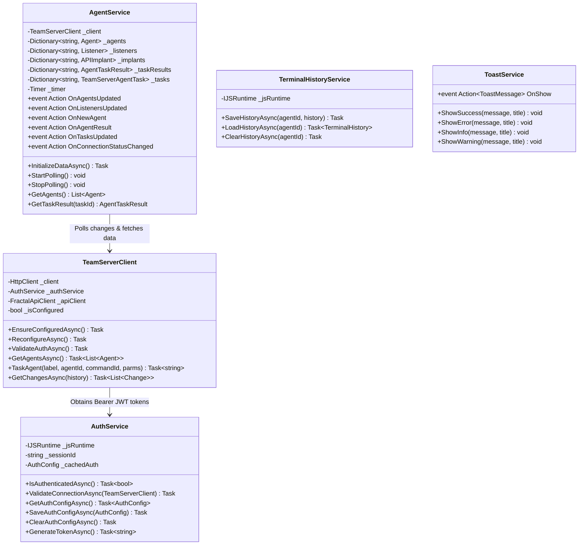

# Core Services & State Management — Technical Documentation

## Overview

State management in WebCommander follows a **reactive singleton service architecture**. The application maintains all active telemetry (agents, listeners, tasks, task results, implants, and proxies) in client-side in-memory memory caches, updated reactively via long-polling delta streams from the TeamServer.



---

## Service Specifications

### 1. `AuthService` (`Services/AuthService.cs`)
- **Namespace**: `WebCommander.Services`
- **Lifetime**: Singleton
- **Responsibilities**:
  - Manages TeamServer connection credentials and operator identity.
  - Persists and retrieves `AuthConfig` from browser `localStorage` under the key `fractalc2_auth`.
  - Generates client-signed HMAC-SHA256 JWT bearer tokens for every API request.
- **Key Methods**:
  - `Task<bool> IsAuthenticatedAsync()`: Validates that `ServerUrl`, `Username`, and `ApiKey` are non-empty.
  - `Task<AuthConfig?> GetAuthConfigAsync()`: Checks memory cache `_cachedAuth`; if null, reads and deserializes JSON from `localStorage.getItem`.
  - `Task SaveAuthConfigAsync(AuthConfig config)`: Serializes config and invokes `localStorage.setItem`.
  - `Task<string> GenerateTokenAsync()`:
    ```csharp
    var tokenHandler = new JwtSecurityTokenHandler();
    var key = Encoding.ASCII.GetBytes(auth.ApiKey);
    var tokenDescriptor = new SecurityTokenDescriptor
    {
        Subject = new ClaimsIdentity(new[] { 
            new Claim("id", auth.Username), 
            new Claim("session", _sessionId) 
        }),
        Expires = DateTime.UtcNow.AddDays(7),
        SigningCredentials = new SigningCredentials(
            new SymmetricSecurityKey(key), 
            SecurityAlgorithms.HmacSha256Signature)
    };
    var token = tokenHandler.CreateToken(tokenDescriptor);
    return tokenHandler.WriteToken(token);
    ```

---

### 2. `TeamServerClient` (`Services/TeamServerClient.cs`)
- **Namespace**: `WebCommander.Services`
- **Lifetime**: Typed Client (`AddHttpClient<TeamServerClient>`)
- **Responsibilities**:
  - Wraps the underlying `HttpClient` and initializes `FractalApiClient`.
  - Automatically injects the JWT Bearer token into outgoing HTTP request headers.
  - Serializes task parameters using `BinarySerializer` before dispatching commands.
- **Key Methods**:
  - `EnsureConfiguredAsync()`: Configures `_client.BaseAddress` to the target server, generates a fresh token from `AuthService`, sets `_client.DefaultRequestHeaders.Authorization = "Bearer <token>"`, and instantiates `FractalApiClient`.
  - `Task<string> TaskAgent(string label, string agentId, CommandId commandId, ParameterDictionary parms)`:
    ```csharp
    var agentTask = new AgentTask()
    {
        Id = ShortGuid.NewGuid(),
        CommandId = commandId,
        Parameters = parms,
    };
    var ser = await agentTask.BinarySerializeAsync();
    var taskrequest = new CreateTaskRequest()
    {
        Command = label,
        Id = agentTask.Id,
        TaskBin = Convert.ToBase64String(ser),
    };
    await _apiClient.Tasks.CreateAsync(agentId, taskrequest);
    return agentTask.Id;
    ```
  - Exposes domain proxy methods for Listeners, Agents, Tasks, Implants, WebHost, Tools, Loot, and SOCKS Proxies.

---

### 3. `AgentService` (`Services/AgentService.cs`)
- **Namespace**: `WebCommander.Services`
- **Lifetime**: Singleton (Implements `IDisposable`)
- **Responsibilities**:
  - Central operational cache holding state dictionaries for agents, listeners, implants, tasks, and task results.
  - Runs a background timer polling `/session/Changes` every 2 seconds.
  - Dispatches reactive C# event notifications to UI components when state modifications occur.
- **Internal Cache Collections**:
  - `Dictionary<string, Agent> _agents`
  - `Dictionary<string, Listener> _listeners`
  - `Dictionary<string, APIImplant> _implants`
  - `Dictionary<string, AgentTaskResult> _taskResults`
  - `Dictionary<string, TeamServerAgentTask> _tasks`
- **Polling Loop (`PollForChanges`)**:
  ```csharp
  var changes = await _client.GetChangesAsync(_firstCall);
  _firstCall = false;

  foreach (var change in changes)
  {
      switch (change.Element)
      {
          case ChangingElement.Agent:
              // Fetches fresh agent & metadata if new, or removes from cache if deleted
              break;
          case ChangingElement.Listener:
              // Updates listener dictionary
              break;
          case ChangingElement.Task:
              // Updates task record
              break;
          case ChangingElement.Result:
              // Updates task result & fires OnAgentResult if completed
              break;
          case ChangingElement.Implant:
              // Updates implant dictionary
              break;
      }
  }
  ```
- **Error Handling States**:
  - `HttpRequestException` with HTTP status `400-499`: Sets `HasAuthorizationError = true`, invokes `StopPolling()`, and notifies subscribers to display `<LoginModal>`.
  - Network disconnection / 5xx error: Sets `_hasConnectionError = true` and continues background retry timer without stopping polling.

---

### 4. `TerminalHistoryService` (`Services/TerminalHistoryService.cs`)
- **Namespace**: `WebCommander.Services`
- **Lifetime**: Singleton
- **Responsibilities**:
  - Persists agent-specific terminal logs, command input history, and metadata in `localStorage` under keys `terminal_history_{agentId}`.
- **Contract (`Models/TerminalHistory.cs`)**:
  ```csharp
  public class TerminalHistory
  {
      public List<TerminalLine> OutputLines { get; set; } = new();
      public List<string> CommandHistory { get; set; } = new();
      public HashSet<string> SentTaskIds { get; set; } = new();
      public Dictionary<string, string> TaskCommands { get; set; } = new();
  }
  ```

---

### 5. `ToastService` (`Services/ToastService.cs`)
- **Namespace**: `WebCommander.Services`
- **Lifetime**: Singleton
- **Responsibilities**:
  - Application-wide event aggregator for non-blocking notification banners.
  - Methods `ShowSuccess()`, `ShowError()`, `ShowInfo()`, and `ShowWarning()` publish a `ToastMessage` payload received by `NotificationToast.razor` and `ActionToast.razor`.

For details on how `AgentService` and `TeamServerClient` integrate with the terminal command execution engine, see [Technical: Command System](./command-system.md).
