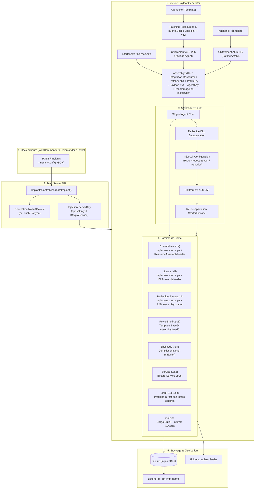
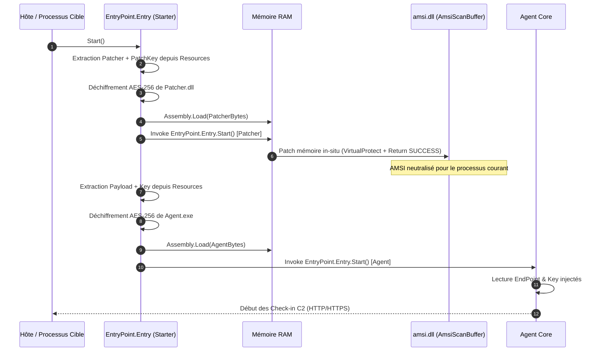

# Documentation Technique : Génération d'Implants (FractalC2)

Cette documentation détaille l'architecture logicielle, le cycle de vie, les mécanismes cryptographiques, le patching binaire IL et natif, ainsi que les formats d'encapsulation du sous-système de **Génération d'Implants** du framework FractalC2.

---

## 1. Vue d'Ensemble & Architecture

La génération d'implants est prise en charge au sein du **TeamServer** par le contrôleur API [`ImplantsController`](file:///e:/Share/Projects/FractalC2/TeamServer/Controllers/ImplantsController.cs), qui délègue la logique de compilation et de transformation à la classe partielle [`PayloadGenerator`](file:///e:/Share/Projects/FractalC2/Common.Payload.Generation/PayloadGenerator.cs) (`Common.Payload.Generation`).

Le rôle de ce moteur est de convertir un agent générique en un artefact autonome, préconfiguré avec les paramètres opérationnels (URL du listener, clé de chiffrement serveur, délai d'injection, architecture) et packagé avec des couches de protection évasive (patching AMSI in-memory, chiffrement AES-256 multicouche, camouflage des métadonnées d'assembly).



---

## 2. Modèle de Données & Configuration (`ImplantConfig`)

La demande de génération est encapsulée dans la classe [`ImplantConfig`](file:///e:/Share/Projects/FractalC2/Common.Payload.Generation/PayloadGenerator.cs) :

| Propriété | Type | Rôle technique |
| :--- | :--- | :--- |
| `ImplantName` | `string` | Nom unique généré aléatoirement via `GenerateImplantName()` (ex: `Lush-Canyon`). Sert de clé de staging HTTP. |
| `Architecture` | `ImplantArchitecture` | Architecture cible : `x86` ou `x64`. |
| `Type` | `ImplantType` | Format final : `Executable`, `Library`, `ReflectiveLibrary`, `PowerShell`, `Shellcode`, `Service`, `Elf`. |
| `Endpoint` | `ConnexionUrl` | URL absolue de rappel du Listener (ex: `https://c2.domain.local:443`). |
| `Listener` | `string` | Identifiant du listener auquel l'implant est rattaché. |
| `ServerKey` | `string` | Clé maîtresse de chiffrement récupérée depuis `ICryptoService.ServerKey`. |
| `IsDebug` | `bool` | Sélectionne les templates du dossier `debug/` et active les traces de console. |
| `StoreImplant` | `bool` | Si vrai, persiste l'implant dans SQLite pour mise à disposition web C2. |
| `IsInjected` | `bool` | Active l'encapsulation dans le module d'injection inter-processus (`Inject.dll`). |
| `InjectionProcessId` | `uint?` | PID du processus hôte cible à injecter. |
| `InjectionProcessName`| `string` | Nom du processus hôte à rechercher (ex: `explorer.exe`). |
| `InjectionProcessSpawn`| `string` | Chemin du binaire à instancier en état suspendu (fork-and-run). |
| `InjectionDelay` | `int` | Délai d'attente (en secondes) avant exécution de l'injection. |

### Génération du Nom de l'Implant
La méthode statique `PayloadGenerator.GenerateImplantName()` combine aléatoirement un adjectif parmi 90 qualificatifs (ex: *Lush*, *Verdant*, *Pristine*, *Mysterious*) et un nom de paysage naturel parmi 90 éléments géographiques (ex: *Canyon*, *Ridge*, *Plateau*, *Oasis*) sous la forme `Adjective-Landscape`. Ce nom garantit un chemin HTTP prévisible et propre pour le téléchargement.

---

## 3. Pipeline Technique de Fabrication

### 3.1. Préparation du Core Agent (`PrepareAgent`)

Pour tous les implants ciblant l'environnement Windows (.NET), le générateur fabrique un stager chiffré en plusieurs étapes :

#### A. Chargement de l'Agent Source
L'assembly maîtresse `Agent.exe` est lue depuis le répertoire de templates approprié (`PayloadTemplates/{Architecture}/` ou `PayloadTemplates/debug/`).

#### B. Patching IL via Mono.Cecil ([`AssemblyEditor.ReplaceRessources`](file:///e:/Share/Projects/FractalC2/Common.Payload.Generation/RessourceEditor.cs))
Contrairement à une recompilation complète à la volée, le moteur patche directement les métadonnées et le dictionnaire de ressources IL de l'assembly :
1. Lecture de l'assembly avec `Mono.Cecil.AssemblyDefinition.ReadAssembly`.
2. Extraction du flux `EmbeddedResource` principal.
3. Parcours avec `ResourceReader` et reconstruction avec `ResourceWriter`.
4. Remplacement des valeurs :
   - `EndPoint` $\rightarrow$ `options.Endpoint.ToString()`
   - `Key` $\rightarrow$ `options.ServerKey`
5. Réécriture du flux d'assembly en mémoire (`assemblyDef.Write(outStream)`).

#### C. Chiffrement AES-256 Symétrique de l'Agent ([`Encrypter`](file:///e:/Share/Projects/FractalC2/Common/Payload/Encrypter.cs))
- Génération d'une clé secrète aléatoire de 48 caractères alphanumériques.
- Dérivation : les 32 premiers octets constituent la clé AES-256 (`Key`), et les 16 octets suivants forment le vecteur d'initialisation (`IV`).
- Chiffrement du binaire via `RijndaelManaged` (mode CBC, Padding PKCS7).
- Le résultat chiffré est encodé en Base64 (`agentb64`).

#### D. Intégration du Découplage AMSI (`Patcher.dll`)
1. Le template `Patcher.dll` est chargé.
2. Il est chiffré indépendamment avec une seconde clé AES-256 éphémère de 48 caractères (`encPatcher.Secret`).
3. Le résultat chiffré est encodé en Base64 (`patcherb64`).

#### E. Assemblage du Starter (`Starter.exe` / `Service.exe`)
1. Chargement de `Starter.exe` (ou `Service.exe` si `options.Type == ImplantType.Service`).
2. Injection des 4 entrées dans les ressources du Starter :
   - `Patcher` : Octets UTF-8 de la chaîne Base64 du `Patcher.dll` chiffré.
   - `PatchKey` : Clé secrète de déchiffrement du Patcher.
   - `Payload` : Octets UTF-8 de la chaîne Base64 du `Agent.exe` chiffré.
   - `Key` : Clé secrète de déchiffrement de l'Agent.
3. **Camouflage d'identité d'assembly** : Appel de `AssemblyEditor.ChangeName(baseStarter, "InstallUtils")` avec attribution du numéro de version `2.5.7.32`.

Le résultat forme le **Staged Agent Core**.

---

### 3.2. Préparation en Mode Injecté (`PrepareInjectedAgent`)

Si `options.IsInjected == true` :
1. Le Staged Agent est d'abord transformé en Reflective DLL via `ReflectiveLibraryEncapsulation`.
2. Le template `Inject.dll` est chargé.
3. Ses ressources sont modifiées via `AssemblyEditor.ReplaceRessources` :
   - `Payload` : Octets bruts de la Reflective DLL / Shellcode.
   - `ProcessId` : PID cible (si fourni).
   - `ProcessName` : Nom du processus cible (si fourni).
   - `ProcessSpawn` : Ligne de commande du binaire à spawner (ex: issu de `SpawnConfig.SpawnToX64` / `SpawnToX86`).
   - `Function` : Nom de l'export réflexif (`ReflectiveLoader`).
   - `Delay` : Délai de temporisation en secondes avant injection.
4. `Inject.dll` est chiffré en AES-256 et embarqué dans le `Starter.exe` (ou `Service.exe`) à la place de l'agent standard.

---

### 3.3. Encapsulation par Format de Sortie

Le binaire intermédiaire obtenu est ensuite finalisé selon `options.Type` :

#### 1. Exécutable Portable (.exe) — `ExecutableEncapsulation`
- **Modèle hôte** : `ResourceAssemblyLoader.exe`.
- **Mécanisme** : Appel du script Python `replace-resource.py` via `PayloadGenerator-Python.cs` :
  ```bash
  python replace-resource.py ResourceAssemblyLoader.exe tmpAgent.exe outImplant.exe
  ```
- **Principe** : L'exécutable hôte PE Win32 intègre l'assembly .NET dans sa table de ressources PE natives. À son lancement, le loader extrait l'assembly et l'exécute directement en mémoire.

#### 2. Bibliothèque Dynamique (.dll) — `LibraryEncapsulation`
- **Modèle hôte** : `DllAssemblyLoader.dll`.
- **Mécanisme** : Même procédé d'injection de ressource native Win32 via Python. La DLL exporte les points d'entrée nécessaires (ex: `DllMain`).

#### 3. DLL Réflexive (.dll) — `ReflectiveLibraryEncapsulation`
- **Modèle hôte** : `RflDllAssemblyLoader.dll`.
- **Architecture** : Uniquement supportée en `x64`.
- **Principe** : Intègre un stub de chargement réflexif (Stephen Fewer) permettant de mapper la DLL en mémoire dans un processus distant sans appel à l'API `LoadLibrary` Win32.

#### 4. Script PowerShell (.ps1) — `PowershellEncapsulation`
- **Modèle hôte** : `payload.ps1`.
- **Mécanisme** :
  1. Le Staged Agent complet est encodé en Base64.
  2. Remplacement du jeton `[[PAYLOAD]]` dans le template `payload.ps1`.
- **Contenu du stager PowerShell** :
  ```powershell
  $b64 = '[[PAYLOAD]]'
  $bytes = [System.Convert]::FromBase64String($b64)
  $assembly = [System.Reflection.Assembly]::Load($bytes)
  $entryPointMethod = $assembly.GetType('EntryPoint.Entry').GetMethod('Start', [Reflection.BindingFlags] 'Static, Public, NonPublic')
  $entryPointMethod.Invoke($null, ($null))
  ```

#### 5. Shellcode brut (.bin) — `BinaryEncapsulation`
- **Moteur sous-jacent** : **Donut** ([`PayloadGenerator-Donut.cs`](file:///e:/Share/Projects/FractalC2/Common.Payload.Generation/PayloadGenerator-Donut.cs)).
- **Commande exécutée** :
  ```bash
  donut.exe -f 1 -a <1=x86|2=x64> -o out.bin -i tmpAgent.exe
  ```
- **Résultat** : Un shellcode PIC (*Position-Independent Code*) autonome, prêt pour les techniques de *process hollowing*, *early bird queueing* ou injection via des injecteurs tiers.

#### 6. Service Windows (.exe)
- Lorsque `options.Type == ImplantType.Service`, le binaire issu de `PrepareAgent` utilisant `Service.exe` comme base est retourné directement sans encapsulation supplémentaire. Il implémente les interfaces `ServiceBase` pour répondre au Service Control Manager (SCM).

#### 7. Binaire Linux ELF (.elf) — `ElfPrepare`
- **Source** : `AgentLinux` (binaire ELF x64 natif).
- **Méthode ([`PayloadGenerator-Linux.cs`](file:///e:/Share/Projects/FractalC2/Common.Payload.Generation/PayloadGenerator-Linux.cs))** : **Binary Pattern Patching direct**.
- **Fonctionnement** :
  1. Le binaire précompilé intègre des marqueurs ASCII de 128 octets paddés avec des étoiles : `[KEY]*****...` et `[ENDPOINT]*****...`.
  2. Le moteur recherche l'offset de ces motifs via `FindPattern()`.
  3. Il écrase directement les octets à ces offsets avec `options.ServerKey` et `options.Endpoint.ToString()`.
  *(Note : Les implants Linux injectés ne sont pas supportés ; l'architecture doit être `x64`).*

#### 8. Loader Rust incRust (Optionnel / Avancé)
- [`PayloadGenerator-incRust.cs`](file:///e:/Share/Projects/FractalC2/Common.Payload.Generation/PayloadGenerator-incRust.cs) fournit les briques pour compiler un chargeur Rust personnalisé via `cargo build` :
  - Cibles : `x86_64-pc-windows-gnu` ou `i686-pc-windows-gnu`.
  - Fonctionnalités (*features*) : `payload_b64`, `syscall_indirect` (x64) ou `syscall_direct` (x86), `no_console`, `inject_self`, `regsvr`.

---

## 4. Cycle d'Exécution sur la Cible (Runtime & Evasion)

À l'exécution sur la machine cible, le `Starter` déroule la séquence suivante en mémoire :



### Propriétés de Défense Évasive :
1. **Zéro Écriture Disque** : Ni le patcher AMSI ni l'agent principal ne sont déposés sur le disque ; ils sont déchiffrés dynamiquement et instanciés via `System.Reflection.Assembly.Load(byte[])`.
2. **Neutralisation Préventive de l'AMSI** : `Patcher.dll` s'exécute **avant** que le payload de l'Agent ne soit déchiffré en mémoire. Ainsi, l'inspection AMSI déclenchée lors du `Assembly.Load` de l'agent principal retourne un statut favorable sans analyser le code offensif.
3. **Double Isolation Cryptographique** : Les clés AES-256 du patcher et du payload sont distinctes et générées aléatoirement à chaque compilation, empêchant la création de signatures statiques sur les binaires hébergés.

---

## 5. Stockage, Hébergement et Staging Web

Lorsque le drapeau `StoreImplant = true` est défini :

1. **Sauvegarde Système de Fichiers** : Le binaire est écrit dans `FoldersConfig.ImplantsFolder` sous son nom complet (ex: `Lush-Canyon.exe`).
2. **Persistance en Base de Données SQLite** :
   - Un modèle [`Implant`](file:///e:/Share/Projects/FractalC2/TeamServer/Models/Implant/Implant.cs) est créé avec son identifiant court (`ShortGuid`), sa configuration sérialisée et ses données binaires encodées en Base64.
   - Enregistrement asynchrone via [`ImplantService.AddImplantAsync`](file:///e:/Share/Projects/FractalC2/TeamServer/Services/ImplantService.cs) et [`ImplantDao`](file:///e:/Share/Projects/FractalC2/TeamServer/Database/ImplantDao.cs).
3. **Exposition Dynamique sur les Listeners HTTP/HTTPS** :
   - Tous les listeners actifs du TeamServer interceptent les requêtes sur la route :
     ```http
     GET /imp/{implantName}
     ```
   - L'implant est chargé depuis le cache/SQLite et retourné sous forme de flux d'octets binaire (`application/octet-stream`).
   - Cela permet aux stagers de téléchargement légers (PowerShell download-cradle, curl, macros) de récupérer le payload final en une seule requête.
4. **Télémétrie et Synchronisation** :
   - L'événement est notifié en temps réel aux consoles d'administration connectées (Commander / WebCommander) via `ChangeTrackingService.TrackChange(ChangingElement.Implant, implant.Id)`.

---

## 6. Répertoire des Composants & Fichiers

| Composant / Fichier | Rôle | Emplacement |
| :--- | :--- | :--- |
| **`ImplantsController.cs`** | Contrôleur API REST gérant `POST /Implants`, `GET /Implants`, `DELETE /Implants/{id}` | [`TeamServer/Controllers/ImplantsController.cs`](file:///e:/Share/Projects/FractalC2/TeamServer/Controllers/ImplantsController.cs) |
| **`PayloadGenerator.cs`** | Orchestrateur central de la préparation et de l'encapsulation | [`Common.Payload.Generation/PayloadGenerator.cs`](file:///e:/Share/Projects/FractalC2/Common.Payload.Generation/PayloadGenerator.cs) |
| **`RessourceEditor.cs`** | Classe `AssemblyEditor` manipulant l'IL et les ressources .NET via Mono.Cecil | [`Common.Payload.Generation/RessourceEditor.cs`](file:///e:/Share/Projects/FractalC2/Common.Payload.Generation/RessourceEditor.cs) |
| **`Encrypter.cs`** | Moteur de chiffrement symétrique AES-256 CBC avec clés éphémères | [`Common/Payload/Encrypter.cs`](file:///e:/Share/Projects/FractalC2/Common/Payload/Encrypter.cs) |
| **`PayloadGenerator-Donut.cs`** | Wrapper d'exécution Donut pour génération de shellcode | [`Common.Payload.Generation/PayloadGenerator-Donut.cs`](file:///e:/Share/Projects/FractalC2/Common.Payload.Generation/PayloadGenerator-Donut.cs) |
| **`PayloadGenerator-Linux.cs`** | Moteur de patching binaire direct pour les binaires Linux ELF | [`Common.Payload.Generation/PayloadGenerator-Linux.cs`](file:///e:/Share/Projects/FractalC2/Common.Payload.Generation/PayloadGenerator-Linux.cs) |
| **`PayloadGenerator-Python.cs`** | Exécuteur du script Python d'injection de ressources natives | [`Common.Payload.Generation/PayloadGenerator-Python.cs`](file:///e:/Share/Projects/FractalC2/Common.Payload.Generation/PayloadGenerator-Python.cs) |
| **`PayloadGenerator-incRust.cs`**| Constructeur de paramètres de compilation Cargo / Rust | [`Common.Payload.Generation/PayloadGenerator-incRust.cs`](file:///e:/Share/Projects/FractalC2/Common.Payload.Generation/PayloadGenerator-incRust.cs) |
| **`Starter (Program.cs)`** | Code source du chargeur .NET déchiffrant le patcher et l'agent | [`Payload/Starter/Program.cs`](file:///e:/Share/Projects/FractalC2/Payload/Starter/Program.cs) |
| **`InjectDll (Entry.cs)`** | Module d'injection distante et de création de processus suspendu | [`Payload/InjectDll/Entry.cs`](file:///e:/Share/Projects/FractalC2/Payload/InjectDll/Entry.cs) |
| **`ImplantService.cs`** | Service de persistance et de requêtage des implants | [`TeamServer/Services/ImplantService.cs`](file:///e:/Share/Projects/FractalC2/TeamServer/Services/ImplantService.cs) |
| **`ImplantDao.cs`** | Couche d'accès aux données SQLite pour les implants | [`TeamServer/Database/ImplantDao.cs`](file:///e:/Share/Projects/FractalC2/TeamServer/Database/ImplantDao.cs) |
