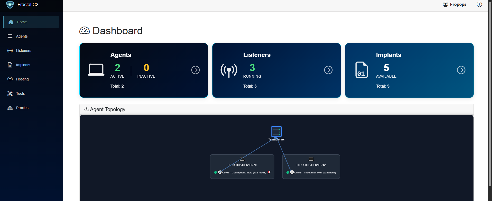
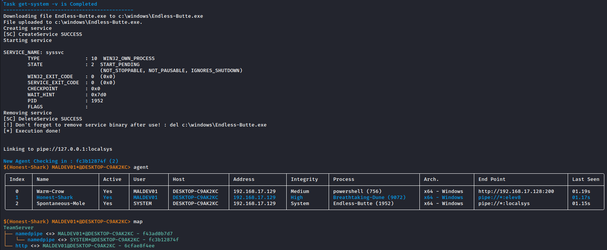
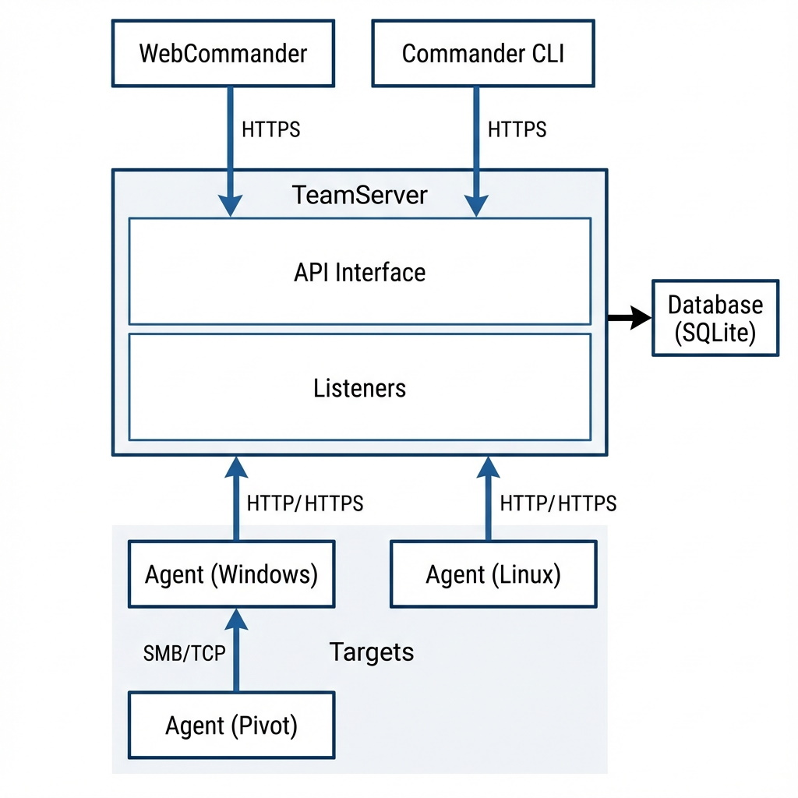

# FractalC2

**FractalC2** is a simple Command and Control (C2) framework built with .NET. It is designed for red team operations and security research, providing a robust TeamServer and multiple client interfaces (CLI and Web).

## 🚀 Quick Install

FractalC2 provides an automated installation script for Debian-based systems (Kali, Ubuntu).

**Full Install (TeamServer + Clients)**
```bash
wget -qO- https://raw.githubusercontent.com/Fropops/FractalC2/refs/heads/main/Install/install.sh | sudo bash -s -- All
```

For more detailed instructions, troubleshooting, and manual installation, see the **[Installation Guide](docs/user-guide/install.md)**.

## 📸 Screenshots

### WebCommander

*Modern web interface for managing operations.*

### Commander CLI

*Powerful command-line interface for efficient tasking.*

## 📚 Documentation

The project includes detailed documentation for both users and developers.

### User Guide
*   **[Installation](docs/user-guide/install.md)**: How to set up FractalC2.
*   **[WebCommander](docs/user-guide/web-commander.md)**: Guide to the web user interface.
*   **[Commander CLI](docs/user-guide/commander.md)**: Guide to the command-line interface.
*   **[Agent Commands](docs/user-guide/agent-commands.md)**: Reference for all available agent commands (Execution, File System, Network, etc.).

### Technical Documentation
*   **[Architecture](docs/technical/architecture.md)**: Overview of the system components and communication flows.
*   **[Implant Generation](docs/technical/implant-generation.md)**: Deep dive into how payloads are created, patched, and encrypted.

## 🏗️ Architecture

FractalC2 is composed of:
*   **TeamServer**: The core server handling listeners, data pivoting, and database management.
*   **Agents**: .NET-based modular implants supporting HTTP/HTTPS and TCP / Named Pipes (P2P) communication.
*   **WebCommander**: Blazor WASM client for a responsive, cross-platform UI.
*   **Commander**: A cross-platform .NET CLI for terminal-loving operators.


